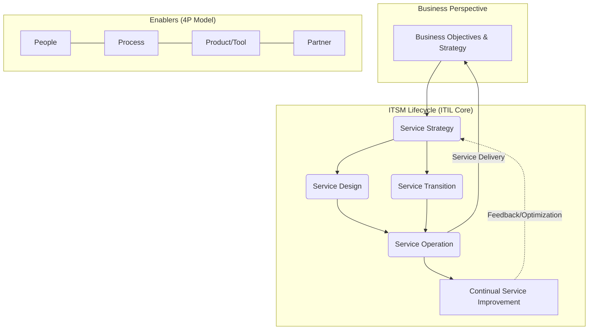

Parent: [[IT 경영전략]]

## 1. [도입: Why] 비즈니스와 IT의 융합, ITSM의 개요 및 배경

**가. ITSM(IT Service Management)의 정의**
- 조직의 비즈니스 목표 달성을 지원하기 위해 IT 서비스를 설계, 전환, 운영, 지속 개선하는 **프로세스 기반(Process-oriented)**의 종합적인 IT 관리 체계입니다.
- 핵심 키워드: **ITIL(Best Practice)**, **SLA(Service Level Agreement)**, **비즈니스 연계성(Alignment)**

**나. 등장 배경 및 필요성**
- **비즈니스 의존성 심화**: IT가 단순 지원 도구를 넘어 비즈니스의 핵심 동인(Enabler)으로 역할이 변화함에 따라 고품질의 서비스 요구가 증대되었습니다.
- **서비스 가시성 및 품질 향상**: 주먹구구식 IT 운영을 탈피하고, 가용성(Availability)과 무결절성(Seamless)을 보장하는 체계적 접근이 필요합니다.
- **규제 및 컴플라이언스 대응**: IT 거버넌스(IT Governance) 확립 및 투명성(Transparency) 확보를 통한 리스크 관리 요구가 커졌습니다.

## 2. [핵심: What & How] ITSM의 아키텍처 및 핵심 메커니즘

**가. ITSM 개념도 및 아키텍처**

**나. 핵심 구성 요소 (4P Model)**

| 구분 (4P) | 세부 내용 | 주요 요소 및 기술 |
| :--- | :--- | :--- |
| **People** (사람) | 서비스 제공, 관리, 운영을 담당하는 인적 자원 및 조직 역량 | 명확한 R&R, RACI 매트릭스, ITSM 조직 문화, 직무 교육 |
| **Process** (프로세스) | IT 서비스를 일관성 있고 효과적으로 제공하기 위한 표준화된 흐름 | 사고(Incident) 관리, 문제(Problem) 관리, 변경(Change) 관리 |
| **Product** (제품/도구) | 프로세스를 지원하고 자동화(Automation)하는 시스템 및 인프라 | ITSM 솔루션(ServiceNow, Jira Service Desk), CMDB, APM |
| **Partner** (파트너) | 외부 서비스 공급자 및 아웃소싱 벤더 관리 체계 | SLA(Service Level Agreement), OLA, UC 관리, 협력사 통제 |

## 3. [심화: Deep-dive] ITSM 주요 프로세스 및 프레임워크 비교 분석

**가. ITSM 핵심 관리 프로세스 (Service Operation 및 Transition 중심)**
- **사고 관리 (Incident Management)**: 서비스 중단이나 품질 저하 발생 시, **최대한 신속하게 정상 운영 상태로 복구(Workaround)**하는 단기적 조치 프로세스입니다.
- **문제 관리 (Problem Management)**: 사고의 **근본 원인(Root Cause)**을 파악하고 영구적인 해결책을 제시하여 재발을 방지하는 프로세스입니다. KEDB(Known Error Database)를 활용합니다.
- **변경 관리 (Change Management)**: IT 환경의 모든 변경 사항(추가, 수정, 삭제)을 표준화된 방법론으로 통제하여, **비즈니스 리스크를 최소화**하고 승인 체계(CAB: Change Advisory Board)를 운영합니다.

**나. ITSM 관련 유사 프레임워크 비교**

| 구분 | ITIL (IT Infrastructure Library) | COBIT (Control Objectives for Information and Related Technology) | ISO/IEC 20000 |
| :--- | :--- | :--- | :--- |
| **목적** | IT 서비스 관리 Best Practice 제공 | IT 거버넌스 및 통제 프레임워크 | IT 서비스 관리 체계의 국제 표준 인증 |
| **관점** | **How** (어떻게 IT 서비스를 관리할 것인가?) | **What** (무엇을 통제하고 감사할 것인가?) | **Audit** (최소 요구사항 및 표준을 충족하는가?) |
| **특징** | 라이프사이클(v3) / SVS(v4) 중심 프로세스 | 비즈니스와 IT 목표 연계, 성숙도 모델 제공 | 조직의 ITSM 수준을 대외적으로 공식 인증 |

## 4. [결론: Effect & Insight] 기술사적 제언 및 실무 적용 방안

**가. 실무 도입 시 고려사항 및 성공 요인 (CSF)**
- **SLA의 현실화 (SLA to XLA)**: IT 부서 내부의 기술적 지표(가용성 99.9% 등, Watermelon SLA 현상)에 매몰되지 않고, 사용자가 실제 체감하는 **XLA(eXperience Level Agreement)** 기반의 지표 도출이 필요합니다.
- **단계적(Phased) 접근**: 빅뱅 방식의 전사 도입보다는, Pain-point가 가장 큰 사고 관리(Incident)나 서비스 데스크(Service Desk)부터 점진적으로 확대 적용해야 합니다.

**나. 거버넌스 및 보안(Security) 통제 방안**
- **무단 변경 통제 방지**: 모든 운영 반영은 **CAB(변경 자문 위원회)** 승인을 거치도록 강제하고, 변경 이력을 형상 관리 시스템(CMDB)과 실시간으로 동기화하여 투명성을 확보해야 합니다.
- **접근 통제 및 감사 로그(Audit Trail)**: **최소 권한의 원칙(Need-to-know)**에 따라 담당자별로 ITSM 솔루션 접근 권한을 분리하고, 보안 사고 발생 시 추적할 수 있는 무결성 있는 로그 체계를 구축해야 합니다.

**다. 최신 IT 트렌드(AI, Cloud)와 연계한 발전 방향 및 제언**
- **AIOps 기반의 예방적 ITSM**: 머신러닝을 활용한 이상 징후 조기 탐지(Anomaly Detection)와 자동 복구(Auto-remediation) 기능을 ITSM과 연계하여, MTTR(평균 복구 시간)을 획기적으로 단축하는 **Zero Touch Operation**으로 진화해야 합니다.
- **Agile ITSM 환경 구축**: 클라우드 네이티브 환경(MSA, DevOps)에서는 기존의 무거운 변경 관리 절차가 병목이 될 수 있으므로, CI/CD 파이프라인과 결합된 **민첩한(Agile) 변경 및 릴리스 통제 체계** 수립이 시급합니다.

> [!tip] 기술사 인사이트
> 답안 작성 시 ITSM을 단순한 '헬프데스크 시스템'으로 한정 짓지 말고, **비즈니스 가치 창출(Value Co-creation)**을 위한 전략적 프로세스로 격상시켜 서술하는 것이 고득점의 핵심입니다. ITIL v4의 주요 개념인 SVS(Service Value System)를 키워드로 활용하세요.

## Related Notes
- [[ITIL]]
- [[SLA]]
- [[IT 거버넌스]]
- [[AIOps]]