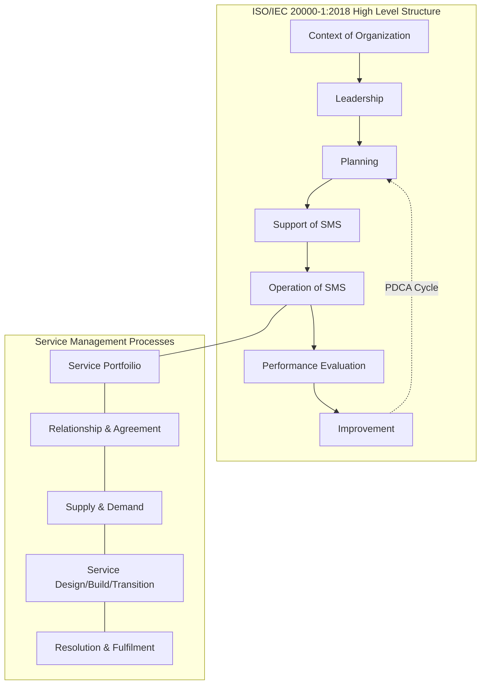

Parent: [[ITSM]]

## 1. [도입: Why] IT 서비스 관리의 국제 표준, ISO/IEC 20000의 개요 및 배경

**가. ISO/IEC 20000의 정의**
- 조직이 고객에게 제공하는 IT 서비스의 품질을 관리하고 개선하기 위한 **최소 요구사항을 정의한 국제 표준(International Standard)**입니다.
- 핵심 키워드: **ITIL 기반**, **PDCA 사이클**, **SMS(Service Management System)**, **적합성 인증**

**나. 등장 배경 및 필요성**
- **글로벌 신뢰성 확보**: IT 서비스 제공자의 역량을 객관적으로 증명하기 위한 제3자 인증 체계가 필요하게 되었습니다.
- **ITIL의 표준화**: Best Practice인 ITIL을 실제 인증 가능한 표준 규격으로 정립하여 서비스 품질의 일관성을 보장합니다.
- **비즈니스 연속성 보장**: 표준화된 프로세스를 통해 운영 리스크를 줄이고, 중단 없는 IT 서비스 제공 환경을 구축하기 위함입니다.

## 2. [핵심: What & How] ISO/IEC 20000의 아키텍처 및 핵심 메커니즘

**가. ISO/IEC 20000 SMS 아키텍처 (HLS 적용)**

**나. 핵심 구성 요소 및 요구사항 (ISO/IEC 20000-1 중심)**

| 구분 | 주요 내용 | 핵심 요구사항 |
| :--- | :--- | :--- |
| **조직 상황 (Context)** | 조직의 내/외부 이슈 파악 및 SMS 범위 설정 | 이해관계자 요구사항, SMS 범위 정의 |
| **리더십 (Leadership)** | 경영진의 의지 및 자원 지원 확약 | 서비스 관리 정책 수립, R&R 할당 |
| **운영 (Operation)** | 실제 IT 서비스 관리 프로세스 수행 | 서비스 설계, 전환, 운영, 문제 해결 |
| **성능 평가 (Evaluation)** | 서비스 품질 및 SMS 효과 측정 | 내부 심사, 경영 검토, 모니터링 |
| **개선 (Improvement)** | 부적합 사항 시정 및 지속적 개선 | 시정 조치, 지속적 개선 활동 |

## 3. [심화: Deep-dive] 주요 개정사항 및 유사 표준 비교

**가. ISO/IEC 20000-1:2011 vs 2018 주요 개정사항**
- **HLS(High Level Structure) 도입**: ISO 9001(품질), ISO 27001(보안) 등 타 표준과 통합 운영이 용이하도록 구조를 통일하였습니다.
- **서비스 라이프사이클 강조**: 단순히 프로세스 나열이 아닌, 서비스의 계획-설계-전환-운영의 흐름을 강화하였습니다.
- **문서화 요구사항 완화**: '문서화된 절차'보다는 '프로세스의 효과적 운영'에 더 중점을 두어 유연성을 확보하였습니다.

**나. ISO/IEC 20000 vs ISO/IEC 27001 비교**

| 구분 | ISO/IEC 20000 | ISO/IEC 27001 |
| :--- | :--- | :--- |
| **주요 목적** | **IT 서비스 품질** 관리 및 향상 | **정보 보안** 및 자산 보호 |
| **핵심 대상** | 서비스 프로세스 (Incident, Change 등) | 정보 자산 및 보안 통제 항목 (Annex A) |
| **상호 관계** | 서비스 가용성 확보를 통한 품질 보장 | 서비스 운영 중 보안 위협 대응 및 기밀성 보장 |
| **시너지** | SMS 운영 중 보안 프로세스 통합 (HLS) | ISMS 인증 범위 내 ITSM 운영 안정성 확보 |

## 4. [결론: Effect & Insight] 기술사적 제언 및 실무 적용 방안

**가. 성공적인 인증 획득 및 유지 전략**
- **Gap Analysis 선행**: 현재 운영 중인 ITSM 프로세스와 표준 요구사항 간의 차이를 사전에 분석하여 개선 과제를 도출해야 합니다.
- **실무 중심의 문서화**: 심사를 위한 문서가 아닌, 실제 운영 부서에서 활용 가능한 **Living Document** 체계를 구축해야 합니다.

**나. 거버넌스 및 보안(Security) 통제 방안**
- **보안 요구사항 내재화**: 서비스 설계 및 전환 단계부터 **Security by Design** 원칙을 적용하여 ISO 27001 수준의 보안 통제 항목을 프로세스에 녹여내야 합니다.
- **공급자 관리 강화**: 아웃소싱 벤더와의 계약(UC)에 ISO 20000 수준의 품질 지표를 명시하고 주기적인 감사를 수행해야 합니다.

**다. 최신 IT 트렌드와의 연계 및 제언**
- **Agile/DevOps 환경에서의 표준 준수**: 고정된 절차보다는 자동화된 파이프라인(CI/CD) 내에서 표준 요구사항이 충족될 수 있도록 **Compliance as Code** 전략이 필요합니다.
- **통합 인증 체계 (IMS)**: 클라우드 환경 확산에 따라 ISO 20000(품질), ISO 27001(보안), ISO 27017/18(클라우드 보안)을 통합하여 관리하는 **Integrated Management System** 구축이 향후 기술사적 대안입니다.

> [!info] 기술사 팁
> ISO/IEC 20000은 단순한 기술 표준이 아니라 **경영 시스템(Management System)**임을 강조해야 합니다. 특히 최근 개정판(2018)의 HLS 구조와 리스크 기반 사고(Risk-based Thinking)를 언급하면 차별화된 답안이 됩니다.

## Related Notes
- [[ITSM]]
- [[ISO27001]]
- [[IT 거버넌스]]
- [[품질관리]]
- [[SLA]]