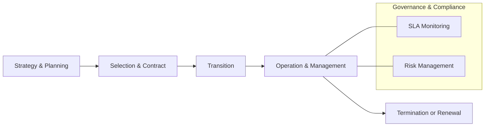

Parent: [[IT 경영전략]]

## 1. [도입: Why] 핵심 역량 집중과 비용 효율화, IT Outsourcing의 개요 및 배경

**가. IT Outsourcing(ITO)의 정의**
- 조직의 비즈니스 가치를 극대화하기 위해 IT 서비스의 기획, 개발, 운영 등 업무의 전부 또는 일부를 **외부 전문 업체(Service Provider)**에 위탁하여 관리하는 경영 전략입니다.
- 핵심 키워드: **핵심 역량(Core Competency)**, **SLA(Service Level Agreement)**, **TCO(Total Cost of Ownership) 절감**

**나. 등장 배경 및 필요성**
- **핵심 역량 집중**: 비핵심 업무인 IT 운영을 외부에 맡기고, 조직은 본연의 비즈니스 전략 및 R&D에 자원을 집중하기 위함입니다.
- **비용 절감 및 가변화**: 고정비 성격의 인건비 및 인프라 유지비를 변동비 형태의 서비스 이용료로 전환하여 재무 유연성을 확보합니다.
- **전문성 및 최신 기술 확보**: 급변하는 IT 트렌드에 대응하기 위해 외부 전문가의 기술력과 최신 인프라를 신속하게 활용합니다.

## 2. [핵심: What & How] IT Outsourcing의 유형 및 추진 라이프사이클

**가. IT Outsourcing 추진 라이프사이클 (Mermaid)**

**나. ITO 운영 모델 및 유형 분류**

| 유형 | 세부 내용 | 장점 | 단점 |
| :--- | :--- | :--- | :--- |
| **Total Outsourcing** | IT 부문 전체를 위탁 (인력, 자산 포함) | 규모의 경제, 관리 단일화 | 벤더 종속(Lock-in), 내부 역량 상실 |
| **Selective Outsourcing** | 특정 기능(인프라, 개발 등)만 선별 위탁 | 유연성 확보, 리스크 분산 | 통합 관리의 어려움, 인터페이스 복잡 |
| **Shared Service** | 그룹 내 IT 자회사를 통한 통합 서비스 | 내부 통제 용이, 보안 강화 | 경쟁력 약화 가능성, 수익성 한계 |
| **Multi-sourcing** | 영역별로 복수의 전문 업체와 계약 | 최상의 기술력 확보, 벤더 경쟁 유도 | 협력사 간 책임 전가(Finger-pointing) |

## 3. [심화: Deep-dive] ITO 성과 관리(SLA/SLM) 및 BPO 비교

**가. ITO 성과 관리의 핵심: SLA와 SLM**
- **SLA (Service Level Agreement)**: 서비스 제공자와 사용자 간에 합의된 서비스 수준에 대한 정량적 계약서입니다. (가용성, 장애 복구 시간 등)
- **SLM (Service Level Management)**: SLA를 기반으로 서비스를 주기적으로 측정, 평가하고 개선하여 합의된 품질을 유지하는 **관리 프로세스**입니다.
- **Penalty & Reward**: 목표 미달성 시 위약금을 부과하고, 초과 달성 시 인센티브를 제공하여 서비스 품질 향상을 유도합니다.

**나. ITO vs BPO (Business Process Outsourcing) 비교**

| 구분 | IT Outsourcing (ITO) | Business Process Outsourcing (BPO) |
| :--- | :--- | :--- |
| **위탁 대상** | IT 인프라, 어플리케이션, 네트워크 | 콜센터, 인사(HR), 회계, 물류 등 비즈니스 프로세스 |
| **핵심 목적** | IT 운영 효율화 및 기술 전문성 확보 | 비즈니스 프로세스 혁신 및 운영 비용 절감 |
| **성격** | 기술 중심 (Technology-oriented) | 기능 중심 (Function-oriented) |
| **SLA 지표** | 시스템 가동률, 장애 처리 속도 | 고객 만족도, 업무 처리 건수, 정확도 |

## 4. [결론: Effect & Insight] 기술사적 제언 및 실무 적용 방안

**가. 실무 도입 시 고려사항 및 리스크 관리**
- **Hidden Cost 주의**: 계약 금액 외에 전환 비용(Transition Cost), 관리 비용(Governance Cost) 등 숨겨진 비용을 철저히 분석해야 합니다.
- **Lock-in 방지 전략**: 특정 벤더에 대한 의존도를 낮추기 위해 표준 기술을 준수하고, 계약 해지 시 지식 자산(Source Code, DB Schema 등)의 이관 의무를 명시해야 합니다.

**나. 거버넌스 및 보안(Security) 통제 방안**
- **정보보호 가이드라인 준수**: 아웃소싱 인력에 대한 물리적/논리적 접근 권한 통제를 강화하고, 정기적인 보안 감사를 수행해야 합니다.
- **Compliance 준수**: 개인정보보호법 등 법적 규제 준수 여부를 계약서에 명시하고 위반 시 책임 소재를 명확히 해야 합니다.

**다. 최신 IT 트렌드와 연계한 발전 방향 (Cloud Sourcing)**
- **From ITO to Cloud Sourcing**: 전통적인 인력 중심의 아웃소싱에서 SaaS, PaaS, IaaS 기반의 **Managed Service**로 패러다임이 변화하고 있습니다.
- **Agile Governance**: 클라우드 환경의 유연성에 맞춰 SLA 지표를 실시간으로 조정하고, 개발과 운영이 통합된 DevOps 환경에 최적화된 거버넌스 체계를 구축해야 합니다.

> [!warning] 기술사적 제언
> 최근의 아웃소싱은 단순 비용 절감을 넘어 **디지털 전환(DX)의 파트너십**으로 진화하고 있습니다. 따라서 단순 갑을 관계를 탈피하여 성과를 공유하는 **Vested Outsourcing** 모델이나 사용자 경험 중심의 **XLA(eXperience Level Agreement)** 도입을 고려해야 합니다.

## Related Notes
- [[SLA]]
- [[ITSM]]
- [[IT 거버넌스]]
- [[클라우드 컴퓨팅]]
- [[BPO]]
- [[Vested Outsourcing]]