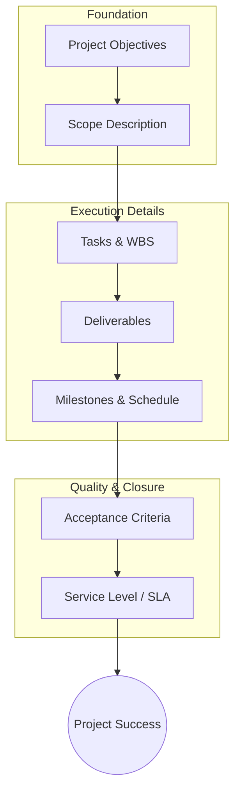

Parent: [[IT_Outsourcing]]

## 1. [도입: Why] 프로젝트 성공의 이정표, SoW의 개요 및 배경

**가. SoW(Statement of Work)의 정의**
- 프로젝트 수행을 위해 필요한 **작업 내용, 인도물, 일정, 품질 요건** 등을 구체적으로 기술하여 발주자와 수주자 간의 합의를 명문화한 문서입니다.
- 핵심 키워드: **작업 범위(Scope)**, **인도물(Deliverables)**, **수락 기준(Acceptance Criteria)**, **계약의 부속서**

**나. 등장 배경 및 필요성**
- **분쟁 방지 및 책임 명확화**: 프로젝트 수행 과정에서 발생할 수 있는 범위 모호성을 제거하고 R&R(Role & Responsibility)을 명확히 정의합니다.
- **범위 확장(Scope Creep) 방지**: 승인되지 않은 작업의 추가를 방지하여 프로젝트의 시간 및 비용 리스크를 관리합니다.
- **성과 측정의 기준**: 프로젝트 종료 시 계약 이행 여부를 판단하는 객관적인 검수 및 수락의 근거로 활용됩니다.

## 2. [핵심: What & How] SoW의 구성 요소 및 작성 메커니즘

**가. SoW의 주요 구성 요소 간 관계도 (Mermaid)**

**나. SoW 핵심 항목 상세 기술 (표)**

| 항목 | 상세 설명 | 주요 포함 내용 |
| :--- | :--- | :--- |
| **목적 (Objectives)** | 프로젝트를 수행해야 하는 비즈니스적 이유 | 기대 효과, 전략적 목표 |
| **작업 범위 (Scope)** | 수행해야 할 작업과 수행하지 않을 작업(Out of Scope) | 경계 정의, 업무 분장 |
| **태스크 (Tasks)** | WBS와 연계된 구체적인 작업 단위 | 분석/설계/개발/테스트 단계별 활동 |
| **인도물 (Deliverables)** | 프로젝트 결과로 제출해야 할 유무형의 산출물 | 문서, 소스코드, 시스템, 매뉴얼 |
| **일정 (Schedule)** | 주요 마일스톤 및 종료 시점 | 착수일, 단계별 종료일, 최종 납기일 |
| **수락 기준 (Acceptance)** | 인도물이 승인되기 위해 충족해야 할 조건 | 검수 절차, 품질 지표, 성능 요건 |

## 3. [심화: Deep-dive] SoW 유형 분석 및 관련 문서 비교

**가. 작성 관점에 따른 SoW 유형**
- **Design/Detail SoW**: 발주자가 수행 방법을 구체적으로 지정하는 방식 (전통적 방식).
- **Level of Effort SoW**: 특정 기간 동안 투입될 인력의 수준을 정의하는 방식 (운영/유지보수 중심).
- **Performance-Based SoW**: 구체적인 방법보다는 달성해야 할 **성과 지표(Outcome)** 중심으로 정의하는 방식 (최근 트렌드).

**나. 유사 문서와의 비교 (RFP vs SoW vs Contract)**

| 구분 | 제안요청서 (RFP) | 작업기술서 (SoW) | 계약서 (Contract) |
| :--- | :--- | :--- | :--- |
| **주체** | 발주자 (Client) | 발주자 + 수주자 합의 | 법무/구매 부서 중심 |
| **시기** | 업체 선정 전 (비딩 단계) | 계약 시점 및 착수 단계 | 최종 합의 및 서명 단계 |
| **성격** | 요구사항의 나열 (What) | 실행 방안의 구체화 (How) | 법적 권리 및 의무 정의 |
| **핵심 내용** | 문제 해결 요구사항 | 구체적 업무 범위 및 산출물 | 지체상금, 손해배상, 소유권 |

## 4. [결론: Effect & Insight] 기술사적 제언 및 실무 적용 방안

**가. 실무 작성 시 고려사항 및 리스크 관리**
- **모호한 표현의 제거**: "충분히", "최선을 다해"와 같은 주관적 형용사를 배제하고, **수치화된 정량적 지표**를 사용해야 합니다.
- **Out of Scope의 명시**: 수행하지 않는 범위를 명확히 함으로써 과도한 요구(Unfunded Mandate)에 대응할 수 있는 방어를 구축해야 합니다.

**나. 거버넌스 및 보안(Security) 통제 방안**
- **변경 통제 프로세스 연계**: SoW 체결 이후의 모든 범위 변경은 **변경 요청서(CR)**를 통해 승인된 경우에만 SoW의 부속서로 업데이트 관리해야 합니다.
- **보안 및 지적재산권**: 산출물의 보안 등급과 결과물에 대한 지적재산권 귀속 주체를 SoW 내에 명확히 명시하여 사후 분쟁을 예방합니다.

**다. 최신 IT 환경에서의 SoW 변화 방향**
- **Agile SoW**: 폭포수 모델과 달리 유연한 범위 조정을 수용하기 위해, 전체 예산 내에서 스프린트 단위로 작업을 구체화하는 **Backlog 기반 SoW** 도입이 확산되고 있습니다.
- **SLA 결합형 SoW**: 단순 인도물 제출을 넘어, 운영 단계의 성능(Performance)과 가용성을 담보하는 SLA 지표를 SoW의 수락 기준과 연계하여 실질적인 비즈니스 가치를 보장해야 합니다.

> [!tip] 기술사적 인사이트
> 기술사 답안에서 SoW는 단순한 문서가 아니라 **'Scope Management의 핵심 도구'**이자 **'Legal & Technical Bridge'**임을 강조하십시오. 특히 최근 클라우드 및 MSA 환경에서의 SoW는 고정된 범위보다 'Service Level'과 'Interface' 정의에 더 집중해야 함을 언급하면 좋습니다.

## Related Notes
- [[IT_Outsourcing]]
- [[SLA]]
- [[프로젝트_범위관리]]
- [[WBS]]
- [[변경관리]]