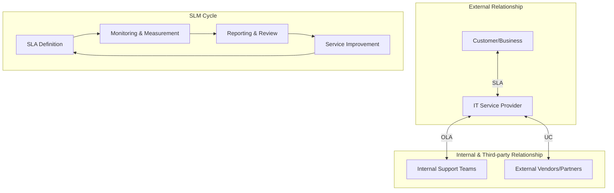

Parent: [[ITSM]]

## 1. [도입: Why] 서비스 품질의 정량적 약속, SLA의 개요 및 배경

**가. SLA(Service Level Agreement)의 정의**
- 서비스 제공자와 사용자 간에 제공될 서비스의 내용, 수준, 책임 등을 **정량적인 지표(KPI)**로 명시하여 체결한 상호 합의서입니다.
- 핵심 키워드: **정량적 지표**, **SLO(Service Level Objective)**, **Penalty & Reward**, **가시성 확보**

**나. 등장 배경 및 필요성**
- **객관적 품질 측정**: 모호한 서비스 수준을 구체적인 수치(가용성, 복구시간 등)로 정의하여 서비스 만족도를 객관화합니다.
- **분쟁 예방 및 책임 명확화**: 장애 발생 시 책임 소재를 명확히 하고, 보상 기준(Credit)을 사전에 정의하여 법적/실무적 분쟁을 방지합니다.
- **지속적 서비스 개선**: 측정되지 않으면 관리될 수 없다는 원칙에 따라, 서비스 수준을 주기적으로 측정하여 개선의 근거로 활용합니다.

## 2. [핵심: What & How] SLA의 구성 요소 및 체계도

**가. SLA/OLA/UC 관계 및 관리 체계도 (Mermaid)**

**나. SLA의 핵심 구성 항목 (표)**

| 항목 | 상세 설명 | 예시 |
| :--- | :--- | :--- |
| **서비스 범위** | 협약 대상이 되는 구체적인 IT 서비스 목록 | ERP 운영, 네트워크 관리, 클라우드 인프라 |
| **SLO (Service Level Objective)** | 서비스 수준에 대한 구체적인 목표 수치 | 시스템 가동률 99.9%, 장애 복구 2시간 이내 |
| **SLI (Service Level Indicator)** | 목표 달성 여부를 측정하기 위한 척도 | MTBF, MTTR, 응답 시간, 가용성 |
| **Penalty & Reward** | 목표 미달성 시 위약금 및 초과 달성 시 인센티브 | 지체상금, 서비스 크레딧 부여, 성과급 |
| **보고 및 검토** | 서비스 수준 측정 결과 보고 주기 및 방법 | 월간 SLM 보고서, 분기별 경영 검토 |

## 3. [심화: Deep-dive] SLA 유사 개념 비교 및 SLM 프로세스

**가. SLA vs OLA vs UC 비교 분석**

| 구분 | SLA (Service Level Agreement) | OLA (Operating Level Agreement) | UC (Underpinning Contract) |
| :--- | :--- | :--- | :--- |
| **대상** | 서비스 제공자 - 외부 고객 | 서비스 제공자 - 내부 지원 조직 | 서비스 제공자 - 외부 협력 업체 |
| **성격** | 비즈니스 관점의 서비스 계약 | 조직 내부의 운영적 합의 | 외부 업체와의 법적 조달 계약 |
| **관계** | 대외적 약속 (Output) | 내부적 조율 (Internal support) | 하부 지탱 (Foundation) |

**나. SLA에서 SLO, SLI의 관계**
- **SLI (지표)**: 무엇을 측정할 것인가? (예: Error Rate)
- **SLO (목표)**: 어느 수준까지 달성할 것인가? (예: Error Rate < 0.1%)
- **SLA (협약)**: SLO를 어기면 어떤 일이 발생하는가? (예: 0.1% 초과 시 비용 환불)

## 4. [결론: Effect & Insight] 기술사적 제언 및 실무 적용 방안

**가. 실무 적용 시 고려사항: Watermelon SLA 극복**
- **문제점**: 기술적 지표(가용성 99.9% 등)는 정상이지만(Green), 사용자는 불만인(Red) 현상이 발생할 수 있습니다.
- **해결책**: 시스템 지표뿐만 아니라 비즈니스 프로세스 가용성과 사용자 만족도 지표를 결합한 **하이브리드 지표** 설계가 필요합니다.

**나. 거버넌스 및 보안(Security) 통제 방안**
- **보안 SLA 명시**: 가용성뿐만 아니라 보안 사고 발생 빈도, 패치 준수율, 보안 취약점 조치 시간 등을 SLA 항목에 포함하여 보안 거버넌스를 강화해야 합니다.
- **데이터 무결성 확보**: SLA 측정 도구(Tool)에 대한 조작 방지 및 감사 로그를 확보하여 측정 결과의 신뢰성을 담보해야 합니다.

**다. 최신 IT 트렌드와 연계한 발전 방향**
- **XLA(eXperience Level Agreement)로의 진화**: IT 중심의 정량 지표에서 사용자 경험과 감정을 측정하는 정성적 지표를 통합한 XLA 도입이 확산되고 있습니다.
- **AI/ML 기반 Predictive SLA**: 과거 데이터를 기반으로 장애를 예측하여 SLA 위반이 발생하기 전 선제적으로 대응하는 **예측형 SLM** 체계 구축이 기술사적 대안입니다.

> [!tip] 기술사적 인사이트
> SLA는 단순한 '위약금 부과용 문서'가 아니라, **'비즈니스와 IT의 소통 도구'**입니다. 답안 작성 시 클라우드 환경에서의 **Service Credit** 방식과 MSA 환경에서의 **Micro-SLA** 개념을 언급하면 최신 트렌드를 반영한 우수 답안이 됩니다.

## Related Notes
- [[ITSM]]
- [[IT_Outsourcing]]
- [[SLM]]
- [[XLA]]
- [[SoW]]