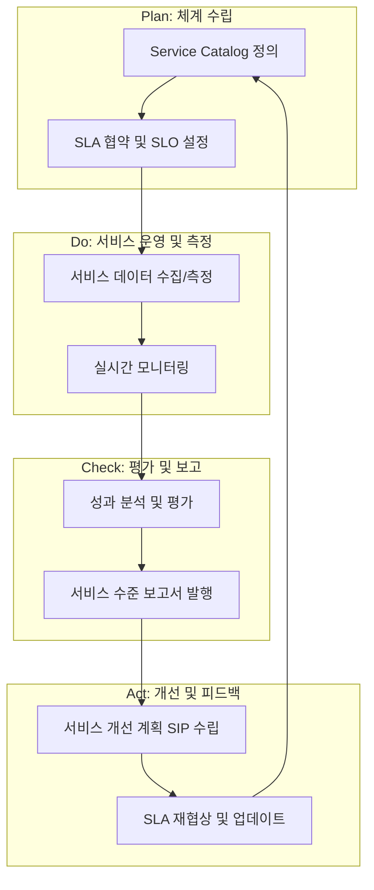

Parent: [[ITSM]]

## 1. [도입: Why] 지속적 서비스 품질 향상의 핵심, SLM의 개요 및 배경

**가. SLM(Service Level Management)의 정의**
- 고객과 합의된 서비스 수준(SLA)을 유지하고, 이를 주기적으로 **측정, 평가, 개선**하여 IT 서비스의 품질을 지속적으로 향상시키는 **관리 프로세스**입니다.
- 핵심 키워드: **PDCA 사이클**, **SLA 준수**, **서비스 개선 계획(SIP)**, **비즈니스 가치 증대**

**나. 등장 배경 및 필요성**
- **SLA의 실효성 확보**: 단순히 계약서(SLA)를 작성하는 것에 그치지 않고, 실제로 약속된 품질이 제공되는지 상시 감시하고 통제할 체계가 필요합니다.
- **IT 투명성 및 가시성 제공**: IT 서비스의 현 수준을 정량적으로 보고함으로써 경영진과 현업 부서에 IT 운영의 성과를 명확히 제시합니다.
- **지속적 개선 문화 정착**: 측정된 지표를 바탕으로 서비스의 약점을 파악하고, 이를 개선하는 선순환 구조(Continuous Improvement)를 확립합니다.

## 2. [핵심: What & How] SLM의 프로세스 아키텍처 및 메커니즘

**가. SLM 운영 라이프사이클 (PDCA 기반)**

**나. SLM의 주요 활동 및 역할 (표)**

| 프로세스 단계 | 주요 활동 내용 | 핵심 산출물 및 지표 |
| :--- | :--- | :--- |
| **체계 수립 (Definition)** | 서비스 카탈로그 작성, 고객 요구사항 분석, SLA 체결 | Service Catalog, SLA/OLA/UC |
| **측정/모니터링 (Monitoring)** | SLI 기반 데이터 수집, 목표 대비 실적 상시 감시 | 성과 데이터, 임계치 알람 |
| **보고 (Reporting)** | 정기적 성과 보고서 작성 및 리뷰 미팅 수행 | 월간/분기 보고서, 대시보드 |
| **개선 (Improvement)** | 미달성 항목 원인 분석, SIP 수립 및 이행 | SIP(Service Improvement Plan) |

## 3. [심화: Deep-dive] SLA와의 관계 및 효과적인 SLM 구축 전략

**가. SLA와 SLM의 관계 분석**

| 구분 | SLA (Agreement) | SLM (Management) |
| :--- | :--- | :--- |
| **성격** | 합의서, 계약서 (Static Document) | 관리 프로세스, 동적 활동 (Dynamic Process) |
| **역할** | 서비스 수준의 '기준' 정의 | 정의된 기준의 '준수 및 향상' 도모 |
| **구성 요소** | 지표(SLI), 목표(SLO), 페널티 등 | 모니터링, 보고, 검토, 개선 활동 |

**나. 효과적인 SLM 구축을 위한 전략 (CSF)**
- **정량적 지표의 객관성**: 측정 도구의 자동화를 통해 데이터 수집의 주관성을 배제하고 신뢰성을 확보해야 합니다.
- **Business Alignment**: IT 지표가 실제 비즈니스 가치(매출 기여도, 업무 중단 손실 등)와 직결되도록 설계해야 합니다.
- **적절한 보상과 제재**: 페널티에만 집중하기보다, 우수 서비스에 대한 리워드를 병행하여 동기 부여를 강화해야 합니다.

## 4. [결론: Effect & Insight] 기술사적 제언 및 실무 적용 방안

**가. 실무 도입 시 고려사항 및 한계 극복**
- **현장 수용성 확보**: SLM이 운영 담당자의 '감시 도구'로 인식되지 않도록, 업무 효율화와 리소스 최적화를 위한 도구임을 명확히 소통해야 합니다.
- **데이터 기반의 의사결정**: 축적된 SLM 데이터를 기반으로 인프라 증설, 기술 부채 해결 등의 투자 우선순위를 결정하는 근거로 활용해야 합니다.

**나. 거버넌스 및 보안(Security) 통제 방안**
- **Audit Trail 확보**: SLM 측정값의 위변조를 방지하기 위해 데이터 수집부터 보고까지의 전 과정에 대한 감사 추적 기능을 강화해야 합니다.
- **보안 지표의 통합**: 가용성 위주의 SLM에서 보안 패치 이행률, 취약점 조치 준수율 등을 통합 관리하는 **Security-aware SLM**으로 확장해야 합니다.

**다. 최신 IT 트렌드와 연계한 발전 방향**
- **Observability 기반의 SLM**: 단순 모니터링을 넘어 시스템 내부 상태를 깊이 있게 파악하는 옵저버빌리티(Observability)를 통해 장애 원인을 선제적으로 진단하고 SLM 지표를 정교화해야 합니다.
- **SRE(Site Reliability Engineering)와의 융합**: Google의 SRE 개념인 **Error Budget**을 SLM에 도입하여, 안정성과 혁신(속도) 사이의 균형을 맞추는 거버넌스 체계를 구축해야 합니다.

> [!tip] 기술사적 인사이트
> SLM은 IT 부서의 성적표가 아니라 **'비즈니스 가치 증명을 위한 프레임워크'**입니다. 답안 작성 시 **SRE의 Error Budget** 개념을 SLM의 현대적 대안으로 제시하거나, **AIOps를 통한 자동화된 SLM**을 언급하면 고득점이 가능합니다.

## Related Notes
- [[ITSM]]
- [[SLA]]
- [[SIP]]
- [[SRE]]
- [[Error_Budget]]
- [[Observability]]