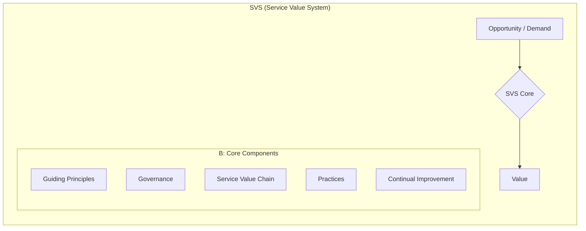

Parent: [[ITSM]]

## 1. [도입: Why] IT 서비스 관리의 사실상 표준(De-facto Standard), ITIL의 개요 및 배경

**가. ITIL(IT Infrastructure Library)의 정의**
- IT 서비스 관리(ITSM)를 위한 가장 널리 공인된 **전 세계적인 베스트 프랙티스(Best Practice) 라이브러리**입니다.
- 핵심 키워드: **베스트 프랙티스**, **서비스 라이프사이클(v3)**, **SVS(Service Value System, v4)**, **비즈니스 가치**

**나. 등장 배경 및 필요성**
- **IT 운영 체계의 표준화**: 1980년대 영국 CCTA가 산재한 IT 관리 기법을 표준화하기 위해 개발하여 전 세계로 확산되었습니다.
- **비즈니스 가치 중심 변화**: IT 인프라 관리 중심에서 고객에게 비즈니스 가치를 전달하는 **'서비스' 중심**으로 패러다임이 전환되었습니다.
- **거버넌스 및 효율성 확보**: 체계적인 프로세스 가이드를 통해 운영 비용을 절감하고 서비스 품질의 일관성을 보장하기 위함입니다.

## 2. [핵심: What & How] ITIL v4의 아키텍처 및 핵심 메커니즘

**가. ITIL v4 서비스 가치 체계 (Service Value System, SVS) (Mermaid)**

**나. ITIL v4의 4차원 모델 (The Four Dimensions)**

| 구분 | 세부 내용 | 주요 고려사항 |
| :--- | :--- | :--- |
| **Organizations & People** | 조직 구조, 문화, 역할 및 책임, 역량 | 공식적 구조, 문화적 가치, 의사소통 |
| **Information & Technology** | 서비스 관리에 필요한 지식 및 정보기술 | 워크플로우 도구, 인프라, 데이터 보안 |
| **Partners & Suppliers** | 서비스의 설계, 구축, 운영에 참여하는 파트너 | 전략적 파트너십, 계약 및 협력 관계 |
| **Value Streams & Processes** | 가치 창출을 위한 활동의 흐름과 프로세스 | 엔드투엔드 워크플로우, 활동 최적화 |

## 3. [심화: Deep-dive] ITIL v3와 v4의 비교 및 SVC 프로세스

**가. ITIL v3 vs ITIL v4 비교 분석**

| 구분 | ITIL v3 (2011) | ITIL v4 (2019) |
| :--- | :--- | :--- |
| **핵심 개념** | **Service Lifecycle** (SS/SD/ST/SO/CSI) | **Service Value System** (SVS) |
| **중점 사항** | 프로세스(Process) 중심 | 실무(Practices) 및 가치(Value) 중심 |
| **유연성** | 상대적으로 경직된 절차 위주 | Agile, DevOps, Lean과의 통합 강조 |
| **비즈니스 관계** | IT-Business Alignment (연계) | **Value Co-creation (가치 공동 창출)** |

**나. 서비스 가치 사슬 (Service Value Chain, SVC)의 주요 활동**
- **Plan**: 비즈니스 목표에 대한 이해 및 방향 설정
- **Improve**: 모든 단계에서의 지속적 개선 활동
- **Engage**: 이해관계자의 요구사항 파악 및 관계 관리
- **Design & Transition**: 새로운 서비스 또는 변경된 서비스의 설계 및 구축
- **Obtain/Build**: 서비스 구성 요소의 확보 및 구축
- **Deliver & Support**: 서비스의 실제 전달 및 운영 지원

## 4. [결론: Effect & Insight] 기술사적 제언 및 실무 적용 방안

**가. 실무 도입 시 성공 전략 (Guiding Principles)**
- **Start Where You Are**: 현재 상태를 객관적으로 진단하고 이미 잘 수행되고 있는 부분은 유지하며 점진적으로 개선해야 합니다.
- **Collaborate and Promote Visibility**: 부서 간 장벽(Silo)을 허물고 협력하며, 모든 작업 과정을 가시화하여 투명성을 확보해야 합니다.

**나. 거버넌스 및 보안(Security) 통제 방안**
- **Information Security Management Practice**: 보안을 별도의 단계가 아닌 서비스 수명주기 전반에 내재화(Embedded)하여 Risk-based 사고를 확립해야 합니다.
- **Internal Control 연계**: ITIL의 변경 관리 및 구성 관리 프로세스를 내부 회계 관리 제도(ITGC) 등의 컴플라이언스 준수 도구로 활용해야 합니다.

**다. 최신 IT 트렌드와의 융합 및 제언**
- **Agile/DevOps와의 조화**: ITIL v4는 경직된 프로세스를 탈피하여 Agile의 반복적 개발과 DevOps의 자동화 기술을 포용하는 **'High-velocity IT'** 환경으로 진화하고 있습니다.
- **가치 공동 창출(Co-creation)**: IT 부서는 더 이상 일방적인 서비스 공급자가 아니라, 비즈니스 파트너로서 가치를 함께 만들어가는 **Business Enabler** 역할을 수행해야 함을 기술사적 제언으로 제시합니다.

> [!tip] 기술사적 인사이트
> ITIL v4의 핵심은 **'가치(Value)'**와 **'공동 창출(Co-creation)'**입니다. 답안 작성 시 기존 v3의 26개 프로세스에 매몰되지 말고, v4의 **7가지 지침 원칙(Guiding Principles)**과 **SVC(Service Value Chain)**를 언급하여 현대적 IT 환경에 적합한 통찰을 보여주십시오.

## Related Notes
- [[ITSM]]
- [[SLA]]
- [[SLM]]
- [[ISO20000]]
- [[DevOps]]
- [[Agile]]
- [[IT거버넌스]]