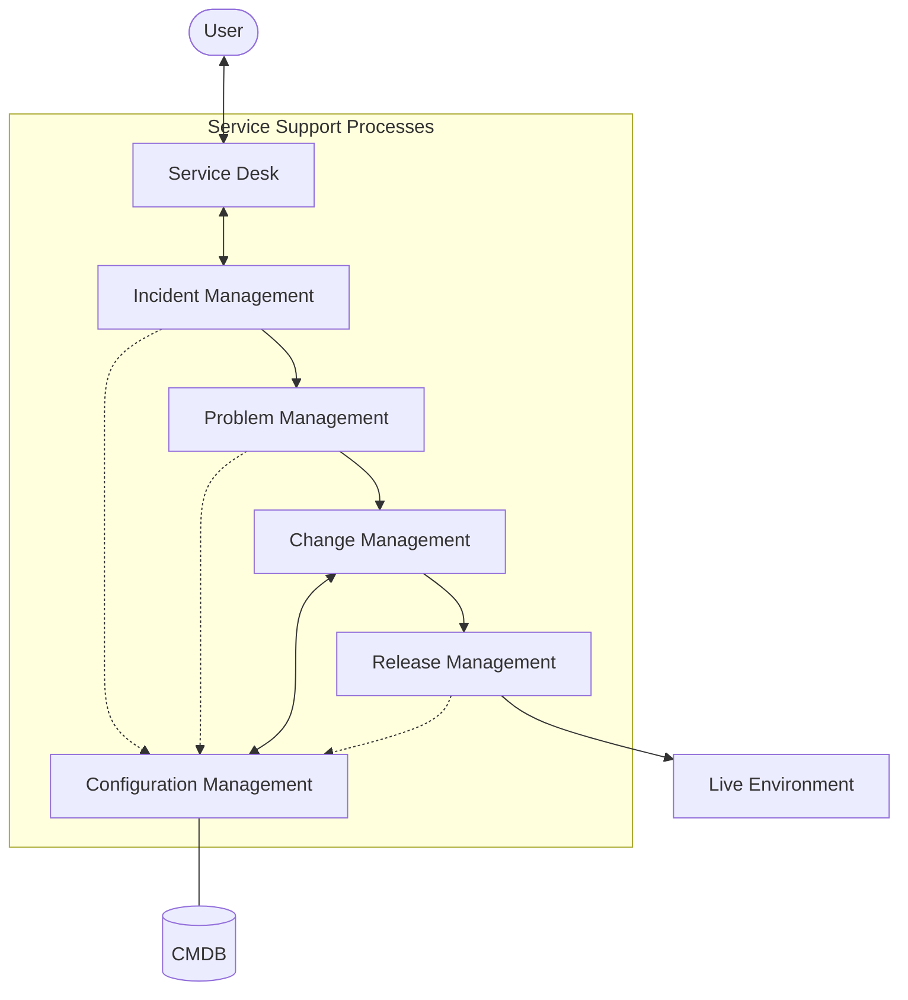

Parent: [[ITSM]], [[ITIL]]

## 1. [도입: Why] 중단 없는 IT 서비스의 보루, Service Support의 개요 및 배경

**가. Service Support(서비스 서포트)의 정의**
- IT 서비스의 안정적 운영을 위해 일상적인 운영 활동을 지원하고, 장애 발생 시 신속한 복구 및 근본 원인을 해결하는 **프로세스 및 기능의 집합**입니다.
- 핵심 키워드: **운영 효율성**, **가용성 보장**, **Service Desk**, **안정적 가치 전달**

**나. 등장 배경 및 필요성**
- **비즈니스 연속성 확보**: IT 서비스 중단이 비즈니스 손실로 직결됨에 따라, 신속한 복구 및 예방적 관리가 필수적이 되었습니다.
- **운영 프로세스의 표준화**: 주먹구구식 운영을 탈피하여 사고-문제-변경-형상-배포로 이어지는 선순환 체계를 구축하기 위함입니다.
- **고객 만족도 제고**: 단일 접점(SPOC)인 서비스 데스크를 통해 사용자의 요구사항을 체계적으로 수렴하고 대응합니다.

## 2. [핵심: What & How] Service Support의 프로세스 아키텍처 및 메커니즘

**가. Service Support 프로세스 연계도 (Mermaid)**

**나. Service Support의 5대 핵심 프로세스 및 기능 (표)**

| 구분 | 주요 목적 | 핵심 활동 및 성과 지표(KPI) |
| :--- | :--- | :--- |
| **Service Desk (기능)** | 사용자 접점(SPOC) 제공 | 요청 접수, 일차 조치, 사용자 만족도 |
| **사고 관리 (Incident)** | 신속한 정상 서비스 복구 | Workaround 제공, MTTR(평균 복구 시간) |
| **문제 관리 (Problem)** | 장애의 근본 원인 제거 | 근본원인 분석(RCA), KEDB(Known Error DB) |
| **변경 관리 (Change)** | 변경에 따른 리스크 최소화 | CAB 운영, 변경 성공률, 무단 변경 통제 |
| **형상 관리 (Configuration)** | IT 자산 및 관계의 가시성 확보 | CMDB 구축, CI(Configuration Item) 관리 |
| **릴리스 관리 (Release)** | 안전한 실제 환경 반영 및 배포 | 버전 관리, 배포 계획 수립, 백백 플랜 |

## 3. [심화: Deep-dive] Service Support와 Service Delivery의 비교 분석

**가. Service Support vs Service Delivery (ITIL v2 핵심 영역)**

| 구분 | Service Support (전술적/운영적) | Service Delivery (전략적/전술적) |
| :--- | :--- | :--- |
| **관점** | 서비스 **운영 및 지원** (Daily) | 서비스 **기획 및 관리** (Planning) |
| **주요 대상** | 사용자 (Users) | 고객/비즈니스 (Customers) |
| **핵심 활동** | 장애 복구, 원인 분석, 변경 통제 | 수준 협약(SLA), 용량 관리, 가용성 관리 |
| **시간적 범위** | 현재, 단기적 (Reactive) | 미래, 중장기적 (Proactive) |

**나. 프로세스 간 상호 작용 메커니즘**
- **IM ↔ PM**: 사고(Incident)의 빈도가 높거나 중대한 경우 문제(Problem)로 이관하여 근본 해결을 도모합니다.
- **PM ↔ CM**: 문제 해결을 위한 패치나 시스템 수정은 변경(Change) 관리의 승인을 거쳐 수행됩니다.
- **CM ↔ CF**: 모든 변경 사항은 형상(Configuration) 정보에 실시간으로 반영되어 CMDB의 무결성을 유지합니다.

## 4. [결론: Effect & Insight] 기술사적 제언 및 실무 적용 방안

**가. 실무 도입 시 고려사항: 사일로(Silo) 현상 극복**
- **통합 ITSM 도구 활용**: 프로세스 간 데이터가 단절되지 않도록 통합 솔루션을 도입하여 데이터의 흐름(Traceability)을 확보해야 합니다.
- **R&R 및 협업 문화**: 사고 대응팀과 문제 분석팀 간의 긴밀한 협력을 위한 성과 지표(Shared KPI) 설계가 필요합니다.

**나. 거버넌스 및 보안(Security) 통제 방안**
- **변경 관리와 보안의 결합**: 모든 변경 요청 시 보안성 검토를 필수 항목으로 포함하고, CMDB를 통해 취약점 발생 시 영향도 분석(Impact Analysis)을 즉시 수행해야 합니다.
- **비인가 형상 변경 탐지**: 실제 인프라 상태와 CMDB 정보 간의 차이를 주기적으로 대조(Verification & Audit)하여 섀도우 IT를 통제해야 합니다.

**다. 최신 IT 트렌드와의 융합 및 발전 방향**
- **AIOps 기반의 Intelligent Support**: 수많은 로그와 사고 데이터를 AI로 분석하여 장애를 사전에 예측하고 자동 복구(Self-healing)하는 체계로 진화해야 합니다.
- **SRE(Site Reliability Engineering) 도입**: 운영(Ops)의 자동화와 개발(Dev) 역량을 결합하여 '수동 작업(Toil)'을 최소화하고 시스템 안정성을 엔지니어링 관점에서 접근해야 합니다.

> [!tip] 기술사적 인사이트
> Service Support는 ITIL의 뿌리와 같은 영역입니다. 답안 작성 시 단순한 장애 처리가 아니라, **'안정적 가치 전달을 위한 기반(Foundation)'**임을 강조하십시오. 특히 **Shift-Left**(개발 단계에서 운영 요건 미리 반영)와 **Self-Service**(Chatbot 등을 통한 자동화) 개념을 추가하면 좋은 점수를 얻을 수 있습니다.

## Related Notes
- [[ITSM]]
- [[ITIL]]
- [[Service_Delivery]]
- [[SRE]]
- [[AIOps]]
- [[CMDB]]