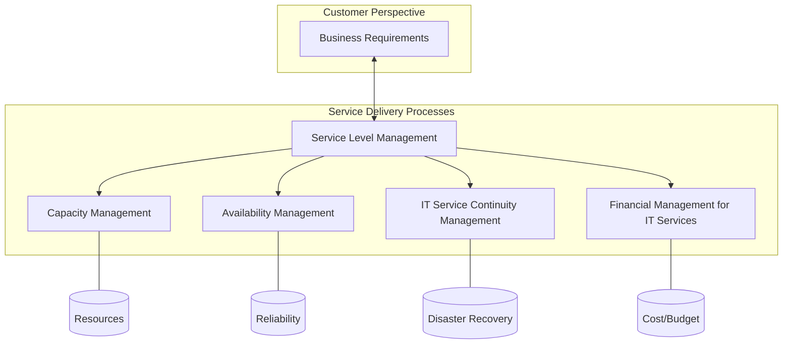

Parent: [[ITSM]], [[ITIL]]

## 1. [도입: Why] 비즈니스 가치 보장과 전략적 IT 관리, Service Delivery의 개요 및 배경

**가. Service Delivery(서비스 딜리버리)의 정의**
- 고객의 비즈니스 요구사항을 충족시키기 위해 IT 서비스의 품질을 기획, 설계 및 관리하여 **중장기적인 가치를 전달**하는 프로세스 집합입니다.
- 핵심 키워드: **SLA(서비스 수준 협약)**, **전략적 기획**, **품질 최적화**, **TCO 관리**

**나. 등장 배경 및 필요성**
- **IT와 비즈니스의 얼라인먼트**: IT가 단순 운영을 넘어 비즈니스 목표 달성을 위한 핵심 파트너로 역할이 변화함에 따라 전략적 관리가 중요해졌습니다.
- **예방적(Proactive) 관리 체계**: 장애 발생 후 조치하는 것이 아니라, 가용성 및 용량을 사전에 예측하여 서비스 중단을 예방하기 위함입니다.
- **비용 효율성 및 투명성**: IT 서비스 비용을 산출하고 비즈니스 가치와 연계하여 IT 투자의 정당성을 확보합니다.

## 2. [핵심: What & How] Service Delivery의 프로세스 아키텍처 및 메커니즘

**가. Service Delivery 프로세스 연계도 (Mermaid)**

**나. Service Delivery의 5대 핵심 프로세스 (표)**

| 구분 | 주요 목적 | 핵심 활동 및 관리 지표 |
| :--- | :--- | :--- |
| **서비스 수준 관리 (SLM)** | 고객과 합의된 품질 유지 및 개선 | SLA/OLA/UC 체결, 서비스 수준 보고 |
| **용량 관리 (Capacity)** | 리소스 최적화 및 미래 수요 예측 | 성과 관리, 수요 예측, 용량 계획 수립 |
| **가용성 관리 (Availability)** | 중단 없는 서비스 제공 능력 확보 | 가용성 측정(MTBF), 신뢰성/유지보수성 향상 |
| **IT 서비스 연속성 관리 (ITSCM)** | 재난 시 핵심 서비스 복구 보장 | BIA(영향분석), DR(재해복구) 계획 및 훈련 |
| **IT 서비스 재무 관리 (Financial)** | IT 서비스의 비용 대비 효과 극대화 | 예산 편성, 회계 관리, 과금(Charging) |

## 3. [심화: Deep-dive] Service Support와의 비교 및 프로세스 간 시너지

**가. Service Delivery vs Service Support 비교**

| 구분 | Service Delivery (전략적/전술적) | Service Support (전술적/운영적) |
| :--- | :--- | :--- |
| **초점** | **무엇을(What)** 제공할 것인가? | **어떻게(How)** 지원할 것인가? |
| **시간적 범위** | 중장기적, 예방적 (Proactive) | 단기적, 대응적 (Reactive) |
| **주요 산출물** | SLA, 가용성 계획, 용량 계획 | 사고 보고서, 변경 이력, CMDB |
| **주요 관계자** | 비즈니스 매니저, 고객 (Customers) | 사용자 (End-users) |

**나. 프로세스 간 상호 작용 및 시너지**
- **SLM ↔ Capacity/Availability**: SLM에서 정의된 목표 품질을 달성하기 위해 용량과 가용성 프로세스에서 필요한 자원과 기술적 요건을 설계합니다.
- **Financial ↔ All**: 모든 프로세스 활동에 수반되는 비용을 산정하여 IT 서비스의 경제적 타당성을 검증합니다.
- **ITSCM ↔ Availability**: 평시 가용성 관리를 기반으로 비상시 복구 전략(ITSCM)을 수립하여 서비스의 총체적 복원력(Resilience)을 확보합니다.

## 4. [결론: Effect & Insight] 기술사적 제언 및 실무 적용 방안

**가. 실무 도입 시 고려사항: 리스크 기반의 자원 배분**
- **중요도에 따른 차등화**: 모든 서비스에 동일한 수준의 가용성과 용량을 할당하는 것은 비효율적이므로, 비즈니스 영향 분석(BIA)을 통해 핵심 서비스에 자원을 집중해야 합니다.
- **가시성 확보**: SLM 대시보드를 통해 서비스 지표를 실시간으로 시각화하여 비즈니스 부서와의 소통을 강화해야 합니다.

**나. 거버넌스 및 보안(Security) 통제 방안**
- **Security-embedded Delivery**: 가용성 및 연속성 관리 설계 시 보안 사고(DDoS, 랜섬웨어 등) 시나리오를 포함하여 **회복력(Resilience)** 관점에서 보안을 통합해야 합니다.
- **컴플라이언스 준수**: 금융, 의료 등 산업별 규제(DR 구축 의무 등)를 ITSCM 프로세스에 반영하여 법적 리스크를 통제해야 합니다.

**다. 최신 IT 트렌드와의 융합 및 발전 방향**
- **Cloud-native Service Delivery**: 클라우드의 Auto-scaling 기능을 활용한 실시간 용량 관리와 Multi-AZ 배치를 통한 고가용성 설계로 패러다임이 전환되고 있습니다.
- **FinOps와의 결합**: 클라우드 비용 최적화(FinOps) 체계를 IT 재무 관리 프로세스에 통합하여, 가변적인 클라우드 비용을 투명하게 관리하고 최적화해야 합니다.

> [!tip] 기술사적 인사이트
> Service Delivery는 IT가 비즈니스에 제공하는 **'약속'**입니다. 답안 작성 시 단순한 지표 관리를 넘어 **'비즈니스 가치 실현'**과 **'비용 효율성'** 사이의 균형(Balance)을 강조하십시오. 특히 최근 클라우드 환경에서의 **FinOps**와 **SRE의 가용성 모델**을 언급하면 매우 전문적인 답안이 됩니다.

## Related Notes
- [[ITSM]]
- [[ITIL]]
- [[Service_Support]]
- [[SLA]]
- [[SLM]]
- [[FinOps]]
- [[BCP_DRP]]