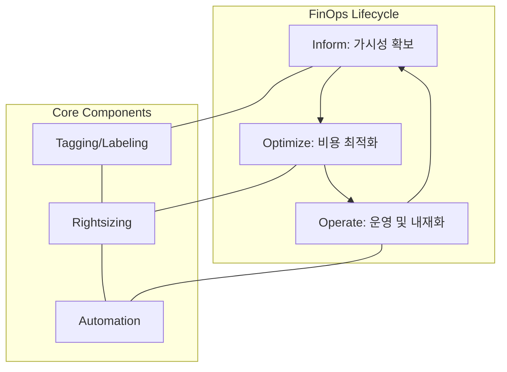

Parent: [[IT 경영전략]], [[클라우드 컴퓨팅]]

## 1. [도입: Why] 클라우드 비용 효율화의 새로운 패러다임, FinOps의 개요 및 배경

**가. FinOps(Cloud Financial Management)의 정의**
- 클라우드 소비 모델에서 가시성을 확보하고 비즈니스 가치를 극대화하기 위해 재무, IT, 비즈니스가 협업하는 **문화적 관행이자 운영 모델**입니다.
- 핵심 키워드: **Finance + DevOps**, **가시성(Inform)**, **최적화(Optimize)**, **운영(Operate)**, **Unit Economics**

**나. 등장 배경 및 필요성**
- **클라우드 비용의 불확실성**: 고정비(CapEx)에서 가변비(OpEx)로의 전환에 따른 예산 초과 및 비용 예측의 어려움이 증대되었습니다.
- **클라우드 낭비(Cloud Waste)**: 사용하지 않는 리소스나 과도한 프로비저닝으로 인한 비용 낭비(평균 30% 이상)를 차단할 필요가 있습니다.
- **분산된 의사결정**: 엔지니어가 비용에 직결되는 리소스를 직접 생성함에 따라, 개발 단계부터 비용 인식을 내재화하는 거버넌스가 절실해졌습니다.

## 2. [핵심: What & How] FinOps의 아키텍처 및 핵심 메커니즘

**가. FinOps 라이프사이클 (Mermaid)**

**나. FinOps의 3단계 주요 활동 (표)**

| 단계 | 주요 활동 내용 | 핵심 산출물 및 지표 |
| :--- | :--- | :--- |
| **Inform** (알림) | 비용 가시성 확보, 태깅(Tagging) 체계 수립, 정확한 비용 할당(Allocation) | 정기 비용 보고서, 예산 대비 실적, 태그 준수율 |
| **Optimize** (최적화) | 사용량 최적화(Rightsizing), 구매 최적화(RI/SP), 유휴 자원 제거 | 비용 절감 잠재액, 예약 인스턴스(RI) 커버리지 |
| **Operate** (운영) | 거버넌스 수립, 비용 인식 문화 확산, 자동화 정책 적용 | 비즈니스 단위별 Unit Cost, 자동화된 비용 알람 |

## 3. [심화: Deep-dive] FinOps 핵심 원칙 및 기존 재무 관리와의 비교

**가. FinOps의 6대 핵심 원칙 (Principles)**
1. **협업(Collaboration)**: 팀 간 실시간 협력을 통한 의사결정
2. **소유권(Ownership)**: 모든 팀이 자신의 클라우드 사용량과 비용에 책임을 짐
3. **FinOps 팀(Centralized Team)**: 중앙 집중화된 팀이 FinOps 관행을 주도
4. **리포팅(Reporting)**: 접근 가능하고 시의적절한 데이터 제공
5. **가치 중심(Value-driven)**: 클라우드의 가변적인 비용을 비즈니스 가치와 연계
6. **비용 절감(Cost Reduction)**: 클라우드의 가변적인 비용 모델을 활용하여 이점 극대화

**나. 전통적 IT 재무 관리 vs FinOps 비교**

| 구분 | 전통적 IT 재무 관리 (TBM) | FinOps (Cloud Financial Mgmt) |
| :--- | :--- | :--- |
| **비용 성격** | 자본 지출 (CapEx), 고정 비용 | 운영 지출 (OpEx), 가변 비용 |
| **주기** | 연 단위, 분기 단위 계획 | 실시간 모니터링 및 즉각적 대응 |
| **의사결정 주체** | 구매 부서, 재무 팀 (Top-down) | 개발자, 엔지니어, 사업 부서 (Distributed) |
| **핵심 지표** | 예산 준수율, ROI | **Unit Economics** (예: 트랜잭션당 비용) |

## 4. [결론: Effect & Insight] 기술사적 제언 및 실무 적용 방안

**가. 실무 도입 시 고려사항: 기술보다 문화가 우선**
- **태깅 거버넌스(Tagging Governance)**: 모든 리소스에 소속 팀, 프로젝트, 서비스 명을 강제로 태깅하도록 정책화하여 비용 추적성(Traceability)을 확보해야 합니다.
- **Unit Economics 도입**: 단순 총액 관리가 아닌 "사용자당 비용", "주문당 클라우드 비용" 등 비즈니스 성과와 연계된 지표를 발굴하여 효율성을 측정해야 합니다.

**나. 거버넌스 및 보안(Security) 통제 방안**
- **비용 이상 탐지(Anomaly Detection)**: 보안 사고(예: 자격증명 탈취를 통한 채굴 노드 생성)로 인한 비용 급증을 실시간으로 감지하는 보안-비용 통합 모니터링 체계를 구축해야 합니다.
- **자동화된 통제(Guardrails)**: 특정 예산을 초과하거나 승인되지 않은 고성능 리소스 생성 시 자동 차단 또는 알림을 보내는 정책(Policy as Code)을 적용해야 합니다.

**다. 최신 IT 트렌드와의 융합 및 제언**
- **AIOps 기반 최적화**: ML 알고리즘을 활용하여 미래의 사용량을 예측하고, 자동으로 RI/SP 구매 전략을 제안하거나 리소스 크기를 조정하는 지능형 FinOps로 진화하고 있습니다.
- **GreenOps로의 확장**: 클라우드 비용 최적화가 곧 에너지 소비 절감과 탄소 배출 저감으로 이어지므로, ESG 경영과 연계된 **지속 가능한 IT 운영** 전략으로 승화시켜야 합니다.

> [!tip] 기술사적 인사이트
> FinOps는 단순히 '돈을 아끼는 기술'이 아니라 **'클라우드에서 더 많은 비즈니스 가치를 얻는 방식'**입니다. 답안 작성 시 **Unit Economics**와 **Policy as Code**를 통한 자동화 거버넌스를 강조하고, 최근 트렌드인 **ESG(GreenOps)**와의 연결 고리를 언급하면 고득점이 가능합니다.

## Related Notes
- [[클라우드 컴퓨팅]]
- [[DevOps]]
- [[IT 서비스 재무 관리]]
- [[Unit Economics]]
- [[GreenOps]]
- [[ESG 경영]]