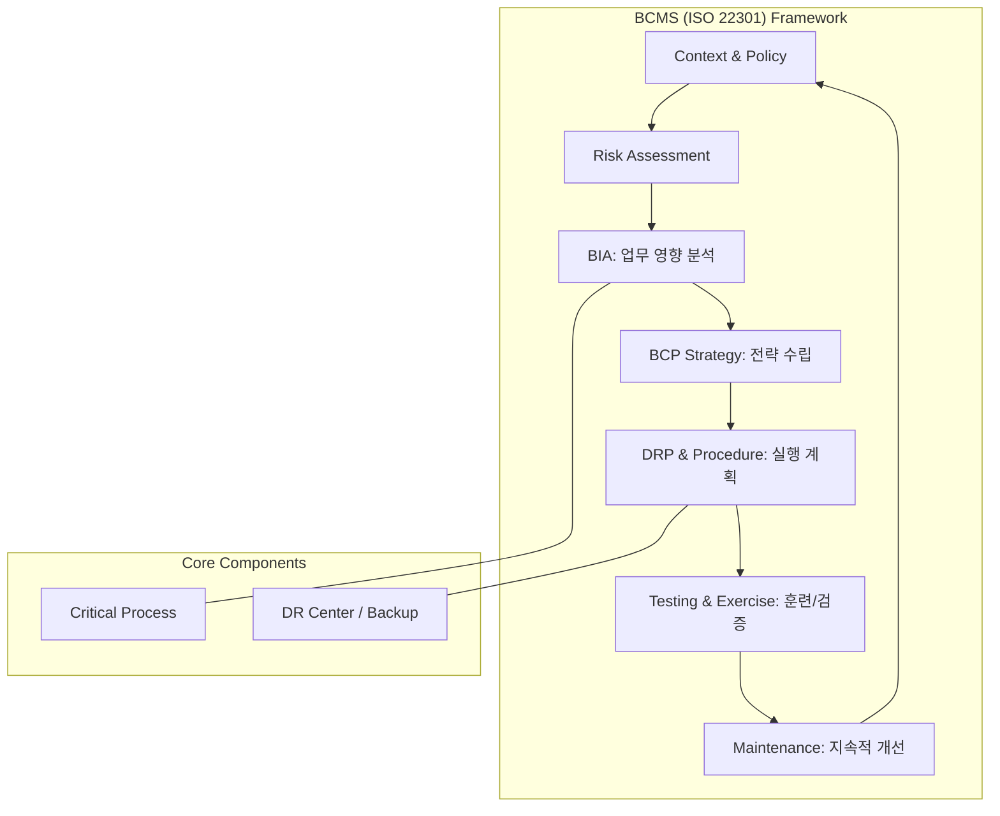

Parent: [[IT 경영전략]], [[Service_Delivery]]

## 1. [도입: Why] 재난 시 비즈니스 생존의 설계도, BCP의 개요 및 배경

**가. BCP(Business Continuity Planning)의 정의**
- 재난, 재해 등 비상 상황 발생 시 기업의 핵심 업무 프로세스를 중단 없이 유지하거나, 목표 시간 내에 복구하여 **비즈니스 연속성을 보장**하기 위한 포괄적인 관리 체계입니다.
- 핵심 키워드: **BIA(Business Impact Analysis)**, **DRP(Disaster Recovery Plan)**, **ISO 22301**, **Resilience**

**나. 등장 배경 및 필요성**
- **비즈니스 가용성 요구 증대**: 24/365 서비스가 보편화되면서 단시간의 중단도 막대한 금전적 손실과 브랜드 가치 하락으로 연결됩니다.
- **예측 불가능한 리스크 증가**: 테러, 지진 등 자연재해뿐만 아니라 랜섬웨어, 공급망 중단 등 현대적 위협에 대한 대응력이 필수가 되었습니다.
- **컴플라이언스 강화**: 금융, 공공 등 주요 산업군에서 재해복구 체계 구축을 법적으로 의무화(바젤 III, 전자금융감독규정 등)하고 있습니다.

## 2. [핵심: What & How] BCP의 구성 요소 및 추진 프레임워크

**가. BCP 라이프사이클 및 구성 (Mermaid)**

**나. BCP의 4대 핵심 구성 요소 (표)**

| 구분 | 주요 내용 | 핵심 활동 및 지표 |
| :--- | :--- | :--- |
| **BIA** (업무 영향 분석) | 재해 시 업무 중단에 따른 손실 측정 및 우선순위 결정 | **RTO, RPO, MTPD** 산출 |
| **DRP** (재해 복구 계획) | IT 시스템 및 인프라 복구를 위한 기술적 절차서 | 복구 시나리오, 하드웨어/네트워크 복구 |
| **DR Center** (복구 센터) | 주 센터 재해 시 서비스를 이관하여 운영할 백업 거점 | Mirror, Hot, Warm, Cold Site |
| **Organization** (조직) | 비상 대책 위원회(ERT) 및 복구 실행 팀 구성 | 비상 연락망, 지휘 통제 체계(Command Center) |

## 3. [심화: Deep-dive] 복구 목표 지표(RTO/RPO) 및 DR 센터 유형 비교

**가. 핵심 복구 지표: RTO와 RPO**
- **RTO (Recovery Time Objective, 복구 목표 시간)**: 업무 중단 시점부터 복구되어 정상 가동될 때까지의 **시간** (얼마나 빨리 복구할 것인가?)
- **RPO (Recovery Point Objective, 복구 목표 시점)**: 재해 시 허용 가능한 **데이터 손실량** (어느 시점 데이터로 복구할 것인가?)
- **MTPD (Maximum Tolerable Period of Disruption)**: 비즈니스가 생존 가능한 최대 허용 중단 시간 (RTO는 MTPD보다 작아야 함)

**나. DR 백업 센터 구축 유형 비교**

| 유형 | 데이터 동기화 방식 | 복구 시간 (RTO) | 장단점 |
| :--- | :--- | :--- | :--- |
| **Mirror Site** | 실시간 동기화 (Active-Active) | **즉시 (Zero)** | 높은 가용성 / 가장 높은 비용, 거리 제약 |
| **Hot Site** | 실시간 동기화 (Active-Standby) | **수 시간 이내** | 빠른 복구 / 높은 유지비용 |
| **Warm Site** | 주기적 동기화 (Batch/Log) | **수 일 이내** | 경제성 / 데이터 손실 발생 가능성 |
| **Cold Site** | 데이터만 보관 (Tape/Backup) | **수 주 이내** | 최저 비용 / 복구 신뢰성 낮음, 초기 가동 지연 |

## 4. [결론: Effect & Insight] 기술사적 제언 및 실무 적용 방안

**가. 실무 도입 시 고려사항: 실전적 훈련의 중요성**
- **Paper Plan 탈피**: 아무리 완벽한 문서라도 훈련되지 않으면 무용지물입니다. 불시 훈련과 모의 시나리오 테스트를 통해 숙련도를 높여야 합니다.
- **SLA와의 연계**: BCP의 복구 목표(RTO/RPO)를 고객과의 서비스 수준 협약(SLA)에 반영하여 대외적 신뢰도를 확보해야 합니다.

**나. 거버넌스 및 보안(Security) 통제 방안**
- **Cyber Resilience 강화**: 전통적 재해뿐만 아니라 '랜섬웨어'에 대응하기 위해 수정 불가능한 백업(Immutable Backup)과 에어갭(Air-gap) 기술을 DRP에 포함해야 합니다.
- **대체 사업장 보안**: DR 센터 가동 시에도 본사 수준의 물리적/논리적 보안 통제가 유지되도록 보안 가이드라인을 사전 수립해야 합니다.

**다. 최신 IT 트렌드와 연계한 발전 방향**
- **Cloud DR (DRasS)**: 고가의 물리 센터를 직접 구축하는 대신 클라우드의 유연성을 활용한 **DR as a Service**를 도입하여 비용 효율성과 지리적 분산 효과를 극대화해야 합니다.
- **Chaos Engineering 도입**: 시스템에 인위적으로 장애를 주입하여 복원력을 검증하는 카오스 엔지니어링 기법을 활용, 상시적인 비즈니스 연속성을 확보하는 **'안정적 서비스 운영(SRE)'** 관점으로 진화해야 합니다.

> [!tip] 기술사적 인사이트
> BCP는 '만약의 사태'에 대비한 보험이 아니라, 현대 기업의 **'핵심 생존 전략'**입니다. 답안 작성 시 기술적인 DRP에만 치중하지 말고, **BIA를 통한 비즈니스 가치 우선순위 결정**과 **문화적 내재화(훈련)**를 강조하십시오. 또한 클라우드 환경에서의 **Multi-Region 배포**를 현대적 BCP의 대안으로 제시하면 좋습니다.

## Related Notes
- [[DRP]]
- [[BIA]]
- [[ISO22301]]
- [[SRE]]
- [[클라우드_컴퓨팅]]
- [[Cyber_Resilience]]