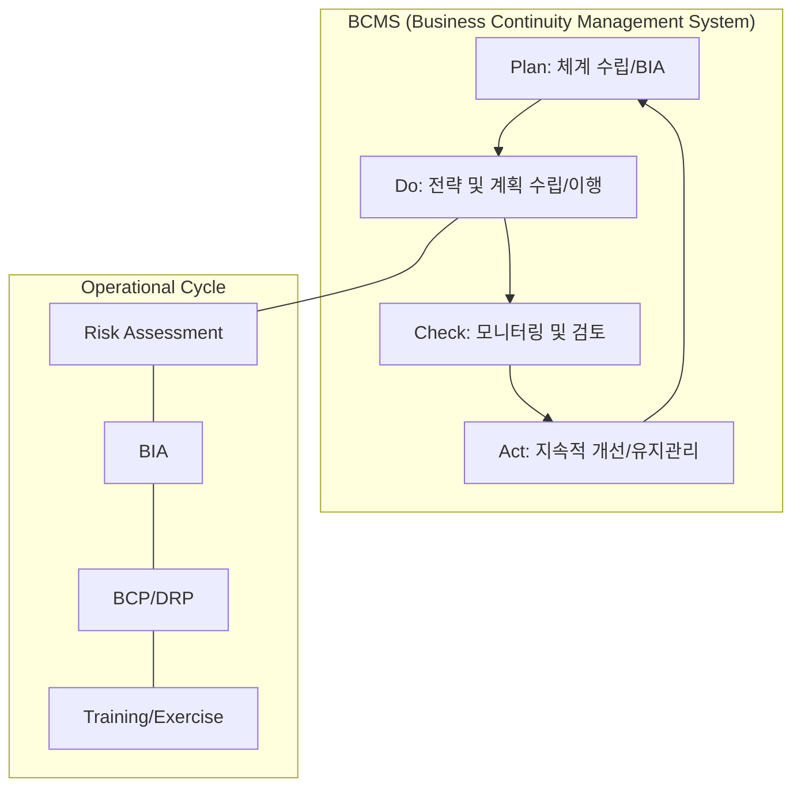

Parent: [[IT 경영전략]], [[BCP]]

## 1. [도입: Why] 전사적 위기 대응 및 복원력 확보, BCM의 개요 및 배경

**가. BCM(Business Continuity Management)의 정의**
- 조직에 잠재적인 위협과 그 위협이 실제 발생할 경우 비즈니스 운영에 미치는 영향을 파악하고, 조직의 **회복력(Resilience)**과 효과적인 대응 능력을 구축하는 **종합적인 관리 프로세스**입니다.
- 핵심 키워드: **관리 체계(System)**, **전사적 참여**, **ISO 22301**, **Resilience**

**나. 등장 배경 및 필요성**
- **단순 복구를 넘어선 관리 체계 필요**: 기술적인 복구(DRP)나 계획(BCP)에 그치지 않고, 이를 지속적으로 운영, 검토, 개선하는 **경영 시스템**으로서의 접근이 요구되었습니다.
- **예측 불가능한 중단(Disruption)의 일상화**: 사이버 공격, 공급망 붕괴 등 현대적 위협에 대해 조직이 상시 대응할 수 있는 역량(Capability) 확보가 필수적입니다.
- **글로벌 표준 준수(Compliance)**: 국제 표준인 **ISO 22301** 인증을 통해 대외적인 비즈니스 신뢰성을 확보하고 투자를 보호합니다.

## 2. [핵심: What & How] BCM의 아키텍처 및 핵심 메커니즘

**가. BCM 라이프사이클 (ISO 22301 PDCA 기반) (Mermaid)**

**나. BCM의 5대 핵심 성공 요소 (CSF) (표)**

| 구분 | 주요 내용 | 핵심 역할 |
| :--- | :--- | :--- |
| **정책 및 거버넌스** | 전사적 BCM 정책 수립 및 자원 할당 | 경영진의 의지 표명, R&R 설정 |
| **비즈니스 영향 분석 (BIA)** | 핵심 업무 식별 및 복구 우선순위 결정 | RTO, RPO, MTPD 산출 |
| **위험 평가 (RA)** | 잠재적 위협 분석 및 취약점 평가 | 시나리오 기반 리스크 식별 |
| **대응 및 복구 전략** | 대체 사업장 확보 및 인력 운용 계획 | BCP 및 DRP 수립 |
| **테스트 및 교육** | 정기적인 모의 훈련 및 전사 교육 | 실효성 검증 및 숙련도 향상 |

## 3. [심화: Deep-dive] BCM, BCP, DRP의 관계 및 ISO 22301 개요

**가. BCM vs BCP vs DRP 비교 분석**

| 구분 | BCM (Management) | BCP (Planning) | DRP (Disaster Recovery) |
| :--- | :--- | :--- | :--- |
| **범위** | **전사적** 경영 시스템 (Process) | **비즈니스** 연속성 확보 (Plan) | **IT 인프라/시스템** 복구 (Technical) |
| **성격** | 관리 체계 및 거버넌스 | 시나리오별 대응 절차 | 기술적 복구 매뉴얼 |
| **핵심 활동** | PDCA 순환 및 지속적 개선 | 업무 가동 및 대체 인력 확보 | 데이터 백업 및 시스템 재가동 |
| **상위 관계** | BCM ∋ (BCP + DRP) | BCP ∋ DRP | BCP의 하부 실행 요소 |

**나. ISO 22301 (BCMS 국제 표준)의 주요 요구사항**
- **Clause 4-6**: 조직 상황 파악, 리더십, 기획 (전략 수립)
- **Clause 7**: 지원 (자원, 역량 확보)
- **Clause 8**: 운영 (BIA, 위협 평가, BCP 수립 및 훈련)
- **Clause 9-10**: 성능 평가 및 개선 (내부 심사, 경영 검토)

## 4. [결론: Effect & Insight] 기술사적 제언 및 실무 적용 방안

**가. 실무 도입 시 고려사항: '살아있는 시스템' 구축**
- **문화적 내재화**: BCM은 특정 부서의 업무가 아닌 전 직원이 숙지해야 할 **조직 문화**로 정착되어야 합니다.
- **주기적 시나리오 고도화**: 과거의 재해 패턴에 안주하지 않고, **Deepfake를 활용한 사회공학적 공격**이나 **클라우드 리전 장애** 등 새로운 위협 시나리오를 지속적으로 반영해야 합니다.

**나. 거버넌스 및 보안(Security) 통제 방안**
- **사이버 복원력(Cyber Resilience)과의 통합**: 보안 사고 대응(IR)과 BCM을 연계하여, 침해 사고 발생 시 신속한 탐지와 격리, 그리고 비즈니스 복구가 유기적으로 이루어지는 통합 거버넌스를 구축해야 합니다.
- **데이터 주권 및 법적 규제 대응**: 국가별 데이터 보관 규정을 고려하여 DR 센터 위치를 선정하고 법적 컴플라이언스를 충족해야 합니다.

**다. 최신 IT 트렌드와 연계한 발전 방향**
- **Resilience as Code**: 인프라 자동화 기술(IaC)을 활용하여 재해 시 코드 기반으로 복구 환경을 즉시 프로비저닝하는 **'자동화된 BCM'**으로 진화해야 합니다.
- **공급망 BCM (Supply Chain BCM)**: 자사뿐만 아니라 핵심 협력사 및 클라우드 제공자(CSP)의 BCM 체계까지 점검하고 관리하는 **생태계 중심의 연속성 확보**가 필수적입니다.

> [!info] 기술사적 제언
> BCM은 단순한 보험이 아니라 **'기업 가치 보호'**와 **'사회적 책임'**의 완수입니다. 답안 작성 시 BCP/DRP와의 차별점을 명확히 하고, **ISO 22301 기반의 체계적 관리**와 **사이버 복원력(Cyber Resilience)**의 결합을 강조하면 고득점이 가능합니다.

## Related Notes
- [[BCP]]
- [[DRP]]
- [[BIA]]
- [[ISO22301]]
- [[Cyber_Resilience]]
- [[IT거버넌스]]