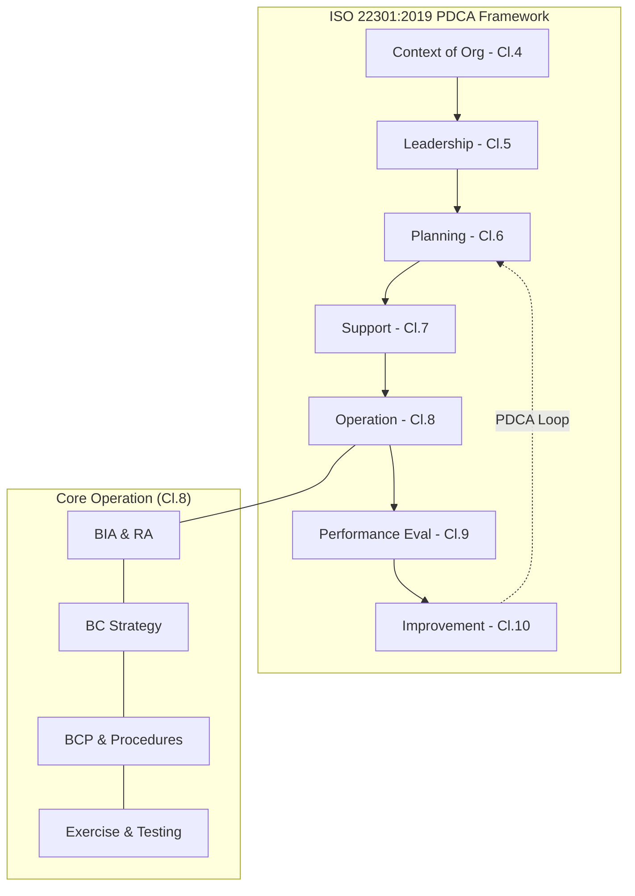

Parent: [[BCM]]

## 1. [도입: Why] 비즈니스 복원력의 글로벌 표준, ISO 22301의 개요 및 배경

**가. ISO 22301의 정의**
- 조직이 직면할 수 있는 다양한 중단 위협에 대해 **비즈니스 연속성을 계획, 수립, 실행, 운영, 모니터링 및 개선**하기 위한 요구사항을 규정한 국제 표준(BCMS)입니다.
- 핵심 키워드: **HLS(High Level Structure)**, **BIA/RA**, **회복력(Resilience)**, **PDCA 사이클**

**나. 등장 배경 및 필요성**
- **글로벌 공급망 리스크 증가**: 전 세계적으로 연결된 공급망 체계에서 한 지점의 중단이 전체 비즈니스 붕괴로 이어지는 현상을 방지하기 위함입니다.
- **예측 불가능한 재난 대응**: 팬데믹, 테러, 사이버 공격 등 고도화된 위협에 대해 조직의 생존 능력을 객관적으로 검증할 표준이 필요해졌습니다.
- **이해관계자 신뢰 확보**: 고객, 투자자 및 규제 기관에 조직의 위기 대응 역량을 입증하여 대외 신뢰도를 제고합니다.

## 2. [핵심: What & How] ISO 22301의 아키텍처 및 핵심 메커니즘

**가. ISO 22301 BCMS 아키텍처 (PDCA 기반) (Mermaid)**

**나. 주요 절(Clause)별 요구사항 상세 (표)**

| 절(Clause) | 요구사항 명칭 | 핵심 내용 및 활동 |
| :--- | :--- | :--- |
| **Cl. 4** | **조직 상황** | 내/외부 이슈 파악, 이해관계자 요구사항, BCMS 범위 설정 |
| **Cl. 5** | **리더십** | 경영진 의지 표명, BC 정책 수립, 조직 내 역할 및 책임 할당 |
| **Cl. 6** | **기획** | 리스크 및 기회 다루기, 비즈니스 연속성 목표 수립 |
| **Cl. 8.2** | **BIA 및 RA** | **BIA(업무영향분석)**를 통한 RTO/RPO 산출, **RA(위험평가)** 수행 |
| **Cl. 8.3** | **BC 전략** | 중단 전/중/후의 비즈니스 연속성 확보를 위한 대안 전략 수립 |
| **Cl. 8.4** | **BC 계획/절차** | 비상 대응팀 구성, 사고 대응 절차 및 **BCP** 문서화 |
| **Cl. 8.5** | **테스트/연습** | 정기적인 모의 훈련을 통한 계획의 실효성 검증 |

## 3. [심화: Deep-dive] ISO 22301:2019 개정사항 및 타 표준과의 관계

**가. ISO 22301:2012 vs 2019 주요 개정 사항**
- **구조 최적화**: HLS를 엄격히 준수하면서도 비즈니스 연속성 특화 용어를 정교화하였습니다.
- **요구사항 유연성**: '문서화된 정보'에 대한 요구를 실질적인 운영 효과성 중심으로 완화하여 조직의 자율성을 높였습니다.
- **Cl. 8(운영) 강화**: BIA와 리스크 평가 프로세스를 더욱 명확히 분리하고 연계성을 강화하였습니다.

**나. ISO 22301 vs ISO 27001(정보보안) 비교**

| 구분 | ISO 22301 (BCMS) | ISO 27001 (ISMS) |
| :--- | :--- | :--- |
| **주요 목표** | **비즈니스 중단 방지** 및 가용성 확보 | **정보 자산 보호** (기밀성, 무결성, 가용성) |
| **핵심 활동** | BIA, RTO/RPO 설정, DRP/BCP | 위험 관리, 보안 통제 항목(Annex A) 적용 |
| **재난 관점** | 전사적 업무 복구 (Physical/Social/IT) | 정보 시스템 및 데이터 보호/복구 |
| **상호 관계** | ISMS의 가용성 영역을 전사적으로 확장 | BCMS 운영을 위한 보안 기술적 근거 제공 |

## 4. [결론: Effect & Insight] 기술사적 제언 및 실무 적용 방안

**가. 실무 인증 획득 및 운영 성공 전략**
- **Top-down 접근**: 경영진의 강력한 지원 하에 전 부서가 참여하는 거버넌스 체계를 구축해야 합니다.
- **실전적 시나리오 설계**: 단순 IT 장애를 넘어 **핵심 인력 부재, 본사 소실, 클라우드 리전 장애** 등 복합적인 시나리오를 반영해야 합니다.

**나. 거버넌스 및 보안(Security) 통제 방안**
- **사이버 보안과의 융합**: 랜섬웨어 등 사이버 공격에 의한 중단 시나리오를 BIA에 포함하고, **사이버 복원력(Cyber Resilience)** 관점에서 대응 체계를 통합해야 합니다.
- **공급망 관리(SCM)**: 핵심 파트너사의 ISO 22301 인증 여부를 점검하거나 파트너사와 공동 훈련을 수행하여 엔드투엔드 연속성을 확보해야 합니다.

**다. 최신 IT 트렌드와의 연계 및 발전 방향**
- **Cloud-based BCMS**: 클라우드의 Multi-AZ/Region 배포 기술과 자동화된 백업 솔루션을 ISO 22301 절차와 결합하여 **RTO를 획기적으로 단축**해야 합니다.
- **ESG 경영의 핵심 지표**: 기업의 사회적 책임(S) 및 거버넌스(G) 관점에서 ISO 22301은 지속 가능한 경영을 입증하는 **ESG 평가의 핵심 요소**로 활용되어야 합니다.

> [!tip] 기술사적 인사이트
> ISO 22301은 단순한 '문서 인증'이 아니라 조직의 **'생존 근육'**을 키우는 과정입니다. 답안 작성 시 기술적인 BCP/DRP에만 머물지 말고, **HLS 기반의 통합 경영 시스템** 관점과 **ESG/공급망 리스크 관리**로의 확장을 언급하면 고득점이 가능합니다.

## Related Notes
- [[BCM]]
- [[BCP]]
- [[BIA]]
- [[ISO27001]]
- [[ESG_경영]]
- [[사이버_복원력]]