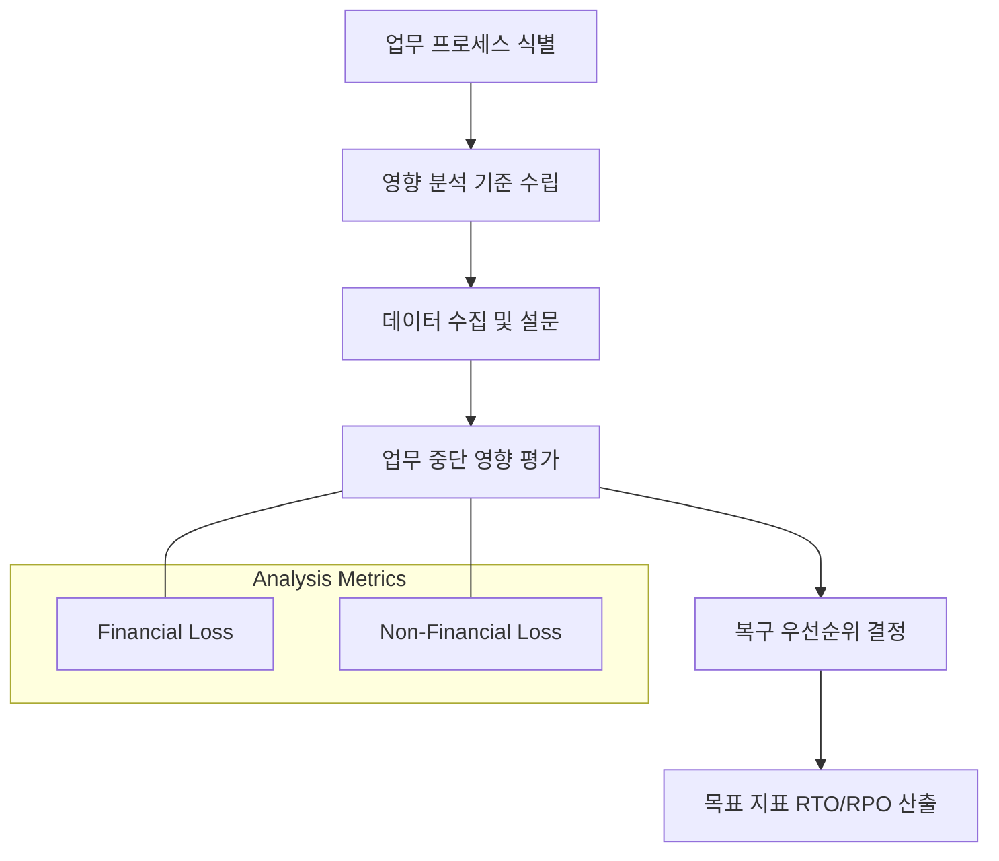

Parent: [[BCM]], [[BCP]]

## 1. [도입: Why] 복구 우선순위 결정의 핵심 도구, BIA의 개요 및 배경

**가. BIA(Business Impact Analysis)의 정의**
- 재난이나 장애로 인해 업무가 중단되었을 때 시간 경과에 따른 **비즈니스 손실(재무적/비재무적)을 분석**하여, 업무별 복구 우선순위와 목표 지표를 도출하는 과정입니다.
- 핵심 키워드: **RTO/RPO/MTPD**, **핵심 업무 식별**, **정량적/정성적 분석**, **상호의존성**

**나. 등장 배경 및 필요성**
- **한정된 자원의 효율적 배분**: 모든 시스템을 동시에 복구할 수 없으므로, 비즈니스 영향이 가장 큰 업무를 우선적으로 복구하기 위한 근거가 필요합니다.
- **복구 목표 지표 수립**: 막연한 '최대한 빨리'가 아닌, 비즈니스 생존을 위해 반드시 지켜야 할 **정량적 복구 시간(RTO)**과 **데이터 복구 시점(RPO)**을 정의합니다.
- **BCP 전략의 기초 데이터**: BIA를 통해 도출된 결과는 재해복구센터 구축 방식과 BCP 수립의 핵심 입력값(Input)이 됩니다.

## 2. [핵심: What & How] BIA의 수행 프로세스 및 핵심 지표

**가. BIA 수행 라이프사이클 (Mermaid)**

**나. BIA 4대 핵심 복구 지표 (표)**

| 지표 | 명칭 | 상세 정의 | 결정 기준 |
| :--- | :--- | :--- | :--- |
| **RTO** | 복구 목표 시간 | 장애 후 서비스 가동까지 허용 가능한 시간 | 비즈니스 중단 허용치 |
| **RPO** | 복구 목표 시점 | 장애 시 허용 가능한 데이터 손실량(시점) | 데이터 재생성 비용/시간 |
| **MTPD** | 최대 허용 중단 시간 | 조직의 생존이 불가능해지기 시작하는 시간 | 손실의 임계점 |
| **WRT** | 작업 복구 시간 | 시스템 복구 후 데이터 무결성/업무 재개 준비 시간 | 수작업 입력, 검증 시간 |

## 3. [심화: Deep-dive] 영향 분석 방법론 및 복구 우선순위 등급화

**가. 정량적 vs 정성적 영향 분석 비교**

| 구분 | 정량적 분석 (Quantitative) | 정성적 분석 (Qualitative) |
| :--- | :--- | :--- |
| **주요 기준** | 직접적 매출 손실, 지체상금, 비용 | 고객 신뢰도, 브랜드 이미지, 법규 위반 |
| **장점** | 수치화된 객관적 결과, TCO 산출 용이 | 수치화 어려운 무형의 가치 반영 가능 |
| **단점** | 정확한 데이터 산출의 어려움 | 주관적 판단 개입 가능성 |

**나. 업무 중요도에 따른 등급(Tier) 분류 예시**
- **Critical (Tier 1)**: RTO 0~4시간 이내. 중단 시 즉각적이고 막대한 손실 발생 업무 (예: 뱅킹 시스템, 결제)
- **Essential (Tier 2)**: RTO 4~24시간 이내. 단기적 중단은 가능하나 신속 복구 필요 업무 (예: ERP, 그룹웨어)
- **Necessary (Tier 3)**: RTO 24시간 이상. 일정 기간 수작업 대체가 가능하거나 영향이 낮은 업무 (예: 인사/총무 지원 시스템)

## 4. [결론: Effect & Insight] 기술사적 제언 및 실무 적용 방안

**가. 실무 수행 시 고려사항: '비즈니스 언어'로의 소통**
- BIA는 IT 부서가 주도하되, 데이터는 반드시 **현업 부서(Business Owner)**로부터 수집되어야 하며 경영진의 승인을 거쳐 공신력을 확보해야 합니다.
- 시스템 간 **상호의존성(Dependency)**을 분석하여, 핵심 업무를 지원하는 하부 인프라(DB, Network)가 누락되지 않도록 해야 합니다.

**나. 거버넌스 및 보안(Security) 통제 방안**
- **보안 사고 영향 반영**: 랜섬웨어에 의한 데이터 암호화 시 RPO 달성 가능 여부를 재점검하고, **Clean Room 복구** 시간을 BIA에 반영해야 합니다.
- **데이터 무결성 검증**: 단순히 시스템을 켜는 RTO뿐만 아니라, 데이터가 올바른지 확인하는 **WRT(Work Recovery Time)**를 보안 관점에서 충분히 확보해야 합니다.

**다. 최신 IT 트렌드와 연계한 발전 방향**
- **실시간 BIA (Continuous BIA)**: 클라우드 기반의 복잡한 마이크로서비스(MSA) 환경에서는 서비스 가변성이 크므로, 정기적 분석이 아닌 **자동화된 가시성 도구**를 통한 상시 BIA 체계로 진화해야 합니다.
- **SRE의 Error Budget과 연계**: BIA로 도출된 RTO를 서비스의 가용성 목표(SLO)와 연결하여, 안정성과 개발 속도 사이의 거버넌스 도구로 활용해야 합니다.

> [!tip] 기술사적 인사이트
> BIA는 BCP의 '나침반'입니다. 답안 작성 시 단순히 지표를 나열하기보다, **MTPD > (RTO + WRT)**라는 논리적 관계를 명확히 제시하고, **재무적 손실과 비재무적 손실의 균형 있는 분석**을 강조하십시오.

## Related Notes
- [[BCP]]
- [[BCM]]
- [[Risk_Assessment]]
- [[SRE]]
- [[사이버_복원력]]