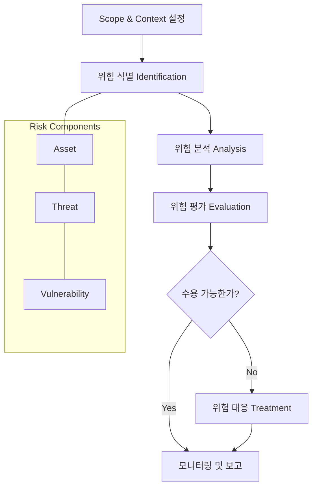

Parent: [[BCM]], [[IT 거버넌스]]

## 1. [도입: Why] 체계적 리스크 통제의 시발점, 위험 평가의 개요 및 배경

**가. 위험 평가(Risk Assessment)의 정의**
- 조직의 목표 달성에 부정적인 영향을 줄 수 있는 **잠재적 위험을 식별, 분석, 평가**하여 대응의 우선순위를 결정하는 프로세스입니다.
- 핵심 키워드: **식별(Identification)**, **분석(Analysis)**, **평가(Evaluation)**, **수용 가능 위험(Risk Appetite)**

**나. 등장 배경 및 필요성**
- **불확실성 관리**: 급변하는 경영 환경과 기술적 위협 속에서 조직의 자산을 보호하기 위한 과학적 접근이 필요합니다.
- **자원의 효율적 배분**: 모든 리스크를 0으로 만드는 것은 불가능하므로, 중요한 리스크에 방어 자원을 집중해야 합니다.
- **컴플라이언스 대응**: ISO 27001, ISMS-P, SOX 등 국내외 보안 및 회계 표준에서 위험 평가를 필수 요구사항으로 규정하고 있습니다.

## 2. [핵심: What & How] 위험 평가의 프로세스 및 메커니즘

**가. 위험 평가 표준 프로세스 (ISO 31000 기반) (Mermaid)**

**나. 위험의 3요소 및 산정 방식 (표)**

| 구성 요소 | 상세 정의 | 예시 |
| :--- | :--- | :--- |
| **자산 (Asset)** | 조직이 보호해야 할 가치가 있는 유무형의 대상 | 데이터, 하드웨어, 인력, 브랜드 |
| **위협 (Threat)** | 자산에 손실을 입힐 수 있는 잠재적 요인 | 해킹, 지진, 내부 유출, 하드웨어 고장 |
| **취약점 (Vulnerability)** | 위협이 발생할 수 있는 자산의 약점 | 보안 패치 미적용, 출입 통제 미흡 |
| **Risk (위험값)** | **자산 가치 × 위협 × 취약점** (또는 영향도 × 발생 가능성) | 정량적 수치 또는 등급(H/M/L) |

## 3. [심화: Deep-dive] 위험 평가 기법 및 대응 전략

**가. 주요 위험 분석 기법**
- **정량적 분석 (Quantitative)**: ALE(연간 예상 손실액) 등을 산출하여 비용 대비 효과 분석 (과거 데이터 필요).
- **정성적 분석 (Qualitative)**: 전문가의 판단에 따라 등급화 (가장 보편적).
- **시나리오 분석**: 발생 가능한 구체적 상황을 가정하여 영향 분석.
- **델파이(Delphi) 기법**: 전문가 집단의 합의를 통한 분석.

**나. 위험 대응(Risk Treatment)의 4가지 유형**

| 대응 유형 | 설명 | 예시 |
| :--- | :--- | :--- |
| **회피 (Avoidance)** | 위험이 발생하는 활동 자체를 중단 | 보안 우려가 큰 특정 서비스 폐지 |
| **전이 (Transfer)** | 위험의 책임을 제3자에게 위탁 | 사이버 보험 가입, 아웃소싱 |
| **완화 (Mitigation)** | 보안 통제를 통해 발생 가능성/영향도 감소 | 방화벽 설치, 보안 교육 |
| **수용 (Acceptance)** | 위험을 인지하고 현재 상태를 유지 | 대응 비용이 손실보다 큰 경우 |

## 4. [결론: Effect & Insight] 기술사적 제언 및 실무 적용 방안

**가. 실무 적용 시 고려사항: 'Risk Appetite'의 결정**
- 무조건 보안을 강화하는 것이 답이 아닙니다. 경영진이 수용 가능한 위험 수준(DoA: Degree of Assurance)을 명확히 정의하고 그 범위 내에서 최적의 통제를 설계해야 합니다.
- **잔류 위험(Residual Risk)**을 지속적으로 추적하여 조직의 수용 범위를 초과하지 않도록 관리해야 합니다.

**나. 거버넌스 및 보안(Security) 통제 방안**
- **상시 위험 평가 체계**: 연 1회 형식적인 평가에서 벗어나, 기술적 취약점 진단과 결합된 **상시 리스크 모니터링** 시스템을 구축해야 합니다.
- **전사적 리스크 관리(ERM) 통합**: IT 리스크를 단순 기술 이슈가 아닌 전사적 비즈니스 리스크의 하위 요소로 통합 관리해야 합니다.

**다. 최신 IT 트렌드와 연계한 발전 방향**
- **AI 기반 위험 예측**: 방대한 보안 로그와 위협 인텔리전스(TI)를 분석하여 잠재적 위협을 선제적으로 식별하는 **Predictive Risk Assessment**로 진화해야 합니다.
- **ESG와 클라우드 리스크**: 클라우드 전환에 따른 위탁 리스크와 ESG(환경/사회/지배구조) 관점의 거버넌스 리스크를 평가 항목에 포함해야 합니다.

> [!tip] 기술사적 인사이트
> 위험 평가는 보안의 '설계도'입니다. 답안 작성 시 **Asset-Threat-Vulnerability**의 관계를 명확히 하고, **비용 대비 효과(CBA)** 관점에서 위험 대응 전략을 수립해야 함을 강조하십시오. 특히 최근의 **공급망 위협**이나 **인적 보안 리스크**를 언급하면 가점 요소가 됩니다.

## Related Notes
- [[BCM]]
- [[BIA]]
- [[ISO31000]]
- [[ISMS-P]]
- [[사이버_복원력]]
- [[IT거버넌스]]