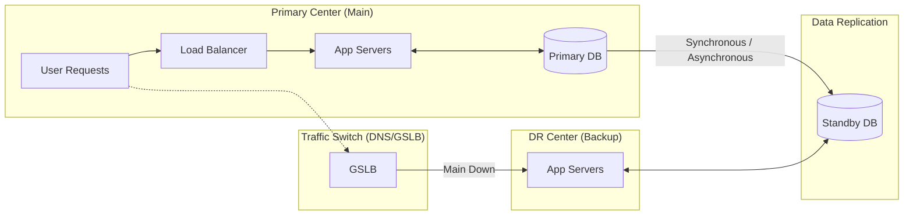

Parent: [[BCP]], [[BCM]]

## 1. [도입: Why] 비즈니스 연속성의 최후 보루, DRS의 개요 및 배경

**가. DRS(Disaster Recovery System)의 정의**
- 지진, 화재, 테러 등 예기치 못한 재해로 인해 주 전산 센터가 중단되었을 때, 핵심 서비스를 복구하기 위해 별도의 거점에 구축한 **IT 인프라 및 운영 체계**입니다.
- 핵심 키워드: **데이터 동기화**, **거점 분리**, **RTO/RPO**, **대체 자원**

**나. 등장 배경 및 필요성**
- **비즈니스 가동성(Availability) 확보**: 무중단 서비스가 기본인 현대 비즈니스 환경에서 재해 시 즉각적인 서비스 전환 체계가 필수적입니다.
- **데이터 자산 보호**: 재난으로 인한 데이터 유실은 기업의 영구적인 폐업으로 이어질 수 있으므로, 원격지 백업 및 복구 체계가 중요합니다.
- **법적 규제 및 신뢰도**: 금융권의 재해복구센터 의무화 등 법적 규제를 준수하고 대외적인 신뢰도를 유지하기 위함입니다.

## 2. [핵심: What & How] DRS의 아키텍처 및 핵심 메커니즘

**가. DRS 운영 모델 및 서비스 전환 아키텍처 (Mermaid)**

**나. DRS 구축의 4대 핵심 기술 요소 (표)**

| 구성 요소 | 상세 내용 | 관련 기술 |
| :--- | :--- | :--- |
| **데이터 복제** | 주 센터와 DR 센터 간의 데이터 동기화 | Storage Mirroring, Database Replication |
| **네트워크 전환** | 장애 시 트래픽을 DR 센터로 자동/수동 유도 | GSLB(Global Server Load Balancing), DNS 변경 |
| **서버/인프라** | 대체 업무를 수행할 하드웨어 및 소프트웨어 | Virtualization, Cloud Provisioning |
| **운영 절차** | 재해 선포부터 복구, 복귀(Fail-back) 절차 | DRS 운영 매뉴얼, 비상 연락망 |

## 3. [심화: Deep-dive] DRS 구축 유형 비교 및 최신 클라우드 DR

**가. DRS 구축 4대 유형 상세 비교**

| 유형 | 데이터 상태 | RTO (복구 시간) | 비용 | 장단점 |
| :--- | :--- | :--- | :--- | :--- |
| **Mirror Site** | 실시간(Sync) | **즉시 (Zero)** | 매우 높음 | 완벽한 복구 / 거리 제약(Latency), 고비용 |
| **Hot Site** | 실시간(Async) | **수 시간 이내** | 높음 | 빠른 복구 / 데이터 손실 소량 발생 가능 |
| **Warm Site** | 주기적(Batch) | **수 일 이내** | 보통 | 경제적 / 복구 지연 및 데이터 손실 큼 |
| **Cold Site** | 테이프/백업본 | **수 주 이내** | 낮음 | 최저 비용 / 복구 신뢰성 낮음, 초기 가동 지연 |

**나. 전통적 DRS vs 클라우드 기반 DRS (DRaaS)**

| 구분 | 전통적 DRS (On-premise) | 클라우드 DRS (DRaaS) |
| :--- | :--- | :--- |
| **비용 모델** | 구축비(CapEx) 위주, 상시 유지비 | 이용료(OpEx) 위주, 사용량 기반 결제 |
| **유연성** | 확장 및 변경이 어려움 | 리소스의 즉각적 확장(Scalability) 가능 |
| **관리 주체** | 자체 운영 인력 필요 | 클라우드 사업자/MSP 지원 |
| **테스트** | 훈련 시 실제 장비 가동 부담 | 가상 환경에서 손쉬운 모의 훈련 가능 |

## 4. [결론: Effect & Insight] 기술사적 제언 및 실무 적용 방안

**가. 성공적인 DRS 운영을 위한 실무적 제언**
- **주기적 모의 훈련**: "문서 속의 DRS"가 아닌 "동작하는 DRS"를 위해 연 1~2회 이상의 실전 같은 Fail-over/Fail-back 훈련이 필수적입니다.
- **데이터 정합성 검증**: 데이터 동기화 과정에서 오류가 없는지, 복구된 데이터가 비즈니스적으로 유효한지 상시 검증해야 합니다.

**나. 거버넌스 및 보안(Security) 통제 방안**
- **DR 센터 보안 규정**: 주 센터와 동일한 수준의 보안 장비(IPS, WAF 등)와 접근 통제를 적용하여, 재해 시 보안 사고가 전이되지 않도록 해야 합니다.
- **Compliance 준수**: 전자금융감독규정 등 산업별 규제에서 요구하는 RTO 준수 여부를 주기적으로 점검하고 보고해야 합니다.

**다. 최신 IT 트렌드와의 융합 및 발전 방향**
- **Multi-Cloud/Multi-Region 전략**: 단일 클라우드 사업자 장애에 대비하여 타 사업자 또는 타 리전으로 DRS를 분산하는 **Multi-Cloud DR**이 대세로 자리잡고 있습니다.
- **Serverless/Container DR**: 인프라를 상시 가동하지 않고 장애 시에만 서버리스 함수나 컨테이너를 즉시 배포하여 비용을 최소화하는 **Serverless DR**로 진화하고 있습니다.

> [!tip] 기술사적 인사이트
> DRS 답안 작성 시 기술적인 **Sync/Async 복제 방식**과 **RTO/RPO 지표**를 연계하여 설명하십시오. 특히 최근에는 단순히 복구하는 것을 넘어 비용 효율성을 극대화하는 **Cloud DR (DRaaS)**과 **Infrastructure as Code (IaC)**를 통한 자동 복구 개념을 언급하면 고득점이 가능합니다.

## Related Notes
- [[BCP]]
- [[BCM]]
- [[RTO_RPO]]
- [[클라우드_컴퓨팅]]
- [[GSLB]]
- [[IaC]]