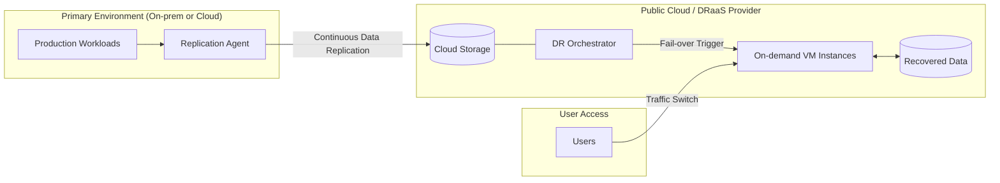

Parent: [[DRS]], [[클라우드_컴퓨팅]]

## 1. [도입: Why] 클라우드 기반의 민첩한 복구 체계, DRaaS의 개요 및 배경

**가. DRaaS(Disaster Recovery as a Service)의 정의**
- 재해 발생 시 IT 인프라 및 데이터를 복구하기 위한 자원과 프로세스를 **클라우드 서비스 형태(As-a-Service)**로 제공받는 재해 복구 모델입니다.
- 핵심 키워드: **Cloud-based**, **Pay-as-you-go**, **Orchestration**, **RTO/RPO 최적화**

**나. 등장 배경 및 필요성**
- **전통적 DR의 고비용 구조 탈피**: 물리적인 제2센터 구축에 따른 막대한 초기 투자비(CapEx)와 유지관리비(OpEx)를 절감하기 위해 클라우드의 유연성을 활용합니다.
- **민첩한 복구 및 테스트 환경**: 복잡한 물리 서버 설정 없이 클릭 몇 번으로 복구 환경을 프로비저닝하고, 정기적인 모의 훈련을 손쉽게 수행할 수 있습니다.
- **랜섬웨어 대응 강화**: 클라우드의 **Air-gap** 백업 및 **Immutable Storage** 기능을 활용하여 사이버 공격으로부터 데이터를 안전하게 보호하고 신속히 복구합니다.

## 2. [핵심: What & How] DRaaS의 아키텍처 및 서비스 메커니즘

**가. DRaaS 서비스 아키텍처 (Mermaid)**

**나. DRaaS의 주요 기능 요소 (표)**

| 기능 요소 | 상세 설명 | 기술적 핵심 |
| :--- | :--- | :--- |
| **복제 (Replication)** | 소스 환경의 데이터를 클라우드로 실시간 또는 주기적 전송 | Block-level Replication, CDP |
| **오케스트레이션** | 장애 발생 시 복구 절차(부팅 순서, IP 변경 등) 자동 수행 | Workflow Automation, Recovery Scripts |
| **온디맨드 자원** | 평상시엔 저장소만 사용하다 재해 시 서버 자원 즉시 할당 | Auto-scaling, Instant Provisioning |
| **보안 및 규정 준수** | 데이터 전송/보관 시 암호화 및 국가별 데이터 주권 준수 | AES-256, TLS, Region 선택 |

## 3. [심화: Deep-dive] DRaaS 서비스 모델 유형 및 기존 DR과의 비교

**가. 관리 주체에 따른 DRaaS 서비스 유형**
- **Managed DRaaS**: 서비스 제공자가 복구의 모든 과정을 책임지고 관리 (가장 높은 비용, 안정성).
- **Assisted DRaaS**: 서비스 제공자가 플랫폼과 일부 가이드를 제공하고, 실제 복구는 조직이 수행.
- **Self-Service DRaaS**: 조직이 직접 클라우드 도구를 활용하여 복구 체계를 구축 및 운영 (최저 비용, 높은 기술력 필요).

**나. 전통적 DR vs DRaaS 상세 비교**

| 구분 | 전통적 DR (On-premise) | 클라우드 DRaaS |
| :--- | :--- | :--- |
| **초기 투자비** | 높음 (서버, 스토리지, 센터 구축) | **낮음 (구독형 모델)** |
| **자원 효율성** | 평시 유휴 자원 발생 (Low Utility) | **필요 시에만 자원 할당 (On-demand)** |
| **확장성** | 물리적 한계로 확장 지연 발생 | **클라우드 자원을 활용한 무한 확장** |
| **RTO/RPO** | 기술 및 예산에 따라 다양 | **최신 복제 기술로 매우 짧은 RTO/RPO 구현** |
| **모의 훈련** | 복잡하고 비용이 많이 듬 (대부분 연 1회) | **가상 환경에서 수시로 안전하게 테스트 가능** |

## 4. [결론: Effect & Insight] 기술사적 제언 및 실무 적용 방안

**가. 실무 도입 시 고려사항 및 성공 요인 (CSF)**
- **네트워크 대역폭 확보**: 초기 데이터 동기화 및 재해 발생 시 트래픽 전환을 위한 충분한 대역폭(Bandwidth)과 레이턴시 관리가 필수적입니다.
- **호환성 검증**: 온프레미스의 레거시 시스템이나 OS 버전이 클라우드 환경에서 정상적으로 부팅 및 동작하는지 사전에 철저히 검증해야 합니다.

**나. 거버넌스 및 보안(Security) 통제 방안**
- **접근 제어 강화 (IAM)**: DRaaS 포털에 대한 계정 유출은 전사 시스템의 통제권을 넘겨주는 리스크가 있으므로 MFA(다요소 인증)와 엄격한 IAM 정책을 적용해야 합니다.
- **데이터 암호화**: 전송 중(In-transit) 및 보관 중(At-rest)인 모든 데이터에 대해 강력한 암호화 알고리즘을 적용하여 클라우드 사업자의 관리 영역에서도 보안을 유지해야 합니다.

**다. 최신 IT 트렌드와의 융합 및 발전 방향**
- **AI-driven Recovery**: AI가 복구 우선순위를 실시간으로 판단하고, 장애 징후를 감지하여 자동으로 Fail-over를 수행하는 **지능형 DRaaS**로 진화하고 있습니다.
- **Multi-Cloud DRaaS**: 특정 클라우드 벤더 종속(Lock-in)을 피하고 가용성을 극대화하기 위해, 서로 다른 클라우드 사업자 간에 복구 체계를 구축하는 멀티 클라우드 전략이 확대될 것입니다.

> [!tip] 기술사적 인사이트
> DRaaS는 단순히 기술적 복구가 아니라 **'비즈니스 회복력(Resilience)'**을 구독하는 모델입니다. 답안 작성 시 클라우드의 **경제성(TCO 절감)**뿐만 아니라 **IaC(Infrastructure as Code)**를 통한 복구 자동화와 **사이버 복원력(Cyber Resilience)** 관점에서의 이점을 강조하십시오.

## Related Notes
- [[DRS]]
- [[BCP]]
- [[BCM]]
- [[클라우드_컴퓨팅]]
- [[사이버_복원력]]
- [[TCO]]