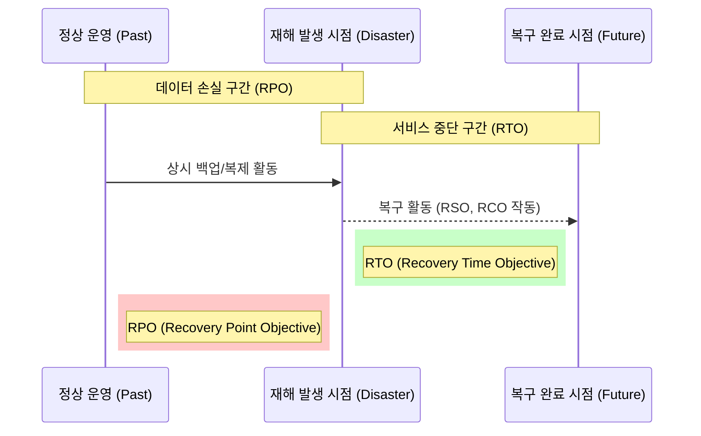

Parent: [[BCP]], [[DRS]]

## 1. [도입: Why] 재해 복구의 성패를 가르는 기준, 복구 목표 지표의 개요 및 배경

**가. 복구 목표 지표의 정의**
- 재난 발생 시 비즈니스 연속성을 확보하기 위해 수립하는 **정량적인 복구 목표값**들로, BIA(업무 영향 분석)를 통해 도출되는 핵심 지표들입니다.
- 핵심 키워드: **정량적 목표**, **SLA 연계**, **비용-효율성 최적화**, **복구 신뢰성**

**나. 등장 배경 및 필요성**
- **복구 전략 수립의 근거**: 주관적인 복구 기준이 아닌 객관적인 지표를 통해 재해복구시스템(DRS)의 구축 방식(Mirror, Hot 등)을 결정합니다.
- **의사소통의 표준화**: 경영진, 현업, IT 부서 간의 복구 수준에 대한 합의를 도출하여 분쟁을 예방하고 책임 소재를 명확히 합니다.
- **리소스 최적화**: 모든 자산을 100% 즉시 복구하는 것은 불가능하므로, 비즈니스 중요도에 따라 차등화된 복구 지표를 설정하여 투자를 효율화합니다.

## 2. [핵심: What & How] 복구 목표 지표의 체계 및 타임라인 분석

**가. 복구 목표 지표 타임라인 아키텍처 (Mermaid)**

**나. 4대 핵심 복구 지표 상세 설명 (표)**

| 지표 | 명칭 | 상세 정의 | 결정 요소 |
| :--- | :--- | :--- | :--- |
| **RPO** | 복구 목표 시점 | 재해 시 허용 가능한 **데이터 손실량** (어느 시점 데이터로 복구할 것인가?) | 데이터 갱신 주기, 백업 빈도 |
| **RTO** | 복구 목표 시간 | 재해 발생 후 업무가 정상 가동될 때까지의 **허용 시간** | 서비스 중단 시 손실액, MTPD |
| **RSO** | 복구 범위 목표 | 복구 대상이 되는 **업무 자산 및 데이터의 범위** (무엇을 복구할 것인가?) | 핵심 업무 식별, 상호의존성 |
| **RCO** | 복구 커뮤니케이션 목표 | 비상 시 내/외부 이해관계자와의 **연락 체계 가동 목표** (누구에게 알릴 것인가?) | 비상 연락망, 보고 체계 가동 시간 |

## 3. [심화: Deep-dive] 지표 간 상호 관계 및 비용 최적화 분석

**가. 지표 간 논리적 제약 조건 및 관계**
- **MTPD ≥ RTO + WRT**: 최대 허용 중단 시간(MTPD)은 실제 복구 시간(RTO)과 업무 재개 준비 시간(WRT)의 합보다 커야 비즈니스가 생존 가능합니다.
- **RSO와 RTO의 상관관계**: 복구 범위(RSO)가 넓어질수록 복구 시간(RTO)은 길어지는 경향이 있으므로 병렬 복구 전략이 필요합니다.

**나. 복구 지표와 구축 비용의 상관관계 (Trade-off)**

| 복구 지표 수준 | 구축 비용 | 적용 기술 예시 |
| :--- | :--- | :--- |
| **RPO/RTO = 0 (Mirror)** | **최고** | 실시간 동기화, Active-Active, 이중화 |
| **RPO/RTO < 수시간 (Hot)** | **높음** | 비동기 복제, 고속 네트워크, 대기 서버 |
| **RPO/RTO < 수일 (Warm)** | **보통** | 주기적 스냅샷, 가상화 기반 복구 |
| **RPO/RTO > 수주 (Cold)** | **낮음** | 오프라인 백업(Tape), 신규 장비 구매 후 복구 |

## 4. [결론: Effect & Insight] 기술사적 제언 및 실무 적용 방안

**가. 실무 적용 시 고려사항: '정교한 BIA' 기반의 지표 설정**
- 단순히 기술적인 가능성에 따라 지표를 정하지 말고, **재무적/비재무적 영향 분석**을 통해 도출된 비즈니스 요구사항을 우선 반영해야 합니다.
- **WRT(Work Recovery Time)**를 간과하지 말아야 합니다. 시스템이 켜진 후(RTO) 데이터를 검증하고 업무를 재개하는 시간까지를 포함한 총체적 복구 관점이 필요합니다.

**나. 거버넌스 및 보안(Security) 통제 방안**
- **사이버 공격 시 지표 재검토**: 자연재해와 달리 랜섬웨어는 백업본까지 오염시키므로, 오염되지 않은 시점으로 복구하는 **격리된 복구 지표**를 별도로 수립해야 합니다.
- **RCO의 실효성 확보**: 기술적 복구만큼 중요한 것이 고객과 시장에 상황을 알리는 것입니다. RCO를 달성하지 못할 경우 2차적인 브랜드 가치 훼손이 발생함을 유의해야 합니다.

**다. 최신 IT 트렌드와의 융합 및 발전 방향**
- **Zero RTO/RPO 지향**: 클라우드 네이티브 기술(Multi-Region, Serverless)을 활용하여 물리적 재해에도 사용자 체감 중단 시간이 0에 수렴하는 **Resilient Architecture**로 진화해야 합니다.
- **Chaos Engineering**: 상시적으로 장애를 주입하고 복구 지표가 준수되는지 자동으로 검증하는 **상시 복구 신뢰성 확보 체계** 구축이 기술사적 대안입니다.

> [!tip] 기술사적 인사이트
> 답안 작성 시 RTO, RPO에만 집중하지 말고 **RSO(범위)**와 **RCO(소통)**를 함께 언급함으로써 **전사적 연속성(Business Continuity)** 관점의 전문성을 보여주십시오. 특히 최근의 대형 장애 사례들과 연계하여 RCO의 중요성을 부각하면 좋은 점수를 얻을 수 있습니다.

## Related Notes
- [[BCP]]
- [[BIA]]
- [[DRS]]
- [[BCM]]
- [[사이버_복원력]]
- [[MTPD]]