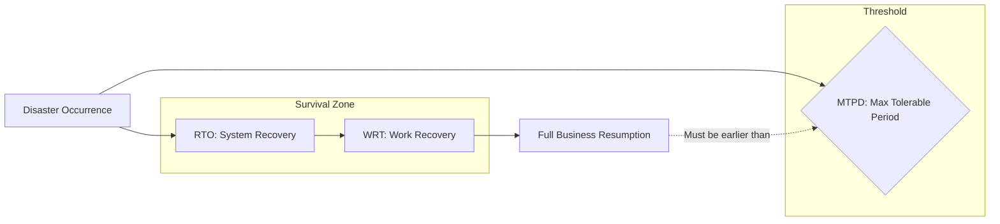

Parent: [[BCM]], [[BIA]]

## 1. [도입: Why] 비즈니스 생존의 임계점, MTPD의 개요 및 배경

**가. MTPD(Maximum Tolerable Period of Disruption)의 정의**
- 재난 발생 시 비즈니스가 중단되었을 때, 조직이 입는 유무형의 손실이 감내할 수 없는 수준에 도달하기까지의 **최대 허용 시간**입니다.
- 핵심 키워드: **비즈니스 생존 임계치**, **ISO 22301**, **RTO의 상한선**, **BIA 결과물**

**나. 등장 배경 및 필요성**
- **정교한 복구 전략 수립**: '무조건 빠른 복구'가 아닌, 실제 비즈니스가 버틸 수 있는 시간(MTPD)을 파악하여 **RTO 설정의 객관적 근거**를 마련합니다.
- **리소스 배분의 기준**: 업무별 MTPD를 분석하여 생존에 직결된 핵심 업무를 식별하고 복구 자원을 우선 배분하기 위함입니다.
- **리스크 관리의 실효성 확보**: 감내할 수 없는 손실(Unacceptable Loss)이 발생하는 시점을 명확히 하여 경영진의 의사결정을 지원합니다.

## 2. [핵심: What & How] MTPD의 개념적 구조 및 지표 간 관계

**가. MTPD와 RTO, WRT의 논리적 관계도 (Mermaid)**

**나. MTPD 산출을 위한 주요 고려 요소 (표)**

| 분류 | 고려 항목 | 상세 내용 |
| :--- | :--- | :--- |
| **재무적 손실** | 매출 손실, 과태료 | 직접적 금전 손실이 자본금을 상회하는 시점 |
| **법적/규제** | 법적 계약 위반 | 면허 취소, 영업 정지 등 법적 제재가 발생하는 시점 |
| **비재무적 손실** | 브랜드 가치, 신뢰도 | 고객 이탈이 가속화되어 회복이 불가능한 시점 |
| **운영적 영향** | 상호의존성 파급 | 하위 프로세스 중단으로 전사 기능이 마비되는 시점 |

## 3. [심화: Deep-dive] MTPD와 RTO의 차이점 및 관계 분석

**가. MTPD vs RTO 비교 분석**

| 구분 | MTPD (Survival Limit) | RTO (Recovery Goal) |
| :--- | :--- | :--- |
| **관점** | **비즈니스 생존** 관점 (현업 주도) | **IT 복구 목표** 관점 (IT 주도) |
| **성격** | 변경하기 어려운 **물리적/논리적 한계** | 기술/비용에 따라 조정 가능한 **목표값** |
| **결정 주체** | 경영진 및 비즈니스 소유자 | IT 부서 및 BCP 담당자 |
| **논리적 관계** | **MTPD > RTO + WRT** (필수 조건) | MTPD 이내에 완료되도록 설정 |

**나. MTPD 산출 시 주의사항: WRT의 포함**
- 시스템만 복구(RTO)된다고 업무가 재개되는 것이 아닙니다. 복구된 데이터의 정합성을 확인하고 수작업을 처리하는 **WRT(Work Recovery Time)**를 반드시 고려하여 **(RTO + WRT) < MTPD**가 유지되도록 설계해야 합니다.

## 4. [결론: Effect & Insight] 기술사적 제언 및 실무 적용 방안

**가. 실무 적용 시 고려사항: MTPD의 동적 관리**
- MTPD는 고정된 상수가 아닙니다. 계절적 요인(예: 결산기, 명절 등)이나 비즈니스 환경 변화에 따라 변동될 수 있으므로 **주기적인 BIA(업무 영향 분석)**를 통해 업데이트해야 합니다.
- **상호의존성(Interdependency)** 분석을 통해, 특정 업무의 MTPD가 연관된 다른 업무의 생존에 미치는 영향을 복합적으로 평가해야 합니다.

**나. 거버넌스 및 보안(Security) 통제 방안**
- **사이버 복원력(Cyber Resilience)**: 랜섬웨어 공격 시에는 단순 시스템 장애보다 복구 시간이 길어질 수 있습니다. 최악의 시나리오에서도 MTPD를 넘기지 않도록 **격리된 클린 백업(Isolated Recovery)** 체계를 구축해야 합니다.
- **SLA와의 정렬**: 대외 고객에게 약속한 SLA가 MTPD를 초과하지 않도록 거버넌스 차원의 정렬(Alignment)이 필요합니다.

**다. 최신 IT 트렌드와 연계한 발전 방향**
- **Chaos Engineering 기반 검증**: 인위적 장애 주입을 통해 실제 복구 완료 시점이 MTPD 이내에 도달하는지 경험적으로 검증하는 **상시 복원력 테스트**로 진화해야 합니다.
- **클라우드 서버리스 활용**: 재해 시 자원을 즉시 프로비저닝하여 RTO를 극단적으로 단축함으로써, MTPD 대비 충분한 **Safety Margin**을 확보하는 전략이 유효합니다.

> [!tip] 기술사적 인사이트
> MTPD는 BCP의 **'Dead-line'**입니다. 답안 작성 시 단순히 정의에 머물지 말고, **MTPD와 RTO, WRT의 산술적 관계**를 명확히 제시하십시오. 또한 최근 카카오 사태 등을 예로 들어 **사회적 수용 한계점**으로서의 MTPD 개념을 언급하면 매우 높은 점수를 얻을 수 있습니다.

## Related Notes
- [[BCP]]
- [[BIA]]
- [[RTO_RPO]]
- [[WRT]]
- [[BCM]]
- [[사이버_복원력]]