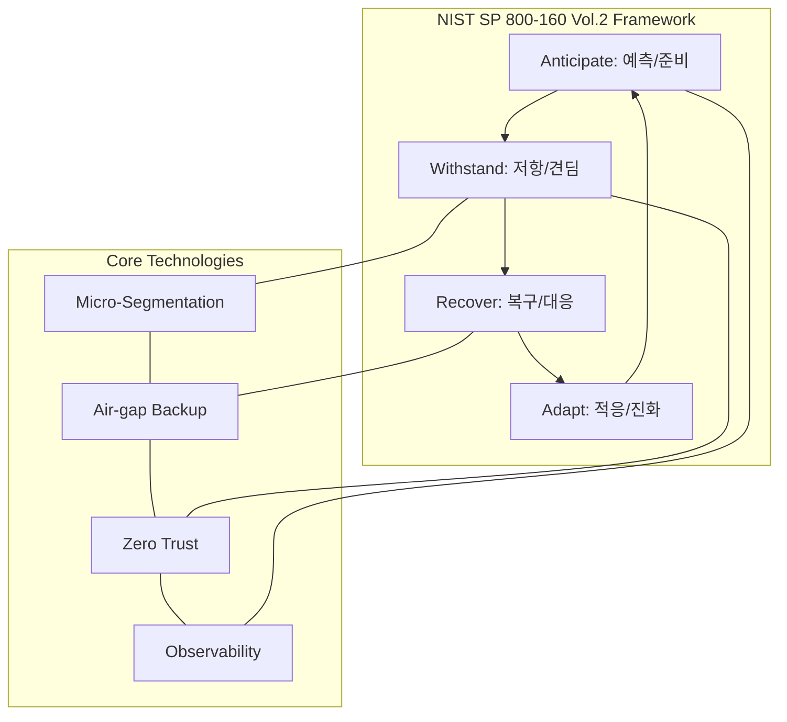

Parent: [[BCM]], [[BCP]], [[보안관제]]

## 1. [도입: Why] 침해 사고를 전제로 한 새로운 보안 패러다임, 사이버 복원력의 개요 및 배경

**가. 사이버 복원력(Cyber Resilience)의 정의**
- 사이버 공격이나 시스템 장애 등 위협 상황이 발생하더라도 비즈니스 핵심 기능을 유지하고, 중단 시 이를 신속하게 복구하며 미래의 위협에 적응하는 **조직적 회복 역량**입니다.
- 핵심 키워드: **Anticipate(예측)**, **Withstand(견딤)**, **Recover(복구)**, **Adapt(적응)** (NIST 기준)

**나. 등장 배경 및 필요성**
- **완벽한 방어의 불가능성**: 지능형 지속 위협(APT)과 제로데이 공격 등으로 인해 "언젠가는 뚫린다(Assume Breach)"는 전제하의 대응 체계가 필요해졌습니다.
- **랜섬웨어 피해의 극대화**: 단순 데이터 탈취를 넘어 가용성을 파괴하는 랜섬웨어 공격에 대응하기 위해, 신속한 비즈니스 재개(Resumption) 능력이 생존 요건이 되었습니다.
- **디지털 전환(DX) 가속화**: 클라우드, 초연결 환경에서 단일 보안 사고가 전사적 리스크로 확산되는 속도가 빨라짐에 따라 전체 시스템의 복원력이 중요해졌습니다.

## 2. [핵심: What & How] 사이버 복원력의 프레임워크 및 메커니즘

**가. 사이버 복원력 라이프사이클 및 기술 요소 (Mermaid)**

**나. 사이버 복원력의 4대 핵심 전략 및 요소 기술 (표)**

| 단계 (Goals) | 상세 활동 | 주요 요소 기술 및 기법 |
| :--- | :--- | :--- |
| **Anticipate** (예측) | 잠재적 위협 식별 및 대응 자원 확보 | Threat Intelligence(TI), 가시성(Observability), 보안 교육 |
| **Withstand** (견딤) | 공격 발생 시 비즈니스 핵심 기능 유지 | Zero Trust, Micro-segmentation, Redundancy, 격리(Isolate) |
| **Recover** (복구) | 중단된 기능을 목표 시간(RTO) 내 복구 | Immutable Backup, Air-gap, 자동화된 오케스트레이션 |
| **Adapt** (적응) | 사고 교훈을 바탕으로 보안 체계 강화 | Lessons Learned 적용, AI 기반 위협 탐지 고도화 |

## 3. [심화: Deep-dive] 사이버 보안(Cyber Security)과의 비교 및 핵심 아키텍처

**가. 사이버 보안 vs 사이버 복원력 비교 분석**

| 구분 | 사이버 보안 (Cyber Security) | 사이버 복원력 (Cyber Resilience) |
| :--- | :--- | :--- |
| **기본 전제** | 공격을 **막을 수 있다** (Prevention) | 공격은 **반드시 발생한다** (Assume Breach) |
| **주요 목표** | 자산의 기밀성, 무결성, 가용성 보호 | **비즈니스 연속성** 및 조직 생존성 확보 |
| **핵심 기술** | 방화벽, IPS, 백신, 암호화 | 에어갭 백업, 세그멘테이션, 신속 복구 |
| **성과 지표** | 탐지율, 차단율, 취약점 조치율 | **RTO/RPO 준수율, 비즈니스 가동 시간** |

**나. 사이버 복원력 강화를 위한 3대 아키텍처 원칙**
- **Non-persistence (비지속성)**: 공격자가 시스템에 영구적으로 머물지 못하도록 자원을 주기적으로 초기화(Refresh) 및 재생성.
- **Privilege Restriction (권한 제한)**: 최소 권한의 원칙과 속성 기반 접근 제어(ABAC)를 통해 피해 확산(Blast Radius)을 최소화.
- **Diversity (다양성)**: 동일한 기술 스택에 대한 공통 취약점 공격을 피하기 위해 인프라 및 보안 솔루션을 다변화.

## 4. [결론: Effect & Insight] 기술사적 제언 및 실무 적용 방안

**가. 실무 도입 시 고려사항: 'Clean-room' 복구 환경**
- 복구 시 원본 백업이 악성코드에 오염되었을 가능성이 높으므로, 격리된 안전한 공간(**Clean-room**)에서 무결성을 검증한 후 운영 환경으로 이관하는 절차를 정립해야 합니다.
- **Immutable Storage**: 백업 데이터 자체가 수정되거나 삭제되지 않도록 하는 불변 스토리지 도입이 랜섬웨어 대응의 필수 조건입니다.

**나. 거버넌스 및 정책 통제 방안**
- **전사적 위기 대응 거버넌스**: 사이버 복원력은 IT 부서의 책임이 아닌, 경영진이 주도하는 **BCM(업무 연속성 관리)**의 핵심 요소로 통합 관리되어야 합니다.
- **정기적 모의 훈련 (Chaos Engineering)**: 인위적인 공격 및 장애 시나리오를 주입하여 실제 복원력을 경험적으로 검증하고 보완하는 문화를 정착시켜야 합니다.

**다. 최신 IT 트렌드와 연계한 발전 방향**
- **AI-Driven Resilience**: AI를 활용하여 공격을 실시간으로 감지하고, 침해된 노드를 자동으로 격리 및 정상 상태로 복구하는 **자율형 복원력(Autonomous Resilience)**으로 진화해야 합니다.
- **클라우드 네이티브 복원력**: 특정 CSP 장애에 대비한 멀티 클라우드 전략과 **Infrastructure as Code(IaC)**를 통한 즉각적인 인프라 재구축 능력을 확보해야 합니다.

> [!tip] 기술사적 인사이트
> 사이버 복원력은 **"How to survive"**에 대한 답입니다. 답안 작성 시 단순히 보안 기술을 나열하기보다, **NIST의 4대 목표(Anticipate, Withstand, Recover, Adapt)**를 논리적 흐름으로 제시하고, **제로 트러스트**와 **에어갭 백업**의 시너지를 강조하면 고득점이 가능합니다.

## Related Notes
- [[BCM]]
- [[BCP]]
- [[Zero_Trust]]
- [[DRS]]
- [[랜섬웨어_대응]]
- [[NIST_SP_800-160]]