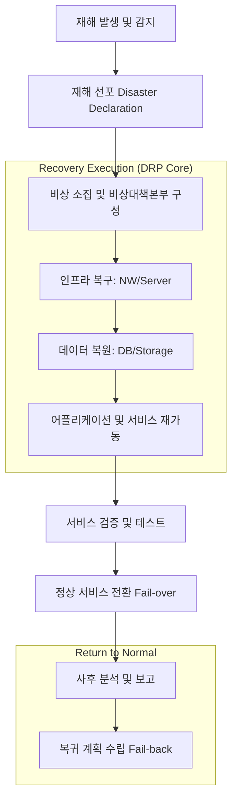

Parent: [[BCP]], [[DRS]]

## 1. [도입: Why] IT 인프라 복구의 구체적 실행 매뉴얼, DRP의 개요 및 배경

**가. DRP(Disaster Recovery Plan)의 정의**
- 재난 발생 시 정보시스템, 데이터, 네트워크 등 **IT 인프라를 목표 시간(RTO/RPO) 내에 복구**하기 위한 기술적 절차와 활동을 규정한 실행 계획서입니다.
- 핵심 키워드: **기술적 복구 절차**, **RTO/RPO 준수**, **비상 대응 매뉴얼**, **BCP의 하위 구성요소**

**나. 등장 배경 및 필요성**
- **IT 의존도 심화**: 기업의 핵심 비즈니스가 IT 시스템에 완전히 의존함에 따라, 시스템 중단은 곧 비즈니스 중단으로 직결됩니다.
- **복구 활동의 표준화**: 긴급 상황에서 관리자의 주관적 판단에 의존하지 않고, 미리 정의된 **표준 운영 절차(SOP)**에 따라 신속하고 정확하게 복구하기 위함입니다.
- **신속한 의사결정 체계**: 비상 시 보고 라인과 의사결정 권한을 명확히 하여 복구 지연 리스크를 최소화합니다.

## 2. [핵심: What & How] DRP의 아키텍처 및 실행 메커니즘

**가. DRP 실행 프로세스 흐름도 (Mermaid)**

**나. DRP의 핵심 구성 항목 (표)**

| 구성 항목 | 상세 내용 | 주요 요소 |
| :--- | :--- | :--- |
| **비상 연락망** | 비상 시 연락 가능한 내부 임직원 및 외부 벤더 명단 | 비상대책본부(ERT), 복구팀 R&R |
| **복구 시나리오** | 재해 유형별(화재, 침수, 해킹 등) 대응 절차 | 시나리오별 복구 우선순위 |
| **기술적 복구 절차** | 시스템별 상세 복구 매뉴얼 (SOP) | 하드웨어 설정, 데이터 복원 명령어 |
| **자원 목록** | 복구에 필요한 하드웨어, SW 라이선스, 네트워크 정보 | IP 할당표, 백업 매체 보관 장소 |
| **Fail-back 절차** | 재해 상황 종료 후 주 센터로 복귀하는 절차 | 데이터 역동기화, 서비스 원복 계획 |

## 3. [심화: Deep-dive] BCP와의 관계 및 DRP 고도화 전략

**가. BCP vs DRP 비교 분석**

| 구분 | BCP (Business Continuity Plan) | DRP (Disaster Recovery Plan) |
| :--- | :--- | :--- |
| **범위** | **전사적** 비즈니스 연속성 (인력, 업무 등) | **IT 시스템 및 데이터** 중심 복구 |
| **주체** | 비즈니스 부서 (현업) | IT 운영 및 보안 부서 |
| **목적** | 비즈니스 생존 및 가용성 유지 | IT 서비스 가용성 복구 |
| **핵심 활동** | 대체 사업장 이동, 수작업 전환 등 | 서버 재기동, 데이터 리스토어 등 |

**나. DRP 실효성 확보를 위한 테스트 유형**
- **서류 검토 (Desk Check)**: 관계자들이 모여 계획서의 오류나 누락을 검토.
- **모의 훈련 (Simulation)**: 가상의 재해 시나리오를 설정하고 역할극 형태로 절차 숙달.
- **부분 복구 테스트 (Parallel Test)**: 실제 장비를 활용하여 특정 시스템만 복구해 보는 테스트.
- **전면 복구 테스트 (Full-interruption)**: 실제 운영을 중단하거나 DR 센터로 완전히 전환하는 고난도 테스트.

## 4. [결론: Effect & Insight] 기술사적 제언 및 실무 적용 방안

**가. 실무 작성 시 고려사항: '정적 문서'에서 '동적 자산'으로**
- 시스템 구성이 변경될 때마다 DRP도 즉시 업데이트되어야 합니다. (현행화 관리)
- **상호의존성(Dependency)**을 고려하여 서버 부팅 순서와 데이터 로딩 순서를 정교하게 설계해야 복구 실패를 방지할 수 있습니다.

**나. 거버넌스 및 보안(Security) 통제 방안**
- **보안 통제의 연속성**: DR 센터 가동 시에도 암호화, 접근 제어 등 보안 설정이 주 센터와 동일하게 적용되도록 DRP 내에 보안 체크리스트를 포함해야 합니다.
- **데이터 정합성 검증**: 복구된 데이터가 비즈니스적으로 유효한지 확인하는 단계(Check-point)를 DRP의 필수 절차로 삽입해야 합니다.

**다. 최신 IT 트렌드와 연계한 발전 방향**
- **Cloud-native DR (IaC 활용)**: 수동 복구 매뉴얼 대신 **Terraform**이나 **Ansible** 같은 코드를 통해 인프라를 자동 복구하는 **Infrastructure as Code(IaC)** 기반 DRP로 전환해야 합니다.
- **Site Reliability Engineering (SRE)**: 장애를 일상적인 것으로 간주하고 자동 복구(Self-healing) 역량을 강화하여, 사람이 개입하는 DRP의 범위를 최소화해야 합니다.

> [!tip] 기술사적 인사이트
> DRP는 BCP를 지탱하는 **'기술적 뿌리'**입니다. 답안 작성 시 단순한 백업 절차에 머물지 말고, **재해 선포(Declaration)**부터 **복귀(Fail-back)**까지의 전체 라이프사이클을 서술하고, **IaC 기반의 자동화된 복구 체계**를 현대적 대안으로 제시하십시오.

## Related Notes
- [[BCP]]
- [[DRS]]
- [[RTO_RPO]]
- [[IaC]]
- [[SRE]]
- [[사이버_복원력]]