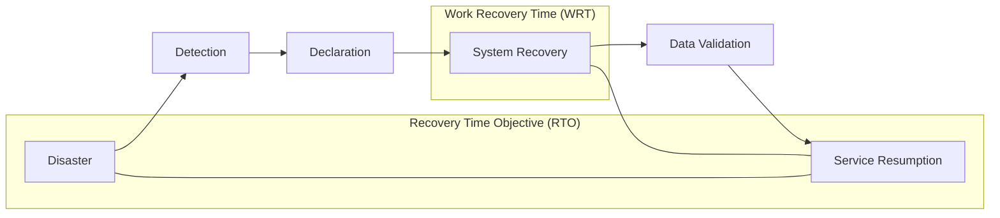

Parent: [[BCP]], [[Recovery_Metrics]]

## 1. [도입: Why] 서비스 가동의 마지노선, RTO의 개요 및 배경

**가. RTO(Recovery Time Objective)의 정의**
- 재난이나 장애 발생 시점부터 IT 서비스가 복구되어 정상 가동될 때까지 허용되는 **최대 중단 시간**입니다.
- 핵심 키워드: **서비스 중단 허용치**, **비즈니스 생존 시간**, **SLA 핵심 지표**, **다운타임(Downtime)**

**나. 등장 배경 및 필요성**
- **비즈니스 가용성 보장**: IT 서비스 중단이 매출 손실, 고객 이탈 등으로 직결됨에 따라, 생존 가능한 복구 시간의 기준을 설정할 필요가 있습니다.
- **복구 전략 수립의 기준**: RTO 수준에 따라 재해복구시스템(DRS)의 구축 유형(Mirror, Hot, Warm, Cold)이 결정됩니다.
- **SLA(Service Level Agreement) 준수**: 고객 및 이해관계자에게 서비스 복구에 대한 정량적 약속을 제공하여 신뢰도를 유지합니다.

## 2. [핵심: What & How] RTO의 개념적 구조 및 산정 메커니즘

**가. RTO가 포함된 복구 타임라인 (Mermaid)**

**나. RTO 산정 시 고려 요소 (표)**

| 분류 | 고려 항목 | 상세 내용 |
| :--- | :--- | :--- |
| **비즈니스 관점** | **MTPD** (최대 허용 중단 시간) | 조직이 생존 불가능한 시점 이전으로 RTO를 설정해야 함 |
| **재무적 관점** | 시간당 손실액 (Down-time Cost) | 복구 비용과 중단 손실액 사이의 최적점(Optimal Point) 도출 |
| **운영적 관점** | **WRT** (작업 복구 시간) | 시스템 복구 후 업무 재개까지 필요한 추가 시간 고려 |
| **기술적 관점** | 인프라 복제 방식 | 동기(Sync) vs 비동기(Async) 방식에 따른 복구 속도 차이 |

## 3. [심화: Deep-dive] RTO 등급 분류 및 비용 최적화 분석

**가. 업무 중요도에 따른 RTO 등급(Tier) 분류**

| 등급 | RTO 목표 | 구축 방식 (예시) | 대상 업무 예시 |
| :--- | :--- | :--- | :--- |
| **Tier 0** | **Zero (즉시)** | Active-Active (Mirror) | 핵심 뱅킹, 실시간 결제, 응급 관제 |
| **Tier 1** | **< 4시간** | Hot Site (실시간 복제) | 대고객 웹 서비스, 그룹웨어 |
| **Tier 2** | **< 24시간** | Warm Site (주기적 복제) | ERP, SCM 등 내부 업무 시스템 |
| **Tier 3** | **> 24시간** | Cold Site (백업본 복구) | 통계 분석, 아카이빙 시스템 |

**나. RTO 단축을 위한 핵심 기술 및 전략**
- **CDP (Continuous Data Protection)**: 스냅샷 주기를 최소화하여 데이터 복구 시간을 단축.
- **Orchestration**: 복구 절차(서버 부팅, IP 변경 등)를 자동화하여 휴먼 에러를 방지하고 시간을 절약.
- **VDI / DaaS**: 재해 시 인력 이동 없이 원격지에서 즉시 업무를 수행할 수 있는 환경 조성.

## 4. [결론: Effect & Insight] 기술사적 제언 및 실무 적용 방안

**가. 실무 적용 시 고려사항: '허구의 RTO' 경계**
- 실제 복구 훈련 없이 서류상으로만 설정된 RTO는 무의미합니다. **정기적인 Fail-over 테스트**를 통해 실제 측정된 복구 시간(RTA: Recovery Time Actual)이 목표(RTO)를 충족하는지 검증해야 합니다.
- 시스템 복구(RTO)와 데이터 복구(RPO)의 균형이 중요합니다. RTO는 매우 짧지만 RPO가 길어 데이터가 많이 유실되면 비즈니스 정상화가 불가능합니다.

**나. 거버넌스 및 보안(Security) 통제 방안**
- **격리된 복구(Isolated Recovery)**: 랜섬웨어 공격 시에는 복구 시간(RTO)보다 데이터의 무결성이 우선입니다. 감염되지 않은 백업을 찾는 시간을 RTO 시나리오에 포함해야 합니다.
- **SLA 기반 거버넌스**: IT 부서와 비즈니스 부서 간의 합의된 RTO를 SLA에 명시하고, 미달성 시의 보상 체계를 정의하여 책임 경영을 강화해야 합니다.

**다. 최신 IT 트렌드와 연계한 발전 방향**
- **Cloud-native Resiliency**: Multi-Region 배포 및 서버리스 아키텍처를 통해 물리적 리전 장애에도 **Zero-downtime**을 실현하는 고가용성 설계로 진화해야 합니다.
- **Chaos Engineering**: 상시적으로 장애를 발생시켜 시스템의 자동 복구 역량을 키움으로써, 사람이 개입하는 RTO 자체를 제거하는 **Self-healing** 시스템 구축이 궁극적 목표입니다.

> [!tip] 기술사적 인사이트
> RTO는 단순한 시간이 아니라 **'조직의 생존 역량'**을 수치화한 것입니다. 답안 작성 시 **MTPD와의 논리적 관계**와 **TCO(총소유비용) 관점의 최적화 전략**을 서술하고, 최근의 대형 장애 사례를 교훈 삼아 **정기적 모의 훈련의 중요성**을 강조하십시오.

## Related Notes
- [[BCP]]
- [[RTO_RPO]]
- [[MTPD]]
- [[WRT]]
- [[DRS]]
- [[Chaos_Engineering]]
- [[사이버_복원력]]