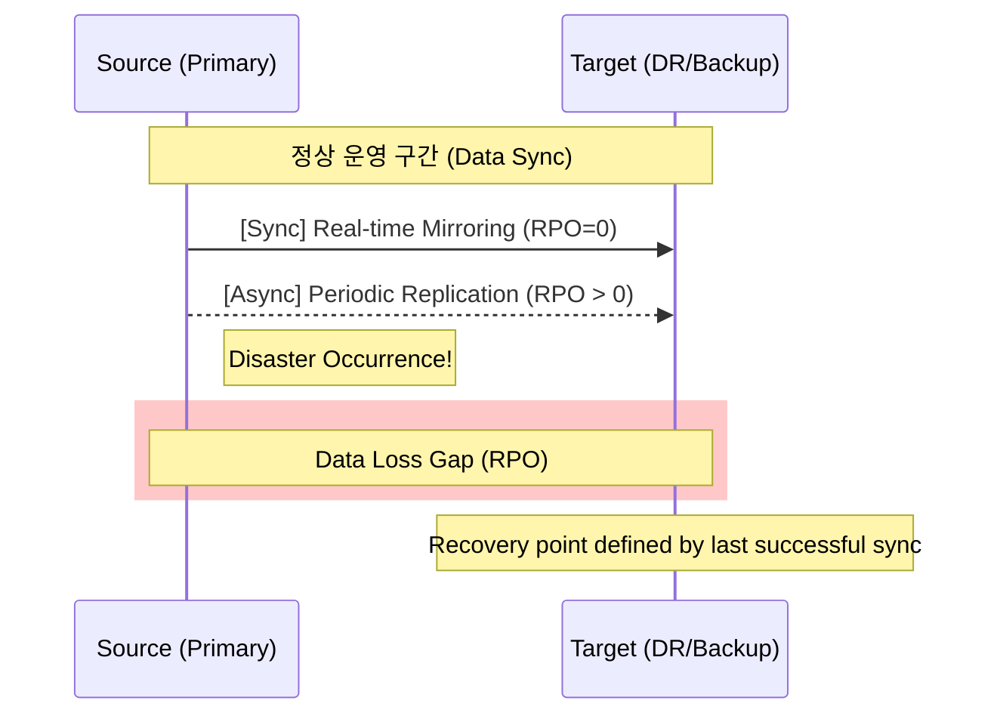

Parent: [[BCP]], [[Recovery_Metrics]]

## 1. [도입: Why] 데이터 유실의 허용한계선, RPO의 개요 및 배경

**가. RPO(Recovery Point Objective)의 정의**
- 재난 발생 시 데이터의 유실을 어디까지 감내할 수 있는지에 대한 **시간적 한계치**로, "어느 시점의 데이터로 복구할 것인가?"를 결정하는 지표입니다.
- 핵심 키워드: **데이터 손실량**, **백업 주기**, **동기화 방식**, **데이터 무결성**

**나. 등장 배경 및 필요성**
- **데이터 자산 가치 증대**: 비즈니스가 데이터 중심으로 변화함에 따라, 재해 시 데이터 소실은 서비스 중단(RTO)보다 더 치명적인 손실(Permanent Loss)을 초래합니다.
- **백업 인프라 투자 기준**: RPO 목표가 짧을수록 실시간 복제 기술이 필요하며, 이는 인프라 구축 비용과 직결되므로 최적의 투자를 위한 기준점이 됩니다.
- **복구 신뢰성 확보**: 재난 발생 직전의 최신 데이터를 얼마나 완벽하게 복원할 수 있는지 정량적으로 정의하여 비즈니스 연속성을 보장합니다.

## 2. [핵심: What & How] RPO의 개념적 구조 및 기술적 메커니즘

**가. RPO 중심의 데이터 복제 타임라인 (Mermaid)**

**나. RPO 달성을 위한 핵심 기술 요소 (표)**

| 기술 유형 | 복제 방식 | 특징 및 RPO 수준 | 주요 기술 예시 |
| :--- | :--- | :--- | :--- |
| **Mirroring** | **Synchronous** | 주 센터 저장 시 DR 센터도 동시 저장. **RPO = 0** | Storage Mirroring, Active-Active |
| **Replication** | **Asynchronous** | 주 센터 저장 후 일정 간격으로 전송. **RPO > 0 (수분~수시간)** | DB Replication, Log Shipping |
| **Snapshot** | **Point-in-time** | 특정 시점의 이미지 저장. **RPO = 스냅샷 주기** | COW/ROW Snapshot, CDP |
| **Backup** | **Periodic** | 일일/주간 단위 대용량 백업. **RPO = 백업 주기 (수일)** | Tape Backup, VTL, Cloud Backup |

## 3. [심화: Deep-dive] RPO 결정 요인 및 데이터 전송 방식 비교

**가. RPO 수준을 결정하는 주요 변수**
- **데이터 변경 빈도 (Transaction Log)**: 초당 트랜잭션이 많을수록 RPO 단축을 위한 네트워크 대역폭 요구량이 급증합니다.
- **네트워크 레이턴시 (Latency)**: RPO=0(Sync)을 구현하기 위해서는 주 센터와 DR 센터 간 거리가 보통 100km 이내로 제한됩니다.
- **복구 비용 (Cost)**: RPO를 0에 가깝게 유지할수록 전용 회선 및 고성능 스토리지 비용이 기하급수적으로 증가합니다.

**나. 동기(Sync) vs 비동기(Async) 복제 방식 비교**

| 구분 | 동기 (Synchronous) | 비동기 (Asynchronous) |
| :--- | :--- | :--- |
| **RPO 목표** | **Zero (실시간)** | 수 분 ~ 수 시간 (지연 발생) |
| **데이터 일관성** | 완벽한 일치 (Strong Consistency) | 최종 일치 (Eventual Consistency) |
| **시스템 성능** | 쓰기(Write) 지연 발생 가능 | 성능 영향 최소화 |
| **거리 제약** | 근거리 (가까울수록 유리) | 원거리 (대륙 간 복제 가능) |

## 4. [결론: Effect & Insight] 기술사적 제언 및 실무 적용 방안

**가. 실무 적용 시 고려사항: '비용과 품질의 균형'**
- 모든 데이터의 RPO를 0으로 설정하는 것은 비효율적입니다. **BIA(업무 영향 분석)**를 통해 데이터 유실 시 재작성 비용과 복구 인프라 구축 비용을 비교하여 최적의 RPO를 설정해야 합니다.
- **데이터 정합성(Consistency) 검증**: RPO를 달성했다고 하더라도 복구된 데이터가 논리적으로 깨져 있다면(Logical Corruption) 무용지물입니다. 주기적인 정합성 체크가 수반되어야 합니다.

**나. 거버넌스 및 보안(Security) 통제 방안**
- **사이버 복원력 관점의 RPO**: 랜섬웨어에 의해 데이터가 오염된 상태로 복제(Sync)되면 RPO=0이 오히려 독이 됩니다. 오염 시점을 피해 복구할 수 있는 **버전 관리(Versioning)**와 **에어갭(Air-gap)** 전략이 병행되어야 합니다.
- **컴플라이언스 준수**: 금융업법 등 데이터 보존 의무가 있는 산업군에서는 법적 요구사항을 충족하는 RPO 체계를 갖추어야 합니다.

**다. 최신 IT 트렌드와 연계한 발전 방향**
- **Cloud-Native Replication**: 클라우드 서비스 사업자(CSP)가 제공하는 글로벌 가용 영역(AZ) 간 실시간 복제 기능을 활용하여 저비용 고효율의 RPO=0 체계 구축이 가능해지고 있습니다.
- **CDP (Continuous Data Protection)**: 과거 특정 시점이 아닌, 모든 쓰기 이벤트를 기록하여 원하는 **어느 시점으로든(Any-point-in-time)** 복구할 수 있는 무한 RPO 기술 도입이 확산되고 있습니다.

> [!tip] 기술사적 인사이트
> RPO는 단순히 '백업 주기'가 아니라 **'데이터의 생존 가치'**를 의미합니다. 답안 작성 시 **Strong Consistency**와 **Eventual Consistency**의 개념을 클라우드 트렌드와 연결하고, 최근의 **랜섬웨어 대응을 위한 Immutable Backup**과의 연계성을 언급하면 고득점이 가능합니다.

## Related Notes
- [[BCP]]
- [[RTO]]
- [[Recovery_Metrics]]
- [[DRS]]
- [[데이터_복제기술]]
- [[랜섬웨어_대응]]
- [[사이버_복원력]]