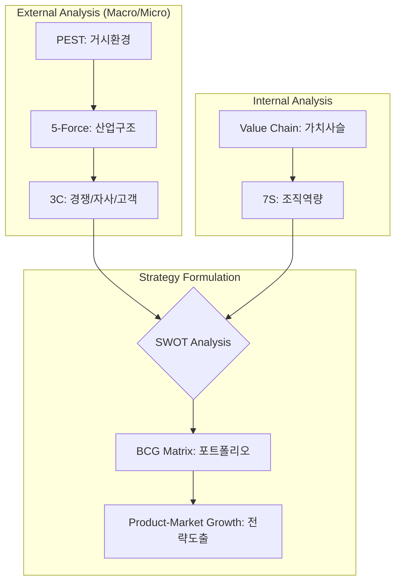

Parent: [[IT 경영전략]]

## 1. [도입: Why] 환경 변화 대응과 지속가능 경영, 경영전략 분석의 개요

**가. 경영전략수립(분석) 도구의 정의**
- 조직의 목표 달성을 위해 내/외부 환경을 체계적으로 분석하고, 경쟁 우위 확보를 위한 최적의 의사결정을 지원하는 **프레임워크(Framework)**입니다.
- 핵심 키워드: **환경 분석**, **경쟁 우위(Competitive Advantage)**, **리소스 배분**, **의사결정 최적화**

**나. 등장 배경 및 필요성**
- **VUCA 시대의 불확실성**: 변동성(Volatility), 불확실성(Uncertainty), 복잡성(Complexity), 모호성(Ambiguity)이 증대됨에 따라 정교한 분석 도구가 필수적입니다.
- **합리적 자원 배분**: 한정된 기업 자원을 핵심 역량에 집중시키기 위해 비즈니스 포트폴리오의 우선순위 결정이 필요합니다.
- **IT-Business Align**: 디지털 전환(DX) 환경에서 기술 트렌드를 비즈니스 전략에 내재화하기 위한 논리적 근거를 제공합니다.

## 2. [핵심: What & How] 경영전략 분석 체계 및 주요 프레임워크

**가. 경영전략 분석 프로세스 및 도구 연계 (Mermaid)**

**나. 환경 분석 차원별 핵심 도구 (표)**

| 분석 차원 | 분석 도구 | 주요 분석 내용 및 키워드 |
| :--- | :--- | :--- |
| **거시 환경** | **PEST** | 정치(P), 경제(E), 사회(S), 기술(T)적 요인 분석 |
| **산업 환경** | **5-Force** | 신규진입, 대체재, 구매자/공급자 교섭력, 기존 경쟁 |
| **미시 환경** | **3C** | 자사(Corporation), 고객(Customer), 경쟁사(Competitor) |
| **내부 역량** | **Value Chain** | 주활동 및 지원활동을 통한 부가가치 창출 분석 |
| **조직 역량** | **McKinsey 7S** | Strategy, Structure, System, Staff, Style, Skill, Shared Value |
| **종합 분석** | **SWOT** | 강점(S), 약점(W), 기회(O), 위협(T)의 교차 분석 (SO/ST/WO/WT) |

## 3. [심화: Deep-dive] 핵심 도구 상세 분석 및 비교

**가. 포터의 5-Force 모델 (산업 매력도 분석)**
- **진입 장벽**: 신규 참여자의 위협 수준 평가.
- **공급자/구매자 교섭력**: 가격 결정권의 주도권 분석.
- **대체재 위협**: 기존 제품을 대체할 혁신적 서비스의 출현 가능성.
- **기존 경쟁**: 산업 내 가격 경쟁 및 차별화 전쟁의 강도.

**나. 전략 도출을 위한 종합 비교 (표)**

| 구분 | SWOT 분석 | BCG Matrix | 가치사슬 (Value Chain) |
| :--- | :--- | :--- | :--- |
| **분석 관점** | 내/외부 환경 종합 | 비즈니스 포트폴리오 최적화 | 내부 운영 프로세스 효율화 |
| **핵심 지표** | S/W (내부), O/T (외부) | 시장 점유율, 시장 성장률 | 본원적 활동, 지원 활동 |
| **주요 산출물** | SO/ST/WO/WT 전략 방향 | Star, Cash Cow, Dog, Question Mark | 부가가치 창출 요인 및 비용 동인 |
| **적용 시점** | 전략 수립 초기 단계 | 사업 다각화 및 투자 결정 시 | 운영 혁신 및 차별화 전략 수립 시 |

## 4. [결론: Effect & Insight] 기술사적 제언 및 실무 적용 방안

**가. 실무 적용 시 고려사항: 프레임워크의 함정 극복**
- **정적 분석의 한계**: 분석 도구는 특정 시점의 단면(Snapshot)이므로, 변화의 흐름을 반영한 **시계열적 분석**이 병행되어야 합니다.
- **데이터 기반 의사결정**: 분석자의 주관적 판단에 의존하지 않도록 객관적인 **빅데이터 및 통계 지표**를 근거로 활용해야 합니다.

**나. 거버넌스 및 보안(Security) 관점의 전략 반영**
- **리스크 기반 전략**: SWOT 분석 시 보안 사고(랜섬웨어 등) 및 규제 대응 리스크를 위협(Threat) 요인으로 필수 반영해야 합니다.
- **거버넌스 체계**: 수립된 전략이 조직 전체로 전파되고 피드백되는 **전략 실행 거버넌스(BSC 등)**와의 연계가 필수적입니다.

**다. 최신 IT 트렌드(AI, DX)와 연계한 발전 방향**
- **AI 기반 예측 분석**: PEST 분석 시 생성형 AI를 활용한 실시간 트렌드 수집과 기술 로드맵(TRM) 수립이 확산되고 있습니다.
- **디지털 가치 사슬 (Digital Value Chain)**: 전통적인 오프라인 프로세스를 넘어, 데이터 흐름 중심의 가치 창출 구조로 분석 틀을 전환해야 합니다.

> [!tip] 기술사적 인사이트
> 경영전략 도구는 그 자체로 목적이 아니라 **'성장을 위한 지도'**입니다. 답안 작성 시 하나의 도구에 치중하기보다 **PEST -> 5-Force -> SWOT -> BCG**로 이어지는 **논리적 선순환 구조**를 제시하고, 특히 **DX 환경에서의 기술(T) 요인 강조**를 통해 전문성을 보여주십시오.

## Related Notes
- [[IT 경영전략]]
- [[SWOT]]
- [[5-Force]]
- [[BCG_Matrix]]
- [[BSC]]
- [[디지털_전환_DX]]