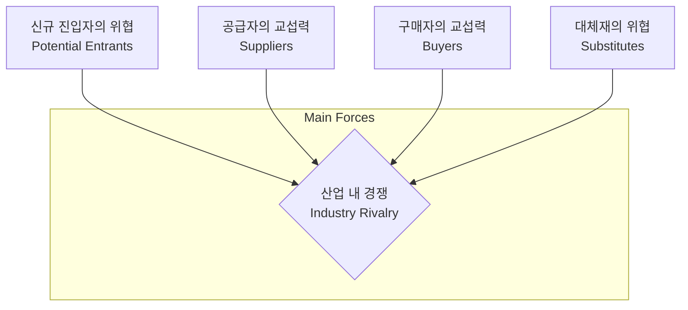

Parent: [[경영전략수립(분석)_도구]]

## 1. [도입: Why] 산업 매력도와 경쟁 강도의 결정 요인, 5-Force의 개요

**가. 5-Force 모델의 정의**
- 마이클 포터(Michael Porter)가 제안한 산업 구조 분석 프레임워크로, 5가지 경쟁 요인을 통해 **산업의 매력도(수익성)**와 **경쟁 강도**를 분석하는 도구입니다.
- 핵심 키워드: **산업 구조 분석**, **수익성 결정**, **5가지 경쟁 세력**, **전략적 포지셔닝**

**나. 등장 배경 및 필요성**
- **외부 환경의 체계적 이해**: 기업의 성과는 내부 역량뿐만 아니라 속한 산업의 구조적 특성에 크게 좌우되므로, 이를 객관적으로 파악할 틀이 필요합니다.
- **경쟁 우위 확보**: 5가지 세력의 강도를 분석하여 위협을 회피하고 기회를 포착하는 최적의 전략적 위치(Strategic Positioning)를 선정하기 위함입니다.
- **수익성 예측**: 신규 사업 진출 시 해당 산업의 잠재적 수익성을 사전에 평가하는 근거로 활용됩니다.

## 2. [핵심: What & How] 5-Force의 구성 요소 및 분석 메커니즘

**가. 5-Force 모델 개념도 (Mermaid)**

**나. 5가지 경쟁 세력별 상세 분석 지표 (표)**

| 경쟁 세력 | 분석 요인 (결정 요인) | 세력이 강해지는 경우 |
| :--- | :--- | :--- |
| **기존 기업 간 경쟁** | 산업 성장률, 고정비 비중, 퇴거 장벽 | 산업 성장이 둔화되고 고정비가 높을 때 |
| **신규 진입자의 위협** | 규모의 경제, 브랜드 충성도, 자본 요구량 | 진입 장벽이 낮고 기존 기업의 보복이 약할 때 |
| **대체재의 위협** | 상대적 가격/성능, 전환 비용(Switching Cost) | 대체재의 가성비가 높고 전환 비용이 낮을 때 |
| **구매자의 교섭력** | 구매 비중, 정보 접근성, 제품 차별화 정도 | 소수의 구매자가 대량 구매하고 정보가 투명할 때 |
| **공급자의 교섭력** | 공급자 집중도, 대체재 유무, 전방 통합 위협 | 공급자가 독과점 형태이며 대체 공급원이 없을 때 |

## 3. [심화: Deep-dive] 5-Force 모델의 한계 및 현대적 확장

**가. 전통적 5-Force 모델의 한계점**
- **정적 분석**: 급변하는 기술 트렌드와 산업 융복합(Convergence) 현상을 실시간으로 반영하기 어렵습니다.
- **협력 관계 간과**: 경쟁자 간의 전략적 제휴나 생태계 내의 협력(Co-opetition)보다는 대립적 경쟁 관계에만 집중합니다.
- **정부/규제 요인 미흡**: 국가별 규제나 보조금 등 공공 부문의 영향력을 직접적인 Force로 다루지 않습니다.

**나. 6번째 Force의 등장: 보완재 (Complementors)**
- **보완재의 존재**: 특정 제품의 가치를 높여주는 다른 제품(예: 스마트폰-앱, 하드웨어-소프트웨어)의 존재가 산업 수익성에 중대한 영향을 미침에 따라 6번째 세력으로 추가되기도 합니다.

## 4. [결론: Effect & Insight] 기술사적 제언 및 실무 적용 방안

**가. 실무 적용 시 고려사항: 디지털 전환(DX)과 5-Force의 변화**
- **진입 장벽의 변화**: 클라우드와 오픈소스 기술로 인해 IT 산업의 물리적 진입 장벽은 낮아졌으나, **데이터 네트워크 효과**라는 새로운 형태의 장벽이 강화되었습니다.
- **구매자 교섭력 강화**: SNS 및 가격 비교 플랫폼을 통해 소비자(구매자)의 정보 권력이 극대화됨에 따라 기업의 가격 결정권이 약화되었습니다.

**나. 거버넌스 및 보안(Security) 관점의 분석**
- **보안 역량의 장벽화**: 고도화된 보안 규제 및 기술력이 신규 진입자를 막는 **전략적 자산(Strategic Asset)**으로 작용할 수 있습니다.
- **공급망 리스크 관리**: 공급자의 교섭력 분석 시 단순 가격뿐만 아니라 공급자의 보안 취약점이 자사에 미치는 리스크를 5-Force 관점에서 평가해야 합니다.

**다. 최신 IT 트렌드와 연계한 발전 방향**
- **플랫폼 비즈니스 분석**: 양면 시장(Two-sided Market) 환경에서는 공급자와 구매자가 동시에 존재하므로, 플랫폼 생태계 관점에서 5-Force를 재해석하여 **네트워크 효과(Network Effect)**를 핵심 변수로 고려해야 합니다.
- **AI 기반 산업 분석**: 생성형 AI를 활용하여 경쟁사의 전략 변화와 대체재의 등장을 실시간 모니터링하고 시뮬레이션하는 동적 분석 체계로 진화해야 합니다.

> [!tip] 기술사적 인사이트
> 5-Force 모델은 **'경쟁의 본질'**을 꿰뚫는 도구입니다. 답안 작성 시 전통적 5가지 요소를 명확히 제시하되, **6번째 요소인 '보완재'**와 **DX 환경에서의 '데이터 권력'**을 언급하여 현대적 관점의 통찰을 보여주십시오.

## Related Notes
- [[경영전략수립(분석)_도구]]
- [[SWOT]]
- [[3C_분석]]
- [[디지털_전환_DX]]
- [[플랫폼_비즈니스]]
- [[네트워크_효과]]