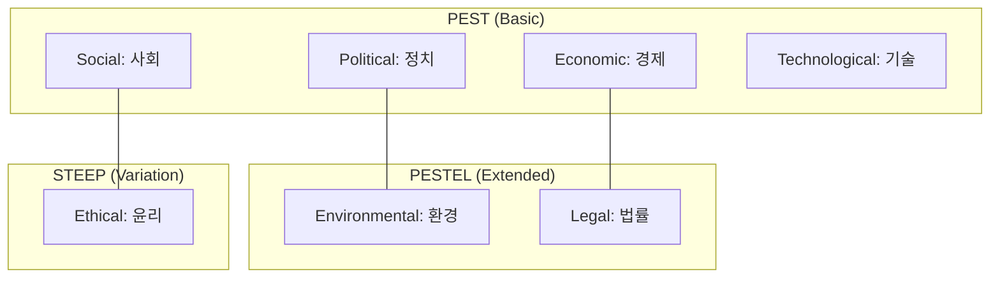

Parent: [[경영전략수립(분석)_도구]]

## 1. [도입: Why] 외부 환경의 기회와 위협 포착, 거시 환경 분석의 개요

**가. PEST / PESTEL / STEEP 분석의 정의**
- 기업의 비즈니스에 영향을 미치는 **외부의 정치, 경제, 사회, 기술적 요인**을 분석하여 기회(Opportunity)와 위협(Threat)을 식별하는 거시 환경 분석 프레임워크입니다.
- 핵심 키워드: **거시 환경(Macro Environment)**, **불확실성 관리**, **전략적 통찰**, **메가 트렌드**

**나. 등장 배경 및 필요성**
- **전략적 의사결정 지원**: 기업이 통제할 수 없는 외부 요인의 변화를 사전에 파악하여 리스크를 최소화하고 선제적 전략을 수립하기 위함입니다.
- **산업 패러다임 변화 대응**: 기술적(T) 파괴나 법적(L) 규제 변화 등 산업의 근본 구조를 바꾸는 요인을 체계적으로 관리합니다.
- **SWOT 분석의 입력값**: SWOT 분석의 기회(O)와 위협(T)을 도출하기 위한 가장 기본적인 외부 환경 분석 단계입니다.

## 2. [핵심: What & How] 거시 환경 분석 모델의 체계 및 구성 요소

**가. PEST 분석에서 PESTEL로의 확장 구조 (Mermaid)**

**나. PESTEL 분석의 6대 핵심 구성 요소 (표)**

| 요인 (Factor) | 주요 분석 항목 | IT 전략적 시사점 예시 |
| :--- | :--- | :--- |
| **Political** (정치) | 정부 정책, 보조금, 무역 규제, 정권 안정성 | 공공 클라우드 전환 정책, 반도체 보조금 |
| **Economic** (경제) | 성장률, 환율, 금리, 인플레이션, 가계 소득 | IT 투자 예산 축소(고금리), 환차손 리스크 |
| **Social** (사회) | 인구 구조, 라이프스타일, 가치관 변화, 교육 | 비대면 서비스 수요, MZ세대 맞춤형 UX |
| **Technological** (기술) | AI, 클라우드, 보안 기술, R&D 투자, 특허 | 생성형 AI 도입, 레거시 시스템의 현대화 |
| **Environmental** (환경) | 기후 변화, 탄소 중립, ESG 경영, 에너지 규제 | 그린 데이터센터 구축, RE100 달성 전략 |
| **Legal** (법률) | 데이터 보호법, 노동법, 지적재산권, 공정거래 | 개인정보보호법(ISMS-P), AI 윤리 가이드라인 |

## 3. [심화: Deep-dive] 거시 환경 분석 모델의 변형 및 비교

**가. 분석 모델별 특징 및 차이점 비교**

| 구분 | PEST 분석 | PESTEL 분석 | STEEP 분석 |
| :--- | :--- | :--- | :--- |
| **중점 영역** | 전통적 4대 영역 중심 | 법률 및 환경 요인 강화 | 윤리 및 생태계 관점 가미 |
| **주요 요인** | P, E, S, T | P, E, S, T, **E(nv), L** | **S**, T, E(co), E(nv), P |
| **적용 목적** | 일반적인 경영 전략 수립 | 컴플라이언스 및 ESG 경영 강조 | 사회적 책임 및 장기 트렌드 분석 |
| **최근 추세** | 기초 분석 도구로 활용 | 가장 보편적으로 사용됨 | ESG 및 사회 혁신 전략에 활용 |

**나. 거시 환경 분석 수행 시 유의사항**
- **상호 연관성 분석**: 각 요인은 독립적이지 않고 서로 연결되어 있습니다. (예: 정치적 규제 강화(P)가 기술 도입(T)을 저해하거나 촉진함)
- **핵심 동인(Key Drivers) 식별**: 수많은 요인 중 우리 비즈니스에 가장 결정적인 영향을 미치는 3~5가지 **핵심 성공 요인(KSF)**을 추려내야 합니다.

## 4. [결론: Effect & Insight] 기술사적 제언 및 실무 적용 방안

**가. 실무 적용 시 고려사항: 'T'와 'L'의 상충 관계**
- 기술 혁신(T)의 속도가 법적 규제(L)보다 빠를 경우 발생하는 '규제 샌드박스' 요인을 면밀히 분석하여 신사업의 법적 안정성을 확보해야 합니다.
- **시나리오 플래닝**: 거시 환경 분석 결과를 바탕으로 최상의 시나리오와 최악의 시나리오를 수립하여 유연한 대응 체계를 구축해야 합니다.

**나. 거버넌스 및 보안(Security) 관점의 분석**
- **법적 요인(Legal)** 강화: GDPR, 개인정보보호법 등 법적 규제는 이제 단순한 환경 요인이 아니라, 위반 시 비즈니스 폐쇄로 이어지는 **치명적 위험(Critical Risk)**으로 관리되어야 합니다.
- **국제 정세(Political)** 반영: 국가 간 기술 패권 전쟁으로 인한 공급망 보안(Supply Chain Security) 리스크를 PEST 분석에 반드시 포함해야 합니다.

**다. 최신 IT 트렌드(AI, ESG)와 연계한 발전 방향**
- **AI 기반 거시 환경 모니터링**: 생성형 AI와 빅데이터 분석을 통해 전 세계의 뉴스, 정책 보고서를 실시간으로 분석하여 PEST 요인의 변화를 감지하는 **실시간 거시 분석 시스템** 도입이 필요합니다.
- **Green IT와 PESTEL**: 환경(E) 요인의 강화에 따라 데이터센터의 전력 효율(PUE)을 개선하고 탄소 배출을 추적하는 **GreenOps** 전략과의 정렬이 시급합니다.

> [!tip] 기술사적 인사이트
> 거시 환경 분석은 **'숲을 보는 도구'**입니다. 답안 작성 시 요인을 단순 나열하기보다, **요인 간의 인과관계**를 서술하고 특히 **'기술(T)'과 '법률(L)'의 변화**가 IT 서비스에 미치는 영향력을 구체적 사례와 함께 제시하십시오.

## Related Notes
- [[경영전략수립(분석)_도구]]
- [[SWOT]]
- [[5-Force]]
- [[ESG_경영]]
- [[GreenOps]]
- [[시나리오_플래닝]]