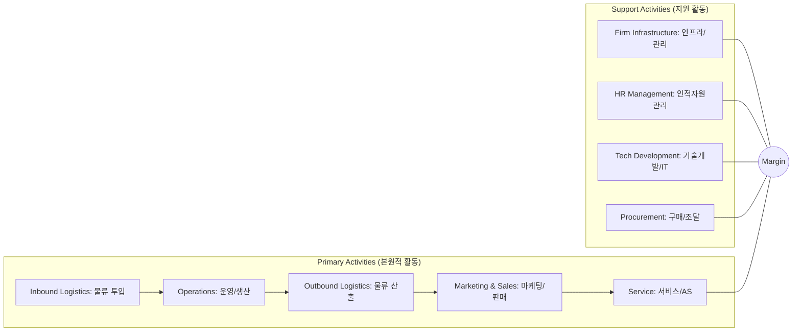

Parent: [[경영전략수럼(분석)_도구]]

## 1. [도입: Why] 내부 프로세스를 통한 가치 창출과 경쟁 우위, 가치 사슬의 개요

**가. 가치 사슬(Value Chain)의 정의**
- 기업이 제품이나 서비스를 기획, 생산, 판매하여 고객에게 전달하기까지의 **모든 활동을 사슬처럼 연결**하여 분석함으로써, 부가가치가 창출되는 원천을 파악하는 도구입니다.
- 핵심 키워드: **부가가치(Value Added)**, **본원적 활동**, **지원 활동**, **마진(Margin)**

**나. 등장 배경 및 필요성**
- **경쟁 우위의 원천 파악**: 경쟁사 대비 비용 우위(Cost Leadership)나 차별화(Differentiation)를 어느 단계에서 실현할 수 있는지 분석하기 위함입니다.
- **프로세스 최적화**: 가치를 창출하지 못하는 '비부가가치 활동(Waste)'을 식별하여 제거하거나 효율화합니다.
- **IT 인프라의 역할 정의**: IT가 단순히 지원 부서가 아니라, 각 가치 창출 활동에 어떻게 기여하여 전체 마진을 높이는지 분석합니다.

## 2. [핵심: What & How] 가치 사슬 모델의 구조 및 메커니즘

**가. 가치 사슬 모델 개념도 (Mermaid)**

**나. 가치 사슬의 주요 활동 구성 요소 (표)**

| 구분 | 주요 활동 | 상세 내용 및 IT 기여 예시 |
| :--- | :--- | :--- |
| **본원적 활동** | **물류 투입** | 원재료 수급 및 창고 관리 (WMS, SCM) |
| (Primary) | **운영/생산** | 제품 제조 및 가공 (MES, Smart Factory) |
| | **물류 산출** | 완제품 배송 및 유통 관리 (TMS) |
| | **마케팅/판매** | 광고, 판매 채널 관리 (CRM, E-Commerce) |
| | **서비스/AS** | 사후 관리 및 고객 지원 (Chatbot, 원격진단) |
| **지원 활동** | **구매/조달** | 원자재 구매 및 협력사 관리 (SRM) |
| (Support) | **기술 개발** | R&D 및 정보기술 인프라 (PLM, Cloud) |
| | **인적 자원** | 채용, 교육, 성과 관리 (HRM, LMS) |
| | **기업 인프라** | 경영 기획, 재무, 법무, 품질 관리 (ERP) |

## 3. [심화: Deep-dive] 가치 사슬의 연계(Linkage) 및 디지털 가치 사슬로의 전환

**가. 활동 간의 연계 (Linkages)**
- **내부 연계**: 각 활동 간의 유기적 결합을 통해 시너지를 창출합니다. (예: 기술 개발(S3)이 생산 공정(P2)의 효율을 획기적으로 개선)
- **외부 연계 (Value System)**: 자사의 가치 사슬을 공급자 및 유통업자의 가치 사슬과 연결하여 전체 최적화를 도모합니다. (예: SCM을 통한 공급망 통합)

**나. 디지털 가치 사슬 (Digital Value Chain)의 특징**

| 구분 | 전통적 가치 사슬 | 디지털 가치 사슬 (DX) |
| :--- | :--- | :--- |
| **핵심 자원** | 노동, 자본, 토지 | **데이터(Data)**, 알고리즘, 연결성 |
| **프로세스** | 순차적(Linear), 고립된 사일로 | **실시간(Real-time)**, 상호 연결된 네트워크 |
| **IT의 역할** | 효율화를 위한 지원 도구 | **비즈니스 모델 그 자체 (Enabler)** |
| **가치 전달** | 제품 판매 중심 (One-way) | **서비스 및 플랫폼 중심 (Iterative)** |

## 4. [결론: Effect & Insight] 기술사적 제언 및 실무 적용 방안

**가. 실무 적용 시 고려사항: '핵심 활동'에의 집중**
- 가치 사슬 분석을 통해 조직의 강점이 있는 **핵심 가치 활동(Core Value Activity)**을 식별하고, 비핵심 활동은 아웃소싱(BPO/ITO)을 통해 효율화해야 합니다.
- **마진(Margin) 극대화**: 단순히 비용을 줄이는 것이 아니라, 고객이 지불할 용의가 있는 가치(Value)를 높이는 방향으로 프로세스를 재설계해야 합니다.

**나. 거버넌스 및 보안(Security) 통제 방안**
- **공급망 보안 (Supply Chain Security)**: 구매/조달(S4) 단계에서 하드웨어/소프트웨어 공급업체의 보안 무결성을 검증하는 것이 가치 사슬 전체의 안정성을 결정합니다.
- **데이터 보안 거버넌스**: 디지털 가치 사슬의 핵심인 데이터가 각 단계에서 안전하게 흐를 수 있도록 전 과정에 걸친 보안 통제가 필요합니다.

**다. 최신 IT 트렌드와의 융합 및 발전 방향**
- **AI 기반 가치 최적화**: 각 가치 활동 단계에 생성형 AI를 도입하여 디자인(S3), 생산(P2), 고객 대응(P5)의 생산성을 극대화하는 **AI-Native Value Chain** 구축이 요구됩니다.
- **Value Network로의 진화**: 단선적인 사슬 형태를 넘어, 파트너와 고객이 함께 가치를 창출하는 **에코시스템(Ecosystem)** 기반의 네트워크 모델로 진화하고 있습니다.

> [!tip] 기술사적 인사이트
> 가치 사슬은 **'비즈니스 프로세스의 해부도'**입니다. 답안 작성 시 본원적/지원 활동의 9개 요소를 명확히 기술하고, 특히 **IT/기술 개발(S3)이 어떻게 본원적 활동의 각 단계를 혁신(DX)**하는지에 대한 구체적 사례를 제시하십시오.

## Related Notes
- [[경영전략수립(분석)_도구]]
- [[디지털_전환_DX]]
- [[SCM]]
- [[CRM]]
- [[Smart_Factory]]
- [[BPO]]