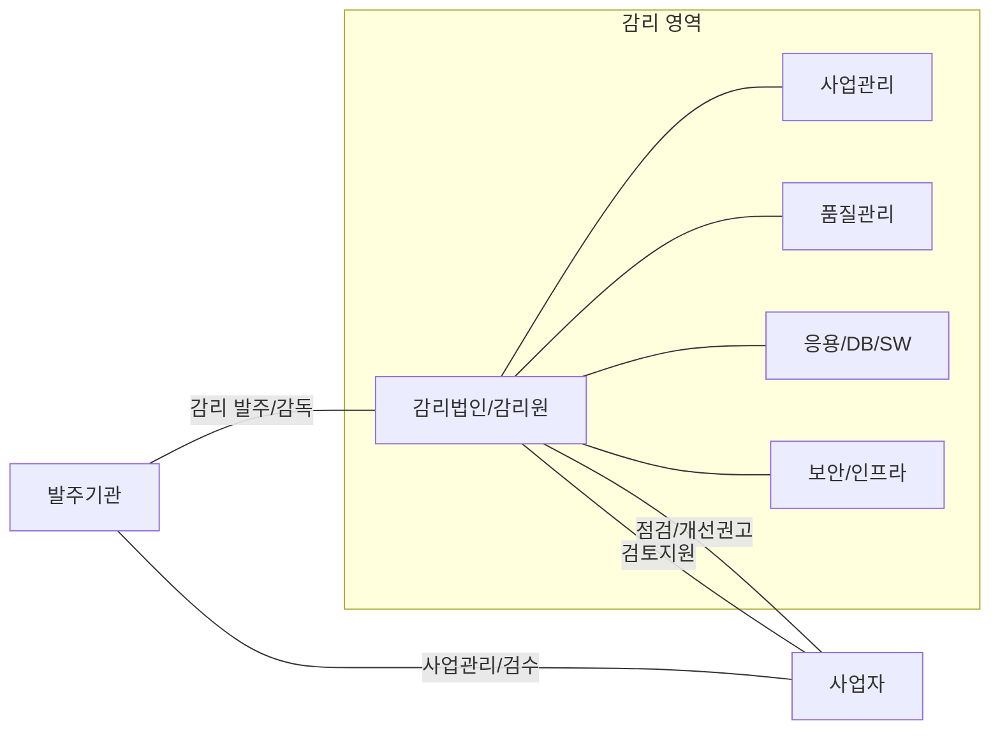

# [028].MG_정보시스템_감리

## 1. [도입: Why] 정보시스템 감리의 개요
### 가. 정의
- **정보시스템 감리 (IS Audit)**: 이해관계로부터 독립된 자가 정보시스템의 **효율성 향상**과 **안전성 확보**를 위하여 제3자적 관점에서 구축·운영에 관한 사항을 종합적으로 점검하고 개선하는 활동
- 핵심 키워드: 독립성, 효율성/안전성, 제3자적 관점, 종합 점검 및 개선

### 나. 등장 배경 및 필요성
- **객관적 품질 확보**: 발주자와 사업자 간의 이해상충을 방지하고 제3자의 시각에서 정보시스템 품질 검증 필요
- **법적 준거성(Compliance)**: 전자정부법에 의거하여 일정 규모 이상의 공공 정보화 사업에 대한 의무 감리 수행
- **위험 관리(Risk Management)**: 사업 수행 과정의 잠재적 위험을 조기 발견하여 사업 실패 비용 최소화

## 2. [핵심: What & How] 감리의 체계 및 구성 요소
### 가. 정보시스템 감리 관계도 (Conceptual Model)

### 나. 감리 대상 및 목적 (대공연장)
| 구분 | 세부 내용 | 비고 |
| :--- | :--- | :--- |
| **감리 대상** | **대**국민 서비스, **공**동 사용, 정보 **연**계 이용, **장**이 인정하는 사업 | 5억 원 이상 구축사업 의무 |
| **감리 목적** | 효과성 확보, 효율성 확보, 안전성 확보, 법적 요건 준수 | 정보시스템 가치 극대화 |

## 3. [심화: Deep-dive] 감리원 유형 및 수행 시점 분석
### 가. 감리원의 종류 및 자격 요건 (총상수)
| 구분 | 정의 및 역할 | 자격 요건 |
| :--- | :--- | :--- |
| **총괄감리원** | 감리 업무를 총괄 조정 및 지휘하는 핵심 리더 | 수석감리원 중 실무 경력 1년 이상의 상근 감리원 |
| **상주감리원** | 현장에 상주하며 사업관리 지원 및 자문을 수행 | 20억 이상 사업 3회 이상 참여 또는 PM/QA 3년 경력 수석감리원 |
| **수석감리원** | 전문 지식을 바탕으로 실제 감리 점검 수행 | 기술사(PE) 또는 감리 관련 국가공인자격 취득자 |

### 나. 수행 시점 및 단계별 감리 (정상추)
| 구분 | 유형 | 특징 |
| :--- | :--- | :--- |
| **시점별** | **정**기감리, **상**주감리, **추**가감리 | 사업 성격 및 발주자 요청에 따라 결정 |
| **2단계 감리** | 설계 단계, 종료 단계 | 분석/설계 완료 시점 및 통합시험 이후 |
| **3단계 감리** | 요구분석, 설계, 종료 단계 | 대규모 사업에서 요구사항 확정의 중요성 강조 |

## 4. [결론: Effect & Insight] 기술사적 제언
### 가. 실무 도입 시 고려사항
- **독립성 확보**: 감리법인이 발주자나 사업자로부터 경제적, 조직적으로 독립되어야 실효성 있는 개선 권고 가능
- **의사소통 관리**: 감리 결과에 따른 개선 권고 사항이 사업 일정에 미치는 영향을 최소화하기 위한 적기(Just-in-Time) 보고 체계 중요

### 나. 보안 및 거버넌스 통제 방안
- **SW 개발보안 준수**: 감리 과정에서 소스코드 진단(Static Analysis)을 통해 취약점을 조기 제거하는 보안 거버넌스 강화
- **성과 중심 감리**: 단순 체크리스트 점검을 넘어, 실제 비즈니스 목표 달성 여부를 평가하는 성과 기반 감리 체계(Performance-based Audit) 전환

### 다. 발전 방향 및 제언
- **데이터 기반 감리**: 수작업 중심 점검에서 탈피하여 Log 분석, 자동화 도구를 활용한 데이터 기반 감리(Continuous Auditing) 확산 필요
- **신기술 대응**: 클라우드 네이티브 아키텍처, AI 모델 투명성 검증 등 최신 IT 트렌드에 특화된 감리 프레임워크 정립 시급

## 5. 검증 체크리스트 (PE-Audit)

| # | 검증 항목 | 기준 | 판정 |
|---|---|---|---|
| 1 | **최신성·정확성** | 전자정부법 및 감리 기준령의 최신 요건 반영 | ✅ |
| 2 | **키워드 적정성** | 대공연장, 총상수, 정상추 등 핵심 암기 키워드 포함 | ✅ |
| 3 | **시각화 품질** | Mermaid를 통해 감리 이해관계자 관계 명확히 표현 | ✅ |
| 4 | **논리적 일관성** | 정의-대상-유형-제언으로 이어지는 전문적 흐름 | ✅ |
| 5 | **차별화 요소** | 지속적 감리(CA) 및 성과 기반 감리 관점 제시 | ✅ |
