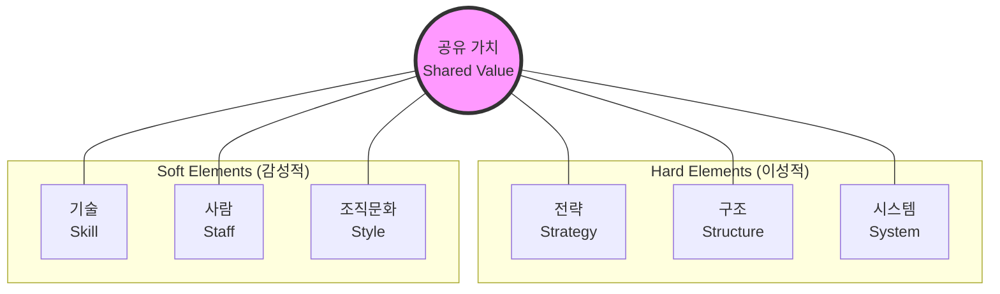

Parent: [[024.Strategic_Analysis_Tools]]

# 1. 맥킨지 7S 모델(McKinsey 7S Model)의 개요

### 가. 7S 모델의 정의
- 조직이 변화에 대처하기 위해 필요한 **7가지 핵심 요소**가 서로 조화되고 상호 보강되어야 한다는 이론에 근거한 **내부 역량 분석 및 조직 진단 도구**임
- 조직의 효율성을 결정짓는 요소들을 'Hard Elements'와 'Soft Elements'로 구분하여 전일적(Holistic) 관점에서 분석함

### 나. 등장 배경 및 필요성
- **조직 혁신 및 변화 관리**: 새로운 전략 수립이나 조직 개편 시, 단순 구조 변경을 넘어 조직의 핵심 가치와 연계된 통합적 변화 평가 필요
- **내부 역량 모니터링**: 기업의 강점과 약점을 파악하고, 각 요소 간의 정렬(Alignment) 상태를 점검하여 지속적 경쟁 우위 확보
- **조직 문화의 중요성 인식**: 무형의 가치(Shared Value, Style 등)가 기업 성과에 미치는 영향을 분석하기 위함

# 2. 7S 모델의 아키텍처 및 핵심 구성 요소

### 가. 7S 모델 개념도

### 나. 7S의 핵심 구성 요소 [두음: 전공시조사기문]
| 구분 | 요소 | 핵심 내용 | 비고/특징 |
| :--- | :--- | :--- | :--- |
| **Hard S** | **Strategy (전략)** | 기업의 목표 달성을 위한 활동 계획 및 자원 배분 | 구체적 실행 방안 |
| | **Structure (조직)** | 조직의 구조, 부서 간 관계, 권한 및 책임 소재 | 수직적/수평적 구조 |
| | **System (시스템)** | 조직 운영을 위한 프로세스, IT 인프라, 보고 절계 | 절차적 투명성 |
| **Soft S** | **Shared Value (공유가치)** | 조직원이 공유하는 기업 정신, 핵심 가치 (모델의 중심) | 조직의 비전 |
| | **Skill (기술)** | 조직이 보유한 핵심 역량, 지식, 전문성 | 차별화된 능력 |
| | **Staff (사람)** | 조직원의 역량, 배경, 태도 및 인적 자원 관리 | HRM 관점 |
| | **Style (조직문화)** | 경영 방식, 의사결정 스타일, 사내 분위기 | 비공식적 상호작용 |

# 3. 7S 모델의 분석 및 활용 상세

### 가. 분석 절차 및 방법
1) **현재 상태 분석 (As-Is)**: 7가지 각 요소별 현재 수준을 정성적/정량적으로 파악
2) **정렬(Alignment) 분석**: 요소 간의 모순이나 괴리 현상이 있는지 점검 (예: 전략과 조직문화의 충돌)
3) **목표 상태 설정 (To-Be)**: 변화된 환경에 대응하기 위해 최적화된 7S의 모습 설계
4) **실행 계획 수립**: 격차(Gap)를 해소하기 위한 단계적 변화 로드맵 구축

### 나. 유사 전략 도구와의 비교 (VRIO vs 7S)
| 비교 항목 | VRIO Framework | McKinsey 7S Model |
| :--- | :--- | :--- |
| **분석 초점** | 자원의 경쟁 우위 원천 분석 | 조직의 내부 정렬 및 효율성 진단 |
| **주요 요소** | 가치, 희소성, 모방불가성, 조직화 | 전략, 조직, 시스템, 공유가치 등 7개 |
| **활용 시점** | 자산 기반의 전략 수립 시 | 조직 변화 및 혁신 관리 시 |

# 4. 기술사적 제언 및 실무 적용 방안

### 가. 실무 도입 시 고려사항
- **Shared Value 중심의 연계성**: 7S의 모든 요소는 중심에 있는 **공유가치(Shared Value)**와 일관성을 가져야 함. 중심 가치가 흔들리면 나머지 6개 요소의 정합성도 깨짐
- **정적인 분석 지양**: 시장 환경 변화에 따라 7S 요소들의 최적 조합도 변하므로, 주기적인 모니터링과 유연한 조정 체계 마련 필요

### 나. 보안(Security) 및 거버넌스 통제 방안
- **시스템(System) 보안**: 조직 분석 과정에서 민감한 인사 정보나 핵심 전략 기술이 노출되지 않도록 데이터 거버넌스 및 접근 제어 강화
- **보안 문화(Style)**: 단순 통제를 넘어, 조직원들이 보안을 당연한 가치로 여기는 보안 내재화(Style) 확산 전략 필요

### 다. 최신 트렌드와 연계한 발전 방향
- **Digital Transformation (DX) 대응**: 'System' 영역에 클라우드, AI 기반의 플랫폼 아키텍처를 투영하고, 'Staff' 영역의 디지털 리터러시 역량 강화를 7S 관점에서 통합 관리
- **애자일 조직(Agile)**: 'Structure'를 유연하게 변경하고 'Style'을 수평적 소통 구조로 전환하는 등, 애자일 전환의 성공 여부를 7S 정렬 분석으로 검증 가능

> [!tip] **기술사 인사이트**
> 7S 모델은 단순한 체크리스트가 아니라 **"전일적 시스템 사고(Holistic System Thinking)"**의 도구입니다. 기술사적 관점에서 특정 기술 도입(System) 시, 그것이 조직의 핵심 가치(Shared Value) 및 구성원의 역량(Staff)과 충돌하지 않는지 분석하는 능력이 실무적 가치를 결정합니다.

## Related Notes
- [[024.Strategic_Analysis_Tools]]
- [[027.Value_Chain]]
- [[030.VRIO_Framework]]
