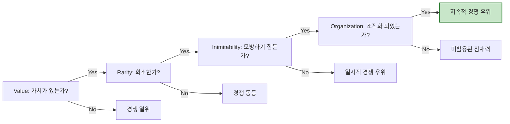

Parent: [[024.Strategic_Analysis_Tools]]

# 1. VRIO 프레임워크(VRIO Framework)의 개요

### 가. VRIO 프레임워크의 정의
- 기업의 **자원 거점 이론(RBV, Resource-Based View)**에 근거하여, 기업이 보유한 내부 자원이 지속적인 경쟁 우위를 창출할 수 있는지 4가지 속성을 기준으로 평가하는 도구임
- 자원의 가치(Value), 희소성(Rarity), 모방불가성(Inimitability), 조직화(Organization)를 통해 기업의 내부 역량을 분석함

### 나. 등장 배경 및 필요성
- **지속적 경쟁 우위 확보**: 단순히 일시적인 성공이 아닌, 장기적으로 경쟁 우위를 유지할 수 있는 원천 자원을 식별하기 위함
- **자산 기반 전략 수립**: 외부 환경(OT) 분석 이전에 기업이 가진 핵심 자산(Strength)의 진정한 가치를 정밀하게 평가할 필요성 대두
- **자원 배분의 최적화**: 경쟁력이 낮은 자원은 개선하거나 매각하고, 핵심 자원에는 역량을 집중하기 위한 의사결정 근거 제공

# 2. VRIO 프레임워크의 아키텍처 및 핵심 메커니즘

### 가. VRIO 분석 프로세스 흐름도

### 나. VRIO의 4가지 핵심 속성
| 속성 | 질문 및 내용 | 경쟁적 결과 (No 일 경우) |
| :--- | :--- | :--- |
| **Value (가치)** | 기업의 외부 위협을 무력화하거나 기회를 포착하는 자원인가? | **경쟁 열위 (Competitive Disadvantage)** |
| **Rarity (희소성)** | 극히 소수의 경쟁 기업만이 해당 자원을 보유하고 있는가? | **경쟁 등등 (Competitive Parity)** |
| **Inimitability (모방불가성)** | 다른 기업이 해당 자원을 복제하거나 대체하는 데 비용이 많이 드는가? | **일시적 경쟁 우위 (Temporary Competitive Advantage)** |
| **Organization (조직화)** | 기업이 해당 자원을 활용할 수 있도록 조직적 체계가 갖춰졌는가? | **미활용 잠재력 (Unexploited Potential)** |

# 3. VRIO의 분석 절차 및 기술 상세

### 가. VRIO 분석의 4단계 절차
1) **자원 및 역량 식별 (Identification)**: 기업이 보유한 유형(설비, 자금) 및 무형(특허, 브랜드, 지식) 자원 목록 작성
2) **속성별 질문 평가 (Questioning)**: V -> R -> I -> O 순서대로 질문을 던져 예/아니오 판단
3) **경쟁 우위 수준 결정 (Evaluation)**: 응답 결과에 따라 현재 자원의 경쟁력 등급 분류
4) **전략적 대안 도출 (Formulation)**: 핵심 자원 보호, 약점 자원 보완, 미활용 자원 활성화 전략 수립

### 나. 모방불가성(Inimitability)의 4대 원천
1) **역사적 조건**: 기업의 독특한 역사나 발전 과정에서 얻은 자원 (예: 브랜드 헤리티지)
2) **인과적 모호성**: 자원과 경쟁 우위 사이의 관계가 명확히 파악되지 않아 복제가 어려움
3) **사회적 복잡성**: 조직 내 인간관계, 조직문화 등 사회적 현상과 얽혀 있는 자원
4) **특허 및 제도**: 법적 장치를 통한 보호 (단, 특허 만료 시 모방 가능성 존재)

# 4. 기술사적 제언 및 실무 적용 방안

### 가. 실무 도입 시 고려사항
- **자원의 동적 역량 (Dynamic Capability)**: 정적인 자원 평가에 그치지 않고, 변화하는 시장 환경에 맞춰 자원을 재구성하고 재배치하는 역량도 VRIO 관점에서 평가해야 함
- **조직화(Organization)의 실행력**: 아무리 훌륭한 알고리즘(Value, Rarity, Inimitability)을 가졌어도, 이를 제품화하고 서비스하는 프로세스(Organization)가 부실하면 무용지물임

### 나. 보안(Security) 및 거버넌스 통제 방안
- **모방불가성(I) 유지 전략**: 핵심 기술 유출 방지(DLP, DRM)를 통해 외부의 인위적 모방 시도를 원천 차단하는 보안 거버넌스 필수
- **지식 자산 관리**: 퇴사자 등에 의한 핵심 노하우 유출 방지를 위해 지식 관리 시스템(KMS)과 보안 프로세스 연계

### 다. 발전 방향 및 제언
- **AI 및 데이터 자산 분석**: 기업이 보유한 양질의 '데이터'와 학습된 '모델'을 VRIO 관점에서 재평가하여 디지털 자산의 가치 실현
- **오픈 이노베이션과의 조화**: 모든 것을 내부 자원(VRIO)으로 해결하기보다, 외부 생태계를 활용하면서도 독자적 우위(Rarity, Inimitability)를 유지하는 균형 전략 필요

> [!tip] **기술사 인사이트**
> IT 기술사로서 VRIO 프레임워크를 적용할 때, **"기술적 독창성(I)"** 못지않게 중요한 것이 **"기술의 조직적 내재화(O)"**입니다. 아키텍처 설계 역량이 조직의 표준 프로세스로 정착되어야만 개인의 능력을 넘어 기업의 지속 가능한 경쟁 우위가 완성됩니다.

## Related Notes
- [[024.Strategic_Analysis_Tools]]
- [[027.Value_Chain]]
- [[029.7S_Model]]
- [[031.SWOT_Analysis]]
