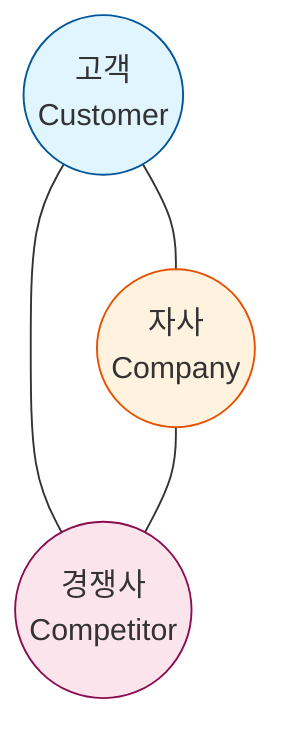

Parent: [[024.Strategic_Analysis_Tools]]

# 1. 3C / 4C 분석의 개요

### 가. 3C / 4C 분석의 정의
- **3C 분석**: 일본의 오마에 겐이치가 제안한 기법으로, 기업의 전략 수립 시 고려해야 할 3가지 핵심 요소인 **고객(Customer), 경쟁사(Competitor), 자사(Company)**를 분석하는 기법임
- **4C 분석**: 3C 분석에 **거시적 환경(Circumstance)** 또는 **협력자(Collaborator)**를 추가하여 더욱 정밀하게 시장 환경을 분석하는 확장된 기법임

### 나. 등장 배경 및 필요성
- **전략적 삼각형(Strategic Triangle)**: 자사와 경쟁사가 고객을 향해 경쟁하는 구도 내에서 차별화 포인트를 발견하기 위함
- **균형 잡힌 시각**: 내부 역량(자사)에만 매몰되지 않고 시장 수요(고객)와 외부 경쟁자(경쟁사)를 입체적으로 조망할 필요성 대두
- **마케팅 전략의 기초**: STP(Segmentation, Targeting, Positioning) 분석을 수행하기 전, 시장의 구조적 특성을 파악하기 위한 필수 단계임

# 2. 3C / 4C 분석의 구성 요소 및 프레임워크

### 가. 3C 분석 개념도

### 나. 핵심 구성 요소 상세 [두음: 고자경 / 고기환경]
| 구분 | 요소 | 핵심 분석 내용 | 비고 |
| :--- | :--- | :--- | :--- |
| **3C** | **Customer (고객)** | 시장 규모, 성장성, 고객 니즈, 세분화 시장 분석 | Demand 측면 |
| | **Competitor (경쟁사)** | 현재/잠재적 경쟁자, 경쟁사 강점/약점, 시장 점유율 | Rival 측면 |
| | **Company (자사)** | 기업 이미지, 기술력, 수익성, 가용 자원 및 역량 | Resource 측면 |
| **4C (추가)** | **Circumstance (환경)** | 거시적 환경 (PEST: 정치, 경제, 사회, 기술 등) | Macro 측면 |
| | *또는 Collaborator* | 유통 채널, 공급업체, 전략적 파트너 | Ecosystem 측면 |

# 3. 3C / 4C 분석의 활용 및 비교

### 가. 분석을 통한 전략 도출
1) **고객-자사 관계**: 고객의 페인포인트(Pain Point)를 자사의 기술력으로 어떻게 해결할 것인가? (Value Proposition)
2) **고객-경쟁사 관계**: 경쟁사가 제공하지 못하는 고객 가치는 무엇인가? (Niche Market 탐색)
3) **자사-경쟁사 관계**: 자사만이 가진 핵심 역량이 경쟁사 대비 우위에 있는가? (VRIO 연계)

### 나. 유사 분석 도구와의 비교
| 비교 항목 | 3C / 4C 분석 | PEST 분석 |
| :--- | :--- | :--- |
| **분석 범위** | 미시적 환경 (시장 내 플레이어 중심) | 거시적 환경 (국가/글로벌 트렌드 중심) |
| **주요 목적** | 경쟁 우위 확보 및 차별화 전략 수립 | 사업 환경의 기회 및 위협 요인 파악 |
| **연계성** | 3C 분석 결과가 SWOT의 내부 역량으로 활용됨 | PEST 분석 결과가 SWOT의 외부 환경으로 활용됨 |

# 4. 기술사적 제언 및 실무 적용 방안

### 가. 실무 도입 시 고려사항
- **고객 니즈의 동태성**: 고객의 요구사항은 고정된 것이 아니라 지속적으로 변하므로, 실시간 데이터(Big Data)를 활용한 동적 3C 분석 체계 필요
- **디지털 경쟁사 범위 확대**: 산업 간 경계가 허물어지는 '빅블러(Big Blur)' 현상에 따라 기존 경쟁자뿐만 아니라 빅테크 기업 등 잠재적 경쟁자도 반드시 포함해야 함

### 나. 보안(Security) 및 거버넌스 통제 방안
- **경쟁사 분석의 윤리성**: 경쟁사 정보 수집 시 기업 보안 정책 및 관련 법규(영업비밀 보호법 등)를 준수하는 거버넌스 준수 필수
- **자사 역량 보호**: 3C 분석 과정에서 자사의 핵심 역량이나 전략이 외부로 유출되지 않도록 정보 보호 체계 강화

### 다. 발전 방향 및 제언
- **Platform 4C**: 플랫폼 비즈니스에서는 '양면 시장'의 특성을 고려하여, 사용자(Customer)뿐만 아니라 공급자(Partner/Collaborator)의 가치 분석이 4C 관점에서 중요해짐
- **AI 기반 시장 분석**: 수많은 고객 리뷰와 경쟁사 뉴스를 AI로 분석하여 3C/4C 인텔리전스를 자동화하는 지능형 전략 수립 도구 도입 확산

> [!tip] **기술사 인사이트**
> 3C 분석의 성공은 **"차별화(Differentiation)"**에 있습니다. 기술사 관점에서는 단순한 기능적 차별화를 넘어, IT 아키텍처의 유연성이나 데이터 분석 역량과 같은 기술적 자산(Company)이 고객(Customer)에게 어떤 가치로 전달되는지를 논리적으로 증명해야 합니다.

## Related Notes
- [[024.Strategic_Analysis_Tools]]
- [[026.PEST_PESTEL_STEEP]]
- [[031.SWOT_Analysis]]
