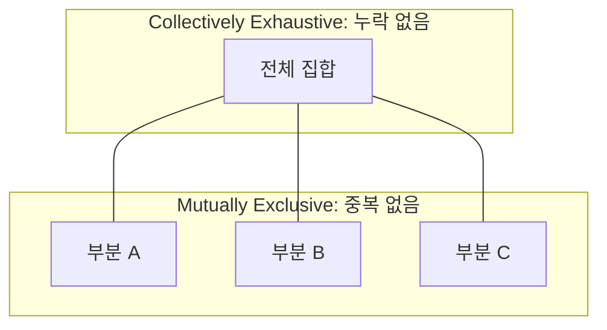

Parent: [[024.Strategic_Analysis_Tools]]

# 1. MECE(Mutually Exclusive, Collectively Exhaustive)의 개요

### 가. MECE의 정의
- 문제를 분석할 때 **"상호 중복되는 것이 없으며(Mutually Exclusive), 누락되는 것도 없이(Collectively Exhaustive)"** 전체를 파악하는 사고방식 또는 방법론임
- 복잡한 문제를 단순화하고 논리적 오류를 최소화하여 효율적인 해결책을 도출하기 위한 전략적 사고의 기초임

### 나. 등장 배경 및 필요성
- **논리적 완전성 확보**: 분석 대상에서 누락이 발생하면 잘못된 결론에 도달할 위험이 있으며, 중복이 발생하면 자원 낭비와 비효율이 초래됨
- **문제 해결의 효율성**: 거대한 문제를 다룰 수 있는 작은 단위로 쪼개어(Divide & Conquer) 체계적으로 접근 가능
- **커뮤니케이션 명확화**: 구조화된 논리 체계를 통해 이해관계자 간의 의사소통을 명확히 하고 설득력을 높임

# 2. MECE의 원리 및 프레임워크 활용

### 가. MECE 개념 시각화

### 나. MECE 적용 방법론 [두음: 57BVC4]
| 방법론 | MECE적 관점 | 설명 |
| :--- | :--- | :--- |
| **5-Force Model** | 경쟁 환경 분석 | 산업 내 5가지 요인을 중복 없이 누락 없이 분류 |
| **McKinsey 7S** | 조직 역량 분석 | 조직을 구성하는 7가지 요소를 체계적으로 배분 |
| **BCG Matrix** | 사업 포트폴리오 | 점유율과 성장성을 기준으로 4개 영역으로 구분 |
| **Value Chain** | 가치 창출 활동 | 본원적/지원적 활동으로 전체 프로세스를 분해 |
| **4C / 3C** | 시장 환경 분석 | 주요 플레이어별로 시장을 분할하여 분석 |

# 3. MECE의 분석 절차 및 심화

### 가. MECE 분석 3단계 절차
1) **초기 가설 설정 (1단계)**: 문제의 범위를 정의하고 해결을 위한 논리적 가설 수립
2) **핵심 요인 파악 (2단계)**: 가설을 기반으로 문제를 MECE 원칙에 따라 트리(Tree) 구조로 분해
3) **해결책 산출 및 제시 (3단계)**: 분해된 각 요인별로 검증을 수행하고 최적의 대안 도출

### 나. MECE를 실천하기 위한 사고 기술
- **Top-down 방식**: 상위 개념에서 하위 개념으로 분류 (분류 기준이 명확할 때 유리)
- **Bottom-up 방식**: 흩어진 정보들을 그룹핑하여 상위 개념 도출 (현상을 먼저 파악할 때 유리)
- **축(Axis) 설정**: 연령, 성별, 지역, 프로세스 단계 등 중복과 누락을 방지할 수 있는 '분류의 기준' 설정이 핵심

# 4. 기술사적 제언 및 실무 적용 방안

### 가. 실무 도입 시 고려사항
- **"기타" 항목의 활용**: 완벽한 MECE가 어려울 경우 '기타(Others)' 항목을 두어 전체 집합의 누락을 방지하되, 기타 항목의 비중이 커지지 않도록 주의해야 함
- **적정 수준의 분해**: 지나치게 세부적으로 분해하면 전체 맥락을 놓칠 수 있으므로, 목적에 맞는 적절한 Depth 조절 필요

### 나. 보안(Security) 및 거버넌스 통제 방안
- **보안 아키텍처 설계**: 보안 영역을 물리적, 관리적, 기술적 보안으로 MECE하게 구분하여 통제 항목의 누락을 방지하는 ISO 27001 등의 프레임워크 준용
- **위험 분석(Risk Assessment)**: 발생 가능한 모든 위험 시나리오를 MECE하게 도출하여 대응 전략에서 사각지대가 발생하지 않도록 관리

### 다. 발전 방향 및 제언
- **Logic Tree와의 결합**: MECE는 단순히 분류하는 단계를 넘어, 원인 분석(Why Tree)과 방법 도출(How Tree)을 위한 로직 트리의 기반이 됨
- **AI 기반 자동 분류**: 비정형 데이터를 MECE 원칙에 따라 자동 그룹핑하는 머신러닝 알고리즘을 활용하여 분석 생산성 향상

> [!tip] **기술사 인사이트**
> MECE는 단순한 이론이 아니라 **"사고의 습관"**입니다. 기술사 답안 작성 시에도 각 단락의 구성 요소가 서로 중복되지 않으면서 주제를 완벽히 커버하고 있는지 스스로 MECE 점검을 수행하는 습관이 고득점의 비결입니다.

## Related Notes
- [[024.Strategic_Analysis_Tools]]
- [[029.7S_Model]]
- [[032.4C_3C_Analysis]]
- [[034.LISS]]
