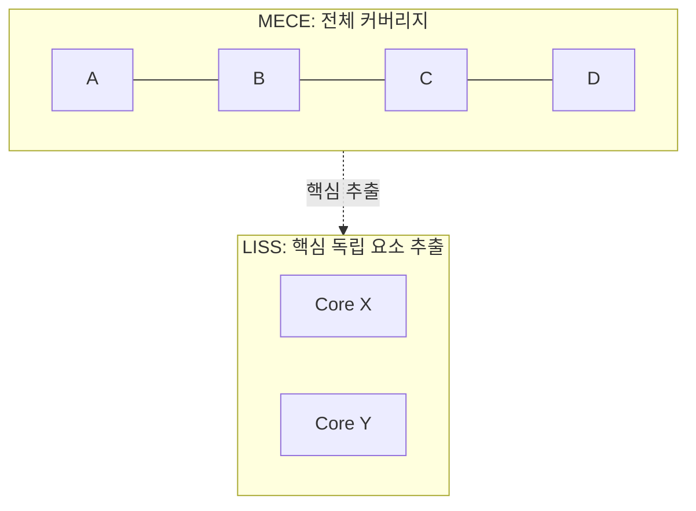

Parent: [[024.Strategic_Analysis_Tools]]

# 1. LISS(Linearly Independent, Spanning Set)의 개요

### 가. LISS의 정의
- 문제를 종합했을 때 중복 없이 하위 분석 대상들의 **핵심(Key Driver)만을 산출해내는** 전략적 분석 및 문제 해결 기법임
- MECE가 "전체"를 누락 없이 파악하는 데 집중한다면, LISS는 전체 중에서 유의미하고 상호 독립적인 **"핵심 요소"**를 도출하는 데 중점을 둠

### 나. 등장 배경 및 필요성
- **분석의 효율성 증대**: 모든 요소를 다루기보다 성과에 가장 큰 영향을 미치는 독립적 변수만을 선별하여 리소스 집중 필요
- **문제 해결의 명확성**: 서로 얽혀 있는 복잡한 문제들 사이에서 독립적인 원인(Linearly Independent)을 식별하여 인과관계 명확화
- **실행 가능한 대안 도출**: 이론적인 분류를 넘어, 실제 전략으로 연결될 수 있는 구체적이고 독립적인 해결 과제 도출

# 2. LISS의 아키텍처 및 메커니즘

### 가. MECE와 LISS의 비교 관점

### 나. LISS 분석 절차 [두음: 파분제가수분전]
| 단계 | 활동 | 세부 내용 |
| :--- | :--- | :--- |
| **문제 파악** | 대상 정의 | 해결하고자 하는 전체 이슈 정의 |
| **문제 분해** | 구조화 | MECE 등을 활용하여 문제 요소를 분할 |
| **문제 제거** | **핵심 선별** | 비핵심 요소 및 종속적 요소를 제거 (LISS의 핵심) |
| **가설 설정** | 논리 구성 | 선별된 핵심 요소를 기반으로 해결 가설 수립 |
| **계획 수립** | 실행 설계 | 분석 및 검증을 위한 로드맵 수립 |
| **분석 종합** | 검증 수행 | 데이터 기반 분석 및 가설 검증 |
| **결과 도출** | 대안 제시 | 최종적인 전략적 대안 확정 |

# 3. LISS의 상세 분석 및 MECE와의 차별점

### 가. 주요 특징: 선형 독립성 (Linearly Independent)
- 각 요소가 다른 요소에 의해 설명되거나 포함되지 않는 독자적인 가치를 지녀야 함
- 종속 관계를 제거함으로써 분석의 복잡도를 획기적으로 낮춤

### 나. MECE vs LISS 상세 비교
| 비교 항목 | MECE | LISS |
| :--- | :--- | :--- |
| **핵심 철학** | 누락 없는 전체 파악 (Whole) | 중복 없는 핵심 추출 (Core) |
| **분석 방식** | 병렬적/포괄적 분류 | 독립적/선택적 선별 |
| **장점** | 사각지대 제거, 논리적 완전성 | 리소스 집중, 분석 효율성, 핵심 파악 |
| **단점** | 비효율적 정보 포함 가능성 | 자칫 중요한 요소를 누락할 위험 |
| **상호 보완** | **MECE로 전체를 펼친 후, LISS로 핵심을 골라내는 것이 정석** | |

# 4. 기술사적 제언 및 실무 적용 방안

### 가. 실무 도입 시 고려사항
- **파레토 법칙(80:20 Rule) 연계**: 전체 문제의 80%를 결정짓는 핵심 20%의 요소를 LISS 관점에서 식별하여 집중 관리
- **종속성 검증**: 도출된 핵심 요소들이 서로 간섭을 일으키지 않는지 상관관계 분석 등을 통해 독립성 검증 필요

### 나. 보안(Security) 및 거버넌스 통제 방안
- **핵심 통제 항목(KRI/KPI) 선정**: 수많은 보안 취약점 중 실제 침해 사고로 이어질 수 있는 '핵심 독립 변수'를 LISS로 선정하여 집중 관제
- **리소스 최적화**: 한정된 보안 예산과 인력을 가장 효과적으로 배치하기 위해 LISS 기반의 보안 거버넌스 의사결정 체계 도입

### 다. 발전 방향 및 제언
- **디지털 전환 전략**: 복잡한 레거시 시스템 전체를 다루기보다, 비즈니스 가치를 혁신할 수 있는 핵심 프로세스(Core Domain)를 LISS로 추출하여 우선 전환
- **데이터 분석 및 피처 엔지니어링**: AI 모델링 시 수많은 변수 중 종속성이 높은 변수를 제거하고 독립적인 핵심 변수만을 추출하는 과정 자체가 LISS의 데이터 과학적 실현임

> [!tip] **기술사 인사이트**
> 기술사 답안에서 LISS를 언급할 때는 **"선택과 집중"**의 논리를 강조해야 합니다. 모든 것을 다 잘하겠다는 전략은 전략이 아닙니다. MECE하게 분석하여 사각지대를 없앴다면, LISS하게 압축하여 실행 가능한 날카로운 해결책을 제시하는 것이 기술사의 품격입니다.

## Related Notes
- [[024.Strategic_Analysis_Tools]]
- [[033.MECE]]
