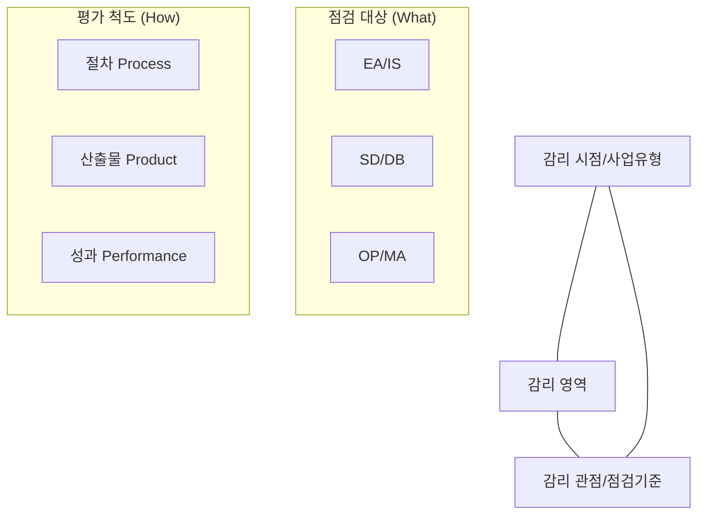

Parent: [[028.MG_정보시스템_감리]]

# 1. 정보시스템 감리 프레임워크의 개요

### 가. 감리 프레임워크의 정의
- 정보시스템 감리의 효율적인 수행을 위해 **감리 시점, 감리 영역, 감리 관점**을 입체적으로 구성한 표준 체계임
- 3개 축(Dimension)으로 이루어진 입체적 모델을 통해 감리 대상 사업을 다각도로 점검함

### 나. 프레임워크의 핵심 구성 3요소 [두음: 시영관]
1) **감리 시점/사업 유형**: 정보화 사업의 유형(구축, 운영 등)과 사업 단계(분석, 설계, 구현 등)
2) **감리 영역**: 점검의 구체적 대상 (아키텍처, 응용SW, DB, 사업관리 등)
3) **감리 관점/점검 기준**: 점검의 핵심 척도 (**절차, 산출물, 성과**)

# 2. 감리 프레임워크의 아키텍처 및 세부 점검 기준

### 가. 감리 프레임워크 입체 모델 (3D Framework)

### 나. 감리 관점 별 세부 점검 기준 [두음: 성산절]
| 감리 관점 | 점검 기준 (Inspection Standards) | 비고 |
| :--- | :--- | :--- |
| **절차 (Process)** | 계획 적정성(Plan), 절차 적정성(Process), 준수성(Compliance) | 활동 중심 |
| **산출물 (Product)** | 기능성, 무결성, 편의성, 안정성, 보안성, 효율성, 준거성, 일관성 | 결과물 중심 |
| **성과 (Performance)** | 실현성(Realizability), 충족성(Sufficiency) | 가치 중심 |

# 3. 개발 모델별 감리 시점 및 영역 상세

### 가. 구조적/정보공학적 모델 (Waterfall 중심)
- **분석/설계/구현**: 시스템 아키텍처, 응용시스템, 데이터베이스 집중 점검
- **시험/전개**: 시험 활동의 적정성 및 운영 준비 상태 확인
- **공통**: 품질보증 활동 및 사업관리 체계 상시 점검

### 나. 객체지향/컴포넌트 기반 모델 (OO/CBD 중심)
- **요구분석**: 사용자 요구사항의 명확성 및 아키텍처 기반 점검
- **분석 및 설계**: 컴포넌트 설계의 재사용성 및 인터페이스 무결성 확인
- **구현/시험/전개**: 반복(Iteration) 단계별 산출물의 점검 및 통합 안정성 확인

# 4. 기술사적 제언 및 실무 적용 방안

### 가. 실무 도입 시 고려사항
- **관점의 균형**: 초기 감리는 **절차(Process)** 중심, 중기 이후는 **산출물(Product)** 중심, 종료 시점은 **성과(Performance)** 중심으로 점검 비중을 조절해야 함
- **사업 특성 반영**: 범용 프레임워크를 그대로 적용하기보다, 클라우드 네이티브나 MSA 등 기술 특성에 맞는 맞춤형 점검 항목(Checklist) 개발 필요

### 나. 보안(Security) 및 통제 방안
- **보안성(Security) 관점 강화**: 산출물 점검 시 개발 보안(시큐어 코딩) 준수 여부와 데이터 암호화 등 핵심 보안 요건을 독립적인 뷰(View)로 관리
- **준거성(Compliance) 확보**: 개인정보보호법, 클라우드 보안 인증(CSAP) 등 최신 법규 준수 여부를 감리 프레임워크 내 준거성 점검 기준으로 내재화

### 다. 발전 방향 및 제언
- **AI 기반 지능형 프레임워크**: 감리 산출물을 AI로 자동 분석하여 결함을 실시간으로 탐지하는 지능형 감리 도구 연계
- **Agile/DevOps 감리**: 전통적인 단계별 감리에서 탈피하여, 지속적인 배포 환경에 적합한 Agile 전용 감리 프레임워크 도입 검토 필요

> [!tip] **기술사 인사이트**
> 감리 프레임워크는 감리의 **"나침반"**입니다. 복잡한 사업 환경 속에서도 시점, 영역, 관점이라는 3가지 좌표를 통해 감리원이 점검의 방향을 잃지 않고 비즈니스 가치 달성을 지원하게 하는 것이 프레임워크의 본질입니다.

## Related Notes
- [[028.MG_정보시스템_감리]]
- [[035.정보시스템_감리_절차(Audit_Procedures)]]
