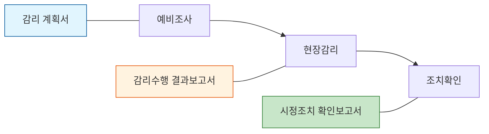

Parent: [[028.MG_정보시스템_감리]]

# 1. 정보시스템 감리 산출물의 개요 및 배경

### 가. 감리 산출물의 정의
- 정보시스템 감리를 수행하면서 그 결과를 기록하고, 시스템의 효율성 향상과 안정성 제고를 위해 점검, 검토, 시정조치, 권고 사항 등을 체계적으로 기록한 공식 문서임
- 감리 절차(예비조사, 현장감리, 조치확인)의 각 단계별 이행 결과를 증빙하는 핵심 자산임

### 나. 등장 배경 및 필요성
- **객관적 근거 확보**: 감리원의 주관적 판단이 아닌, 표준화된 양식과 점검 기준에 따른 객관적 감사 증적(Audit Trail) 확보 필요
- **품질 환류(Feedback)**: 지적 사항에 대한 개선 권고와 시정조치 이행 확인을 통해 정보시스템의 실질적 품질 향상 유도
- **이해관계자 의사소통**: 발주기관, 사업자, 감리법인 간의 공식적인 의사소통 채널로서 결과에 대한 책임성(Accountability) 명확화

# 2. 감리 핵심 산출물의 구성 및 상세 내용

### 가. 감리 단계별 주요 산출물 체계

### 나. 산출물별 세부 구성 요소 [두음: 근목대점 일보행]
| 구분 | 산출물명 | 주요 구성 항목 | 비고 |
| :--- | :--- | :--- | :--- |
| **계획** | **감리 계획서** | 관련근거, 감리목적/기준, 대상범위/단계, 영역별 점검항목, 일정/인력, 통보기관, 행정사항 | **[근목대점 일보행]** |
| **수행** | **감리수행 결과보고서** | I. 종합의견, II. 과업내용 이행여부 점검결과, III. 감리영역별 점검결과 | **현장감리 종료 후** |
| **확인** | **시정조치 확인보고서** | I. 확인계획, II. 확인결과, III. 과업이행여부 확인결과, IV. 영역별 확인결과 | **조치확인 종료 후** |

# 3. 감리 보고서 작성 원칙 및 평가 체계 상세

### 가. 감리 보고서 작성 9대 원칙 [두음: 유간논명완 정객적준]
- **유용성(U)**, **간결성(C)**, **논리성(L)**, **명확성(Cl)**, **완전성(Co)**
- **정확성(A)**, **객관성(O)**, **적시성(T)**, **준거성(Cp)**

### 나. 감리 결과 평가 유형 및 척도
| 유형 | 구분 | 상세 내용 |
| :--- | :--- | :--- |
| **개선권고** | 필수, 협의, 권고 | 시정조치의 시급성 및 중요도에 따른 분류 |
| **개선시점** | 단기, 장기 | 현 프로젝트 기간 내 또는 차기 사업 반영 여부 |
| **과업내용** | 적합, 부적합, 점검제외 | 제안요청서(RFP) 대비 계약 이행 수준 판정 |

### 다. 감리 관점 별 점검 기준 (프레임워크 연계) [두음: 성산절]
1) **성과(Performance)**: 실현성, 충족성
2) **산출물(Product)**: 기능성, 무결성, 편의성, 안정성, 보안성, 효율성, 준거성, 일관성
3) **절차(Process)**: 계획 적정성, 절차 적정성, 준수성

# 4. 기술사적 제언 및 실무 적용 방안

### 가. 실무 도입 시 고려사항
- **종합의견의 통찰력**: 단순 지적 사항의 나열이 아닌, 사업 전체의 성공 가능성과 잔여 위험에 대한 감리원의 전문적 식견(Insight)이 종합의견에 투영되어야 함
- **증빙 기반 보고**: '과업이행여부 점검결과' 작성 시 반드시 객관적인 증빙(화면 캡처, 로그, 문서 등)을 별첨하여 논란의 소지 제거

### 나. 보안(Security) 및 거버넌스 통제 방안
- **산출물 무결성 보호**: 확정된 감리 보고서의 임의 수정을 방지하기 위해 전자서명 및 문서 위변조 방지 솔루션 적용
- **보안 권고의 실효성**: 보안 취약점 지적 시, 단순 지적에 그치지 않고 구체적인 패치 방법이나 아키텍처 개선안을 제시하여 실질적 조치 유도

### 다. 최신 트렌드와 연계한 발전 방향
- **AI 기반 보고서 자동 생성**: 감리 점검 데이터(Checklist)를 바탕으로 생성형 AI가 보고서 초안을 작성하여 감리원의 업무 생산성 및 일관성 향상
- **디지털 대시보드 연동**: 정적인 종이 보고서 중심에서 탈피하여, 감리 결과를 실시간 대시보드로 시각화하여 발주자가 상시 위험을 모니터링하도록 연계

> [!tip] **기술사 인사이트**
> 감리 보고서는 단순한 점검 기록이 아니라 **"품질의 최종 보루"**입니다. 기술사로서 보고서를 작성할 때는 사업자의 노력을 존중하되, 비즈니스 가치 훼손이나 안전성 결여에 대해서는 **유간논명완 정객적준**의 원칙 하에 타협 없는 지적과 실현 가능한 대안을 제시해야 합니다.

## Related Notes
- [[028.MG_정보시스템_감리]]
- [[035.정보시스템_감리_절차(Audit_Procedures)]]
- [[036.정보시스템_감리_프레임워크(Audit_Framework)]]
