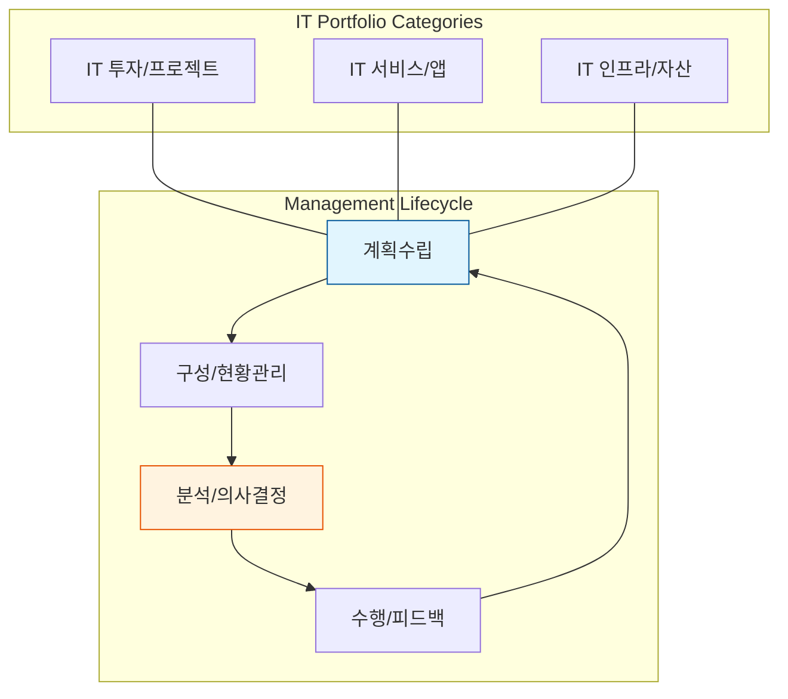

Parent: [[024.Strategic_Analysis_Tools]]

# 1. IT 포트폴리오 관리(ITPM)의 개요 및 배경

### 가. IT 포트폴리오 및 관리의 정의
- **IT 포트폴리오**: 기업이 보유한 정보기술(IT) 항목(투자, 프로젝트, 서비스, 인프라 등)들을 대분류로 구성한 자산의 묶음임
- **IT 포트폴리오 관리 (ITPM)**: IT를 단순 비용이 아닌 **비즈니스 가치와 거버넌스 대상**으로 인식하고, IT 투자가 비즈니스 목표와 연관되어 올바르게 계획, 선택, 평가되도록 관리하는 일련의 전략적 활동임

### 나. 등장 배경 및 필요성
- **IT 투자 효율화**: 한정된 자원을 수익성이 높고 전략적 가치가 큰 사업에 집중 배치(Resource Allocation)할 필요성 증대
- **비즈니스 정렬 (Alignment)**: IT 투자가 기업의 비즈니스 전략과 일치하는지 가시화하고 검증하기 위함
- **리스크 분산**: 특정 분야에 편중된 투자를 방지하고, 투자 목적(운영 유지 vs 신규 혁신)에 따른 균형 잡힌 포트폴리오 구성 필요

# 2. IT 포트폴리오의 구성 및 관리 활동

### 가. IT 포트폴리오 관리 개념도

### 나. IT 포트폴리오 관리 7단계 활동 [두음: 계구현분의수피]
| 단계 | 활동명 | 주요 과업 내용 |
| :--- | :--- | :--- |
| **1. 계획수립** | Planning | 관리 대상 선정, 프로세스 정의, 환경 구축 |
| **2. 구성** | Construction | 데이터 구축 및 카테고리 분류 |
| **3. 현황관리** | Status Mgmt | 데이터 정제 및 최신성 유지 |
| **4. 분석** | Analysis | IT 투자 분석, 가치 비교, ROI 검토 |
| **5. 의사결정** | Decision | 자원 할당 우선순위 결정, 투자 승인/기각 |
| **6. 수행** | Execution | 계획 확인 및 실제 사업/서비스 이행 |
| **7. 피드백** | Feedback | 성과 모니터링, 포트폴리오 재조정(Rebalancing) |

# 3. 포트폴리오 분석 기법 상세 [두음: BGA]

### 가. 핵심 분석 매트릭스 비교
| 기법 | 분석 축 (X/Y) | 핵심 내용 | 비고 |
| :--- | :--- | :--- | :--- |
| **BCG 매트릭스** | 시장 점유율 / 시장 성장률 | Star, Cash Cow, Dog, Question Mark로 분류하여 투자 결정 | **[B]** |
| **GE 매트릭스** | 시장 매력도 / 사업 강점 | 산업의 매력도와 자사의 경쟁력을 9개 영역으로 세분화 분석 | **[G]** |
| **Ansoff 매트릭스** | 제품(기존/신규) / 시장(기존/신규) | 시장침투, 제품개발, 시장개발, 다각화 전략 도출 | **[A]** |

### 나. 투자 유형별 포트폴리오 분류 (Weill & Broadbent)
1) **전략용(Strategic)**: 경쟁 우위 확보 및 신규 비즈니스 창출 목적
2) **정보용(Informational)**: 의사결정 지원 및 정보 가공 목적
3) **인프라용(Transactional)**: 운영 효율화 및 비용 절감 목적
4) **운영용(Infrastructure)**: 비즈니스 기반 환경 제공 목적

# 4. 기술사적 제언 및 실무 적용 방안

### 가. 실무 도입 시 고려사항
- **가시성(Visibility) 확보**: 전사 IT 자산의 현황을 한눈에 볼 수 있는 인벤토리 구축이 최우선이며, 이를 위해 EA(Enterprise Architecture)와 연계 필수
- **동적 포트폴리오 관리**: 시장 환경의 변화에 따라 기존 투자를 중단(Kill)하거나 확장(Scale)하는 유연한 의사결정 체계(Agile PMO) 가동

### 나. 보안(Security) 및 거버넌스 통제 방안
- **보안 투자 포트폴리오**: 보안을 단순 비용이 아닌 '리스크 회피형 투자'로 인식하고, 기술적 보안뿐만 아니라 관리적/물리적 보안에 대한 균형 잡힌 포트폴리오 구성
- **IT 거버넌스 정렬**: COBIT 등 표준 거버넌스 프레임워크와 연계하여 포트폴리오 의사결정의 투명성과 책임성 확보

### 다. 발전 방향 및 제언
- **AI 기반 투자 최적화**: 과거 투자 성과 데이터를 머신러닝으로 분석하여, 최적의 비즈니스 가치를 창출할 수 있는 투자 조합을 추천하는 지능형 ITPM 도입
- **ESG/지속가능성 반영**: IT 자산의 에너지 효율성 및 탄소 배출량 등 ESG 지표를 포트폴리오 평가 항목에 포함하는 'Green IT Portfolio' 확산

> [!tip] **기술사 인사이트**
> IT 포트폴리오 관리의 본질은 **"선택과 집중"**입니다. 기술사 관점에서는 최신 기술 도입(AI, Cloud 등)이 전체 포트폴리오 내에서 어떤 비즈니스 가치를 창출하며, 기존 레거시 시스템과의 자원 배분 갈등을 어떻게 해결할 것인지에 대한 논리적 스레드를 제시하는 능력이 중요합니다.

## Related Notes
- [[024.Strategic_Analysis_Tools]]
- [[027.Value_Chain]]
- [[029.7S_Model]]
- [[033.MECE]]
