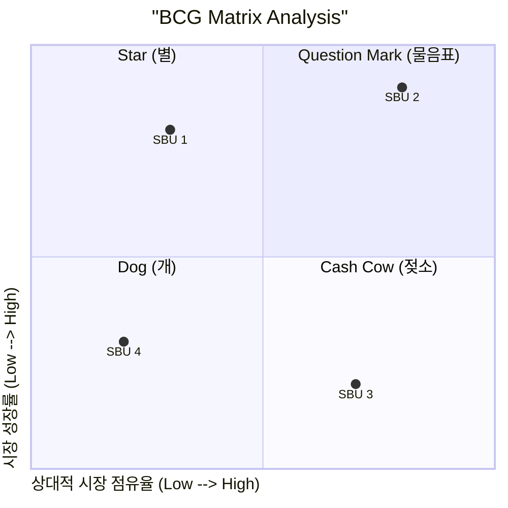

Parent: [[038.IT_포트폴리오_관리(IT_Portfolio_Management)]]

# 1. BCG 매트릭스(BCG Matrix)의 개요

### 가. BCG 매트릭스의 정의
- 보스턴 컨설팅 그룹(BCG)에 의해 개발된 기법으로, 기업 외적 요인인 **시장 성장률**과 기업 내적 요인인 **상대적 시장 점유율**의 관계에 의해 사업부(SBU)를 평가하고 전략을 제시하는 분석 도구임
- 제품 수명 주기(PLC)와 규모의 경제 원리를 결합하여 기업의 현금 흐름(Cash Flow) 최적화를 도구화함

### 나. 핵심 분석 축 (Dimension) [두음: 성점]
1) **시장 성장률 (Market Growth Rate)**: Y축. 사업이 속한 시장의 매력도를 의미하며, 현금의 소요(Investment)를 결정함
2) **상대적 시장 점유율 (Relative Market Share)**: X축. 시장 내 경쟁 지위를 의미하며, 현금의 창출(Earnings)을 결정함

# 2. BCG 매트릭스의 구조 및 4대 영역

### 가. BCG 매트릭스 사분면 [두음: 스문카도]

### 나. 영역별 특징 및 전략 방향
| 영역 | 특징 (성장률/점유율) | 전략적 의미 | 전략 방향 |
| :--- | :--- | :--- | :--- |
| **Star (별)** | High / High | 수익성과 성장성이 모두 높으나 다량의 투자 필요 | **육성**: 시장 지위 유지를 위한 집중 투자 |
| **Question Mark** | High / Low | 시장 잠재력은 높으나 경쟁력이 약함 (현금 유입 < 유출) | **선택**: 투자 확대(별로 이동) 또는 철수 결정 |
| **Cash Cow** | Low / High | 성장은 정체되었으나 시장 지위가 확고하여 현금 창출원 역할 | **유지**: 창출된 현금을 Star나 QM에 재투자 |
| **Dog (개)** | Low / Low | 성장성과 수익성이 모두 낮아 현금 유출입이 미미함 | **철수**: 사업 축소 또는 자산 처분(Divest) |

# 3. BCG 매트릭스의 심화 분석 및 활용

### 가. 사업부 간의 자원 이동 (Success Sequence)
- **성공 경로**: Question Mark -> (투자) -> Star -> (시장성숙) -> Cash Cow
- **실패 경로**: Star -> (경쟁패배) -> Question Mark -> (시장정체) -> Dog

### 나. GE 매트릭스와의 비교
| 비교 항목 | BCG 매트릭스 | GE 매트릭스 |
| :--- | :--- | :--- |
| **평가 지표** | 성장률, 점유율 (단순) | 시장 매력도, 사업 강점 (다차원/복합) |
| **구조** | 2x2 (4개 영역) | 3x3 (9개 영역) |
| **정밀도** | 단순 명료하나 다소 도식적임 | 복합적인 변수를 고려하여 정밀함 |

# 4. 기술사적 제언 및 실무 적용 방안

### 가. 실무 도입 시 고려사항
- **시장 정의의 한계**: 시장의 범위를 어떻게 정의하느냐에 따라 점유율이 왜곡될 수 있으므로, 객관적인 시장 획정이 선행되어야 함
- **시너지 효과 간과**: 독립적인 사업부 평가에는 유리하나, 사업부 간의 기술적/영업적 시너지(Interdependence)를 반영하지 못하는 단점 보완 필요

### 나. 보안(Security) 및 거버넌스 통제 방안
- **보안 투자 포트폴리오**: 보안 솔루션을 BCG 관점에서 분석하여, 유지보수 단계의 솔루션(Cash Cow)에서 절감된 예산을 신기술 보안(Star)에 재투자하는 전략 수립

### 다. 발전 방향 및 제언
- **애자일 포트폴리오 연계**: 전통적인 연간 단위 분석에서 벗어나, 데이터 분석 기반의 실시간 점유율 변화를 반영하는 동적 포트폴리오 분석 체계로 진화 필요

> [!tip] **기술사 인사이트**
> BCG 매트릭스의 본질은 **"균형(Balance)"**입니다. 모든 사업이 Star일 필요는 없으며, 미래의 Star를 키울 수 있는 든든한 Cash Cow와 잠재력 있는 Question Mark가 적절히 조합된 포트폴리오가 기업의 생존을 보장합니다.

## Related Notes
- [[038.IT_포트폴리오_관리(IT_Portfolio_Management)]]
- [[040.AHP(Analytic_Hierarchy_Process)]]
