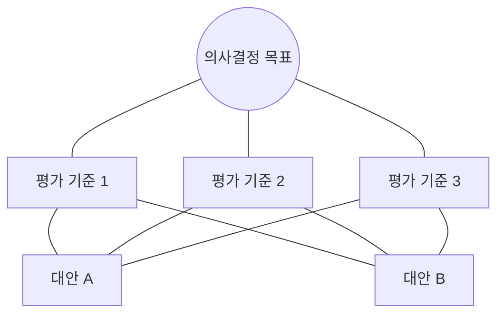

Parent: [[024.Strategic_Analysis_Tools]]

# 1. 계층 분석 과정(AHP)의 개요 및 배경

### 가. AHP의 정의
- 토마스 사티(Thomas Saaty)가 개발한 기법으로, 상호 관련성을 갖는 다수의 요소를 **계층화**하고 이를 **쌍대비교(Pairwise Comparison)**하여 도출된 객관적, 정량적 결과값을 통해 최적의 대안을 도출하는 의사결정 지원 기법임
- 인간의 주관적인 판단을 수치화하여 복합적인 의사결정 문제를 체계적으로 해결함

### 나. 의사결정의 3원칙
1) **계층적 구조 (Hierarchies)**: 복잡한 문제를 목표, 기준, 대안으로 계층화함
2) **우선순위 설정 (Priorities)**: 요소 간 상대적 중요도를 쌍대비교하여 도출함
3) **논리적 일관성 (Consistency)**: 판단의 모순을 검증하여 신뢰성을 확보함

# 2. AHP의 메커니즘 및 분석 절차

### 가. AHP 분석 계층 구조도

### 나. AHP의 5단계 분석 절차 [두음: 계쌍우일최]
| 단계 | 활동 | 세부 내용 |
| :--- | :--- | :--- |
| **1. 계층모형 구축** | Modeling | 목표(Goal)-기준(Criteria)-대안(Alternatives)으로 구조화 |
| **2. 쌍대비교 수행** | Comparison | 각 요소 간 1:1 비교를 통해 9점 척도로 중요도 평가 |
| **3. 우선순위 도출** | Priority | 비교 행렬의 고유벡터(Eigenvector)를 산출하여 가중치 도출 |
| **4. 일관성 검사** | Consistency | 일관성 지수(CI) 및 비율(CR)을 계산하여 판단의 모순 검증 (CR < 0.1 권장) |
| **5. 최종 순위 계산** | Aggregation | 각 기준별 가중치와 대안별 점수를 통합하여 최종 점수 산출 |

# 3. AHP의 심화 분석 및 특징

### 가. 9점 척도(Saaty's Scale) 활용
- 1: 동등하게 중요함
- 3: 약간 중요함 / 5: 상당히 중요함 / 7: 아주 중요함 / 9: 극도로 중요함
- 2, 4, 6, 8: 중간값 활용

### 나. AHP의 장점 및 한계
- **장점**: 정성적 요인의 정량화 가능, 논리적 일관성 검증을 통한 신뢰성 확보, 다수 참여자의 의견 통합 용이
- **한계**: 평가 요소가 많아질 경우 쌍대비교 횟수가 기하급수적으로 증가(Complexity), 상위 계층이 하위 계층에 독립적이라는 가정의 비현실성

# 4. 기술사적 제언 및 실무 적용 방안

### 가. 실무 도입 시 고려사항
- **일관성 관리**: 일관성 비율(CR)이 0.1을 초과하는 경우, 전문가의 판단에 모순이 있음을 의미하므로 재평가(Re-evaluation) 유도 필수
- **민감도 분석 (Sensitivity Analysis)**: 특정 평가 기준의 가중치 변화가 최종 대안 선정에 어떤 영향을 미치는지 시뮬레이션하여 결과의 강건성 확보

### 나. 보안(Security) 및 거버넌스 통제 방안
- **보안 솔루션 선정**: 보안 성능, 운영 편의성, 도입 비용 등 상충하는 기준들 사이에서 AHP를 활용하여 합리적인 솔루션 도입 근거 마련
- **데이터 무결성**: AHP 수행 시 입력 데이터의 왜곡을 방지하기 위한 데이터 거버넌스 및 평가 위원회 독립성 보장

### 다. 발전 방향 및 제언
- **ANP (Analytic Network Process) 확장**: 계층 간 독립성 가정을 탈피하여 상호 피드백 관계를 고려할 수 있는 네트워크 분석으로 고도화
- **AI 연계 의사결정**: 전문가의 판단 데이터를 AI가 학습하여, 신속하고 일관성 있는 의사결정을 지원하는 지능형 DSS(Decision Support System) 연계

> [!tip] **기술사 인사이트**
> AHP의 핵심은 **"합리적 설득력"**입니다. 기술사로서 프로젝트 관리나 기술 도입 전략 수립 시, 직관적인 결정이 아닌 AHP와 같은 검증된 기법을 통해 도출된 데이터 기반의 의사결정을 제시하는 것이 전문성의 척도입니다.

## Related Notes
- [[024.Strategic_Analysis_Tools]]
- [[038.IT_포트폴리오_관리(IT_Portfolio_Management)]]
- [[039.BCG_Matrix]]
