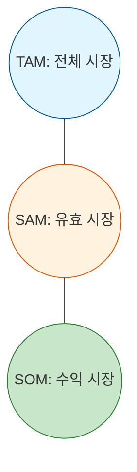

Parent: [[024.Strategic_Analysis_Tools]]

# 1. 시장 규모 분석(TAM/SAM/SOM)의 개요

### 가. TAM / SAM / SOM의 정의
- 기업의 비즈니스 모델이 타겟팅하는 시장의 범위를 **전체 시장(TAM)**, **유효 시장(SAM)**, **수익 시장(SOM)**으로 단계별로 세분화하여 분석하는 프레임워크임
- 시장의 잠재적 규모와 실제 도달 가능한 매출 기회를 정량적으로 산출하여 사업의 타당성을 검증함

### 나. 분석의 필요성
- **객관적 시장 기회 파악**: 막연한 '전체 시장' 수치가 아닌, 실제 확보 가능한 시장 규모를 도출하여 현실적인 사업 계획 수립
- **투자자 설득 및 리소스 배분**: 시장의 확장성과 초기 생존 전략을 동시에 제시하여 의사결정의 신뢰도 향상

# 2. TAM / SAM / SOM의 아키텍처 및 구성 요소

### 가. 시장 계층 구조도 (Concentric Circle Model)

### 나. 구성 요소별 상세 특징
| 구분 | 정의 | 특징 | 산출 관점 |
| :--- | :--- | :--- | :--- |
| **TAM** | **전체 시장** (Total Available Market) | 해당 제품/서비스가 타겟팅하는 산업 분야 전체를 100% 점유했을 때의 수익 규모 | 시장 기회 상한선, 전체 규모 파악 |
| **SAM** | **유효 시장** (Serviceable Available Market) | 자사의 비즈니스 모델, 지리적/환경적 제약 조건을 고려하여 도달 가능한 유효 규모 | 경쟁사 재무제표 고려, 환경 제약 반영 |
| **SOM** | **수익 시장** (Serviceable Obtainable Market) | 시장 초기 진입 시 자사의 영업력과 전략으로 단기간(약 1~2년) 내 확보 가능한 실행 규모 | 초기 생존 목적, 정밀한 산출 근거 |

# 3. 시장 규모 산출 기법 및 상세 분석

### 가. 산출 방식 (Top-down vs Bottom-up)
1) **Top-down (하향식)**: 거시적인 시장 통계 데이터에서 자사의 비중을 추정 (빠르지만 정밀도가 낮음)
2) **Bottom-up (상향식)**: 고객 한 명당 평균 단가(ARPU)와 목표 고객 수 등 미시적 데이터를 기반으로 합산 (정밀도가 높으며 현실적임)

### 나. 단계별 세분화 로직 예시
- **TAM**: 전 세계 이커머스 시장 규모
- **SAM**: 국내 모바일 의류 쇼핑 시장 규모
- **SOM**: 서울 지역 20대 여성 대상 빈티지 의류 쇼핑 앱 매출 목표

# 4. 기술사적 제언 및 실무 적용 방안

### 가. 실무 도입 시 고려사항
- **현실적인 SOM 도출**: SOM은 단순한 '점유율 목표'가 아니라, 현재 투입 가능한 인력과 마케팅 예산으로 **실행 가능한(Actionable)** 수치여야 함
- **시장 정의의 정밀도**: SAM 산출 시 지리적 한계(국내), 기능적 한계(모바일만 지원), 정책적 한계 등을 면밀히 검토하여 허수를 제거해야 함

### 나. 보안(Security) 및 거버넌스 통제 방안
- **영업 비밀 보호**: 시장 규모 산출 시 활용된 미시적 데이터(고객 DB, 단가 정책 등)가 경쟁사로 유출되지 않도록 정보 보안 체계 준수
- **데이터 투명성**: 공공 데이터, 유료 리포트 등 신뢰할 수 있는 소스(Source)를 활용하여 거버넌스 측면의 의사결정 객관성 확보

### 다. 발전 방향 및 제언
- **Dynamic Market Sizing**: 고정된 수치가 아닌, 기술 트렌드와 경쟁 환경 변화에 따라 실시간으로 업데이트되는 동적 시장 규모 분석 시스템 도입
- **신시장(Blue Ocean) 개척**: 기존의 TAM에 머물지 않고, 기술 융합(AI, 메타버스 등)을 통해 새로운 시장 기회(Latent Demand)를 발굴하는 전략적 통찰 필요

> [!tip] **기술사 인사이트**
> TAM/SAM/SOM의 본질은 **"현실 감각"**입니다. 전체 시장(TAM)의 거대함에 도취되지 않고, 우리가 당장 생존할 수 있는 수익 시장(SOM)을 얼마나 정밀하게 정의하고 장악하느냐가 IT 비즈니스 성공의 핵심 지표입니다.

## Related Notes
- [[024.Strategic_Analysis_Tools]]
- [[027.Value_Chain]]
- [[031.SWOT_Analysis]]
- [[038.IT_포트폴리오_관리(IT_Portfolio_Management)]]
