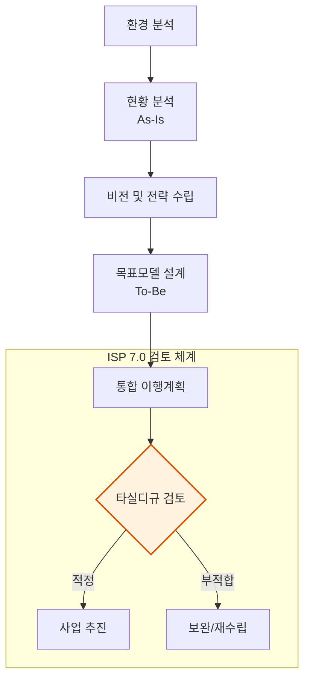

Parent: [[024.Strategic_Analysis_Tools]]

# 1. 정보화 전략 계획(ISP)의 개요 및 배경

### 가. ISP의 정의
- 조직의 비전과 목표를 달성하기 위해 전략적 정보 요구를 식별하고, 업무 활동과 자료 영역을 기술하며, 정보시스템 개발을 위한 통합 프레임워크와 이행 계획을 수립하는 **체계적 접근 방법**임
- 정보시스템 구축 이전에 사업의 타당성, 실현 가능성, 예산의 적정성을 종합적으로 검토하는 **사전 계획 단계**의 핵심 활동임

### 나. 개정 배경 및 필요성 (ISP 7.0 중심)
- **개정 배경**: 형식적 수립에 따른 예산 낭비 요인 발생, 외부 지적 지속, 급변하는 디지털 환경 대응 미흡
- **필요성**: 
    1) **계획 단계 내실화**: 구축 단계의 시행착오를 줄이기 위한 정밀한 To-Be 설계 필요
    2) **투자관리 효율화**: 중복 투자를 방지하고 한정된 예산의 우선순위 최적화
    3) **디지털 전환(DX) 가속**: 클라우드, AI, 데이터 기반의 신기술 내재화 전략 수립

# 2. ISP의 수행 절차 및 핵심 산출물

### 가. ISP 수행 절차 흐름도 [두음: 환현정목통]

### 나. 단계별 주요 활동 및 산출물
| 단계 | 핵심 활동 | 주요 산출물 | 디지털플랫폼정부(DPG) 연계 |
| :--- | :--- | :--- | :--- |
| **1. 환경분석** | 경영/IT 환경, 법·제도 분석 | 경영/정보기술 동향 분석서 | **국민중심** 정보기술 도입 분석 |
| **2. 현황분석** | As-Is 분석, 벤치마킹, Gap 분석 | 업무/IT 현황 분석서, 차이 분석서 | **사용자 편의성** 향상 과제 도출 |
| **3. 전략수립** | 정보화 비전 정의, 전략 과제 도출 | 정보화 전략 정의서 | **민관협력** 전략, **클라우드** 우선 적용 |
| **4. 목표모델** | To-Be 프로세스/시스템/데이터 설계 | To-Be 과제 상세 정의서, 구조 설계서 | **하나의정부** 연계, **AI·데이터** 기반 |
| **5. 이행계획** | 통합 이행 로드맵, 총사업비 산출 | 통합 이행계획 수립서, 효과분석서 | 규모 적정성 및 예산 검증 |

# 3. ISP 7.0 검토 체계 및 DPG 기본원칙

### 가. ISP 7.0 4대 검토 항목 [두음: 타실디규]
| 검토 항목 | 세부 점검 요소 | 핵심 내용 [두음: 필시중 / 추적] |
| :--- | :--- | :--- |
| **1. 사업 타당성** | **[필시중]** | 사업 추진의 **필**요성, **시**급성, 유사 사업과의 **중**복성 점검 |
| **2. 실현 가능성** | **[추적]** | **추**진 여건(조직, 예산)의 성숙도, 기술 적용의 **적**정성 평가 |
| **3. DPG 원칙** | 5대 기본원칙 | 디지털플랫폼정부 기본원칙(클라우드, AI 등) 반영 여부 |
| **4. 규모 적정성** | 사업 규모 검증 | 기능점수(FP) 기반 소프트웨어 개발비 및 운영비 산출 적정성 |

### 나. 디지털플랫폼정부(DPG) 5대 기본원칙
1) **클라우드 기술 우선 적용**: 민간 클라우드 및 디지털서비스 전문계약제도 활용
2) **국민 중심**: 사용자 이용 환경을 고려한 설계 및 통합 인증 체계 도입
3) **하나의 정부**: 범정부 시스템 연계 및 개방형 표준 적용
4) **AI·데이터 기반**: 데이터 기반 의사결정 및 AI 기술 활용 계획 수립
5) **민관 협력**: 민간의 창의적 기술 활용을 위한 협력 방식(PPP) 정의

# 4. 기술사적 제언 및 실무 적용 방안

### 가. 실무 도입 시 고려사항
- **대상 사업 식별**: 모든 사업이 아닌 구축/재구축 사업 위주로 수행하며, 단순 유지보수나 물품 구매는 제외하여 실효성 확보
- **검토 절차의 내실화**: ISP 수립 후 '중간산출물 검토'와 '최종산출물 검토' 단계를 거쳐 계획과 실제 구현 사이의 Gap 최소화

### 나. 보안(Security) 및 거버넌스 통제 방안
- **To-Be 보안 구조 설계**: 목표 모델 설계 단계에서 '제로 트러스트(Zero Trust)' 아키텍처 및 클라우드 보안 인증(CSAP) 요건 선제적 반영
- **데이터 거버넌스**: 하나의 정부 구현을 위해 범정부 데이터 표준을 준수하고 데이터 개방 및 공유 체계에 대한 보안 통제 방안 마련

### 다. 발전 방향 및 제언
- **Agile ISP 도입 검토**: 수년간의 장기 계획인 ISP의 한계를 극복하기 위해, 비즈니스 변화에 따라 계획을 주기적으로 조정하는 **Rolling Plan** 형태의 ISP 고도화 필요
- **ISMP와의 연계**: ISP에서 도출된 전략 과제가 실제 **ISMP(정보시스템 마스터플랜)**를 통해 상세 요구사항으로 매끄럽게 전이되도록 정합성 관리 강화

> [!tip] **기술사 인사이트**
> ISP는 정보화 사업의 **"설계도"**입니다. 최근 ISP 7.0의 핵심은 단순히 시스템을 만드는 것이 아니라, **디지털플랫폼정부(DPG)**라는 큰 틀 안에서 **AI와 데이터**를 어떻게 자산화하고 **클라우드** 상에서 유연하게 서비스할 것인지를 전략적으로 결정하는 것입니다.

## Related Notes
- [[024.Strategic_Analysis_Tools]]
- [[028.MG_정보시스템_감리]]
- [[037.정보시스템_감리_산출물(Audit_Artifacts)]]
