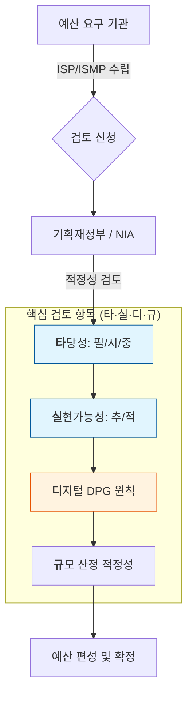

Parent: [[024.Strategic_Analysis_Tools]]

# 1. ISP·ISMP 수립 공통가이드(제9판)의 개요

### 가. 정의
- **ISP·ISMP 수립 공통가이드**: 정보시스템 구축·재구축 예산 요구 전, 사업의 타당성과 규모를 객관적으로 검토하기 위해 기획재정부와 NIA가 정의한 **절차 및 기준서** (제9판, 2024.01 개정)
- **ISP (Information Strategy Planning)**: 조직의 비전 달성을 위해 전략적 정보 요구를 식별하고 통합 정보시스템 계획을 수립하는 **전략 중심** 활동
- **ISMP (Information System Master Plan)**: 특정 사업의 요구사항을 상세 분석하여 규모와 복잡도를 산출하고 RFP를 마련하는 **실행 중심** 활동

### 나. 제9판 개정 배경 및 필요성
- **예산 낭비 방지**: 형식적 ISP 수립에 따른 중복 투자 및 예산 낭비 요인을 사전에 차단
- **DPG 원칙 이행**: **디지털플랫폼정부(DPG)**의 핵심 가치(클라우드, AI·데이터)를 기획 단계부터 내재화
- **사업 내실화**: 상세 요구사항 도출을 통해 구축 단계의 과업 변경 및 분쟁 리스크 최소화

# 2. 핵심 검토 체계: 타·실·디·규 (ISP 7.0 검토 기준)

### 가. 검토 메커니즘 개념도

### 나. 4대 검토 항목 상세 [두음: 타실디규]
| 구분 | 핵심 검토 항목 | 세부 점검 요소 [두음] | 주요 내용 |
| :--- | :--- | :--- | :--- |
| **타** | **사업 타당성** | **[필시중]** | 사업 추진의 **필**요성, **시**급성, 유사 사업과의 **중**복성 점검 |
| **실** | **실현 가능성** | **[추적]** | **추**진 여건(조직, 예산), 기술 적용의 **적**정성(클라우드 등) 평가 |
| **디** | **DPG 원칙** | 5대 기본원칙 | 디지털플랫폼정부 기본원칙 준수 여부 (클라우드 네이티브 등) |
| **규** | **규모 적정성** | FP 기반 산정 | 기능점수(FP) 기반 소프트웨어 개발비 및 운영비 산출 적정성 |

# 3. 디지털플랫폼정부(DPG) 기본원칙 반영 방법

### 가. DPG 5대 기본원칙 (2024 개정 핵심)
1) **클라우드 네이티브 우선**: 클라우드 기술 우선 적용 권고 및 MSA 아키텍처 검토
2) **국민 중심**: 사용자 편의성 향상 과제 도출 및 통합인증체계 도입 계획
3) **하나의 정부**: 범정부 시스템 연계, 개방형 표준 적용 및 데이터 공동 활용
4) **AI·데이터 기반**: AI·데이터 기술 기반 의사결정 활용 계획 및 데이터 구조 설계
5) **민관 협력**: 민간 서비스(SaaS) 우선 적용 및 민관 협력 대상/방식 정의

### 나. ISP와 ISMP의 비교 및 적용 대상
| 비교 항목 | ISP (정보화전략계획) | ISMP (정보시스템 마스터플랜) |
| :--- | :--- | :--- |
| **수행 절차 [두음]** | **[환현정목통]** | **[환요설이]** (환경, 요구사항, 설계, 이행) |
| **주요 대상 사업** | 구축/재구축 사업, 일반재정, R&D | 구축/재구축 중 상세 요구사항 도출 필요 사업 |
| **수립 제외 대상** | 운영·유지, 단순 물품 구매, DB구축 등 | 단순 시스템 개발, 단순 기능 개발 등 |

# 4. 기술사적 제언 및 실무 적용 방안

### 가. 실무 도입 시 고려사항
- **수립 기간 및 예산**: 구축비 규모별 평균 수립 기간(구축비 100억 이상 시 약 5개월)을 고려하여 예산 요구 시점 조정
- **중간산출물 검토**: ISP 7.0 지침에 따라 수립 과정 중 중간산출물 검토를 통해 계획의 실효성 조기 확보

### 나. 보안 및 거버넌스 통제 방안
- **제로 트러스트 보안**: DPG 원칙에 따라 기획 단계부터 제로 트러스트 보안 모델과 클라우드 보안 인증(CSAP) 요건 반영
- **데이터 거버넌스**: '하나의 정부' 구현을 위해 범정부 데이터 표준 및 메타데이터 관리 체계를 설계 단계에 포함

### 다. 발전 방향 및 제언
- **Agile 기획 체계**: 고정된 장기 계획의 한계를 극복하기 위해 기술 변화를 수시 반영하는 **Rolling Plan** 형태의 ISP 운영 필요
- **VFM(Value for Money) 평가**: 단순 비용 절감이 아닌, 투입 예산 대비 공공 서비스 가치 창출액을 정량화하는 성과 중심 거버넌스 강화

> [!tip] **기술사 인사이트**
> ISP·ISMP 가이드 제9판의 핵심은 **"전략(ISP)과 실행(ISMP)의 정렬"**입니다. 특히 **'타실디규'** 검증을 통해 사업의 실현 가능성을 증명하고, **클라우드 네이티브**와 **AI·데이터**라는 DPG 엔진을 기획 단계부터 탑재하는 것이 사업 성공의 핵심 성공 요인(CSF)입니다.

## Related Notes
- [[024.Strategic_Analysis_Tools]]
- [[028.MG_정보시스템_감리]]
- [[037.정보시스템_감리_산출물(Audit_Artifacts)]]
- [[043.ISMP(Information_System_Master_Plan)]]
