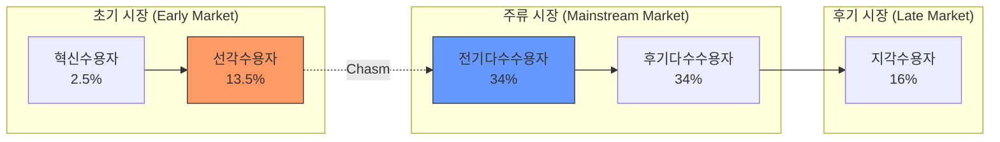

# [043] 기술수용주기 (Technology Adoption Life Cycle)

## 1. [도입: Why] 기술수용주기의 개요

### 가. 정의
- 신제품이 시장에 출시된 후 소비자 집단의 유형에 따라 기술이 수용되는 과정을 제품수명주기(PLC) 관점에서 기술한 사회학적 모델 (Technology Adoption Life Cycle)

### 나. 등장 배경 및 필요성
1) **캐즘(Chasm) 현상 규명**: 초기 시장과 주류 시장 사이의 단절 현상을 이해하고 극복하기 위한 전략적 도구
2) **시장 세분화(Segmentation)**: 수용자 집단별 특성에 따른 마케팅 믹스(4P) 및 타겟팅 전략 수립
3) **기술 로드맵 수립**: 제품의 성숙도에 따른 R&D 투자 및 서비스 고도화 시점 결정

## 2. [핵심: What & How] 기술수용주기의 구조 및 수용자 분류

### 가. 개념도 및 메커니즘

### 나. 핵심 구성 요소 (혁선전후지)
| 구분 | 설명 | 비고/특징 |
|---|---|---|
| **혁신수용자 (Innovators)** | 신기술 자체에 열광하며 위험을 감수하는 집단 | 기술 애호가, 베타 테스터 |
| **선각수용자 (Early Adopters)** | 기술보다는 비즈니스 가치와 경쟁 우위를 중시 | 비전을 가진 전략가 |
| **전기다수 (Early Majority)** | 실용주의적 관점에서 검증된 솔루션 선호 | 실용주의자, 주류 시장 진입 |
| **후기다수 (Late Majority)** | 기술에 보수적이며 표준화가 완료된 후 도입 | 보수주의자, 가격 민감도 높음 |
| **지각수용자 (Laggards)** | 기술 도입에 거부감을 느끼며 최후에 수용 | 회의론자, 전통적 방식 고수 |

## 3. [심화: Deep-dive] 캐즘(Chasm) 및 시장 전이 전략

### 가. 캐즘(Chasm) 현상 상세 분석
- **현상**: 선각수용자에서 전기다수수용자로 넘어가는 단계에서 발생하는 급격한 수요 정체 및 단절 현상
- **원인**: 비전 중심의 선각자와 실용 중심의 다수 사용자 간 기대치 및 수용 목적의 간극 발생

### 나. 시장 전이 전략 (Crossing the Chasm)
| 단계 | 전략명 | 상세 내용 |
|---|---|---|
| **진입** | **D-Day (Attack)** | 틈새 시장(Niche Market)을 공략하여 거점 확보 |
| **확산** | **Bowling Alley** | 인접한 세부 시장으로의 연속적인 확장 유도 |
| **대중화** | **Tornado** | 압도적인 시장 점유율 확보 및 대량 판매 체제 구축 |
| **안정** | **Main Street** | 제품 차별화 및 고객 지원 강화를 통한 충성도 유지 |

## 4. [결론: Effect & Insight] 기술사적 제언

### 가. 실무 도입 시 고려사항
- **홀 제품(Whole Product)**: 주류 시장 진입을 위해 핵심 기술 외 부가 서비스, 보증, 인프라 등 통합 패키지 제공 필수
- **표준화 선점**: 후기 다수 사용자를 유인하기 위해 산업 표준 확보 및 에코시스템 구축 필요

### 나. 보안 및 거버넌스 통제 방안
- **기술 성숙도 기반 보안**: 초기 시장에서는 기능 중심, 주류 시장 진입 시에는 보안 표준(ISMS 등) 준수 강화

### 다. 발전 방향 및 제언
- 최근 생성형 AI(GenAI)와 같은 **파괴적 혁신 기술**은 수용 주기가 과거보다 급격히 단축되는 **Compressed Adoption** 경향을 보임. 기업은 Fast-Follower 전략보다는 틈새 시장을 선점하는 First-Mover 전략과 캐즘 극복을 위한 고객 데이터 기반의 **Deep-Tech 마케팅**이 요구됨.

---

## [PE-Audit] 검증 결과
| # | 검증 항목 | 기준 | 판정 |
|---|---|---|---|
| 1 | **최신성·정확성** | 캐즘 이론 및 시장 전이 전략 반영 | ✅ |
| 2 | **키워드 적정성** | 혁선전후지, 캐즘, 홀제품, 볼링애널리 등 배치 | ✅ |
| 3 | **시각화 품질** | Mermaid를 통한 수용자 분포 및 캐즘 위치 표현 | ✅ |
| 4 | **논리적 일관성** | Why(PLC 결합) -> What(5단계) -> How(캐즘극복) 연계 | ✅ |
| 5 | **차별화 요소** | Compressed Adoption 및 GenAI 연계 제언 | ✅ |
