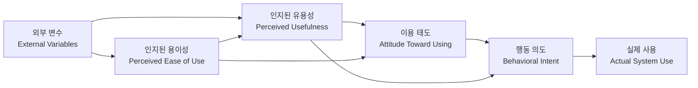

# [044] 기술수용모델 (Technology Acceptance Model, TAM)

## 1. [도입: Why] 기술수용모델의 개요

### 가. 정의
- 합리적 행위 이론(TRA, Theory of Reasoned Action)을 기반으로 정보기술 이용자의 수용 행태를 **인지된 유용성**과 **인지된 용이성**으로 설명하는 예측 모델 (Technology Acceptance Model)

### 나. 등장 배경 및 필요성
1) **IT 도입 성공률 제고**: 시스템 구축 후 실질적인 활용도를 높이기 위한 사용자 심리 요인 분석 필요
2) **시스템 설계 최적화**: 기술 중심 설계에서 사용자 중심 설계(UCD)로의 패러다임 전환 근거 제공
3) **성과 예측**: 신규 정보시스템 도입 시 조직 구성원들의 수용 의도 및 실제 사용 행태 예측

## 2. [핵심: What & How] 기술수용모델의 구조 및 변수

### 가. 개념도 (TAM 모델 흐름)

### 나. 핵심 구성 요소 (유용태행)
| 구분 | 설명 | 비고/특징 |
|---|---|---|
| **인지된 유용성 (PU)** | 기술을 사용할 때 직무 성과가 향상될 것이라고 믿는 정도 | 성과 기대, 효율성 향상 |
| **인지된 용이성 (PEOU)** | 기술을 배우고 사용하는 과정이 쉽고 노력이 적게 든다고 느끼는 정도 | 학습 용이성, 인터페이스 편의성 |
| **이용 태도 (ATU)** | 기술 사용에 대한 긍정적 또는 부정적인 감정적 반응 | 심리적 태도 |
| **행동 의도 (BI)** | 실제 기술을 사용할 의지가 있는 정도 | 실제 사용의 가장 직접적 변수 |

## 3. [심화: Deep-dive] TAM의 확장 (TAM2, TAM3)

### 가. TAM2 (확장된 기술수용모델)
- **특징**: 조직 차원의 수용 요인을 보완하기 위해 사회적 영향 및 업무 관련성 변수 추가 (이용태도 제외)
- **주요 외부요인 (주사업결결)**:
  1) **주관적 규범**: 주변 사람의 영향력
  2) **사회적 이미지**: 기술 사용을 통한 지위 향상 기대
  3) **업무 관련성**: 현재 업무와의 적합도
  4) **결과 품질**: 출력된 결과물의 우수성
  5) **결과 입증 가능성**: 성과를 명확히 보여줄 수 있는 정도

### 나. TAM3 (포괄적 기술수용모델)
- **특징**: 인지된 용이성(PEOU)의 결정 요인을 상세화하여 개인적 효능감과 즐거움 요인 포함
- **주요 요인**: 컴퓨터 자기 효능감, 외부지원 인식, 컴퓨터 불안, 인지된 즐거움 등

### 다. 기술수용모델 비교 (TAM vs UTAUT)
| 비교 항목 | TAM (TAM/TAM2/TAM3) | UTAUT (통합기술수용이론) | 비고 |
|---|---|---|---|
| **기반 이론** | TRA (합리적 행위 이론) | TRA, TPB, SCT 등 8개 이론 통합 | 이론적 확장 |
| **핵심 요인** | 유용성, 용이성 중심 | 성과 기대, 노력 기대, 사회적 영향 등 | 다각도 분석 |
| **조절 변수** | 성별, 연령 등 제한적 고려 | 성별, 연령, 경험, 자발성 등 구체적 명시 | 정교함 차이 |

## 4. [결론: Effect & Insight] 기술사적 제언

### 가. 실무 도입 시 고려사항
- **UX/UI 고도화**: 용이성(PEOU) 확보를 위한 직관적인 인터페이스 설계 및 접근성 강화
- **체험 마케팅**: 유용성(PU) 체감을 위한 PoC(Proof of Concept) 및 튜토리얼 제공

### 나. 보안 및 거버넌스 통제 방안
- **보안의 용이성**: 보안 절차가 사용 용이성을 저해하지 않도록 생체인식, FIDO 등 편리한 인증 체계 도입
- **변화 관리(Change Management)**: 조직 내 저항 최소화를 위한 교육 및 보상 체계 연계

### 다. 발전 방향 및 제언
- 최근 초거대 AI 기술 수용 시에는 단순 유용성을 넘어 **윤리적 수용성(Trustworthiness)** 및 **환각(Hallucination)에 대한 불안감**이 핵심 변수로 등장함. 기술사는 TAM 프레임워크에 '신뢰성(Trust)' 변수를 통합한 **Trust-augmented TAM** 관점의 거버넌스 수립을 주도해야 함.

---

## [PE-Audit] 검증 결과
| # | 검증 항목 | 기준 | 판정 |
|---|---|---|---|
| 1 | **최신성·정확성** | TAM2, TAM3의 핵심 변수 및 외부요인 반영 | ✅ |
| 2 | **키워드 적정성** | 유용성, 용이성, TRA, UTAUT, 변화관리 등 배치 | ✅ |
| 3 | **시각화 품질** | Mermaid를 통한 TAM의 인과관계 흐름 표현 | ✅ |
| 4 | **논리적 일관성** | Why(심리적 요인) -> What(핵심변수) -> How(확장모델) 연계 | ✅ |
| 5 | **차별화 요소** | Trust-augmented TAM 및 AI 윤리 연계 제언 | ✅ |
