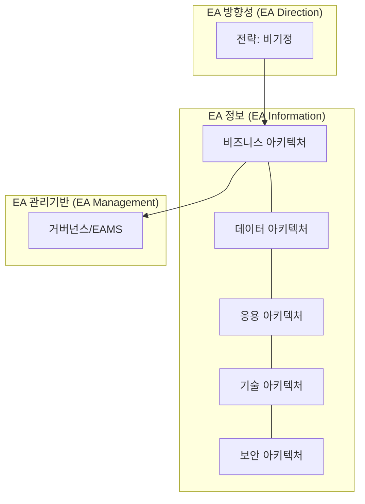

# [045] EA 프레임워크 (Enterprise Architecture Framework)

## 1. [도입: Why] EA 프레임워크의 개요

### 가. 정의
- 조직의 비즈니스 전략과 IT 자원을 유기적으로 연결하여 전체적인 관점에서 정보시스템의 청사진을 제시하는 표준 체계 (EA Framework)

### 나. 등장 배경 및 필요성
1) **IT 복잡성 증가**: 분산된 시스템 간의 상호운용성 확보 및 데이터 정합성 유지 필요
2) **IT 투자 효율화**: 중복 투자를 방지하고 정보자원의 재사용성 극대화 (TCO 절감)
3) **비즈니스 정렬(Alignment)**: 급변하는 경영 환경에 대응하기 위해 비즈니스와 IT의 전략적 통합 요구

## 2. [핵심: What & How] EA 프레임워크의 구조 및 구성 요소

### 가. 개념도 (EA 매트릭스 및 계층 구조)

### 나. 핵심 구성 요소 (비데응기보)
| 구분 | 설명 | 비고/특징 |
|---|---|---|
| **비즈니스(BA)** | 비즈니스 프로세스, 조직, 목표 등을 정의 | 최상위 아키텍처 |
| **데이터(DA)** | 전사적 데이터 구조, 흐름, 관리 원칙 정의 | 데이터 공유 및 통합 |
| **응용(AA)** | 비즈니스 지원 어플리케이션 및 인터페이스 정의 | 서비스 컴포넌트 관리 |
| **기술(TA)** | HW, NW, SW 등 인프라스트럭처의 기술 표준 | 표준 기술 프로파일(SP) |
| **보안(SA)** | 각 계층별 보안 요구사항 및 통제 방안 정의 | 전 계층 수직 관통 |

## 3. [심화: Deep-dive] EA 프레임워크의 유형 및 참조 모델

### 가. 주요 프레임워크 유형
| 구분 | 특징 | 주요 내용 |
|---|---|---|
| **Zachman (ZEAF)** | EA의 시초, 6x6 매트릭스 구조 | 관점(Who/What/How 등) 중심 |
| **TOGAF** | ADM(Architecture Development Method) 중심 | 오픈 그룹 표준, 실무적 활용도 높음 |
| **FEAF / DoDAF** | 미 연방정부 / 국방성 표준 | 참조 모델(RM) 및 상호운용성 강조 |
| **INDEX** | 국내 공공기관용 범정부 EA 프레임워크 | 한국 정보화 전략 반영 |

### 나. EA 관리 도구 및 산출물
- **EAMS (EA Management System)**: EA 산출물 통합 관리 시스템
- **RM (Reference Model)**: 아키텍처 수립 시 참조하는 표준 모델
- **산출물**: 아키텍처 모델, 이행 로드맵, 원칙/표준 가이드

## 4. [결론: Effect & Insight] 기술사적 제언

### 가. 실무 도입 시 고려사항
- **현행(As-Is) 분석의 정확도**: 정확한 현행 아키텍처 파악이 목표(To-Be) 수립의 성패 결정
- **전담 조직 구성**: EA는 일회성 프로젝트가 아닌 지속적인 거버넌스 프로세스이므로 전문 인력 확보 필수

### 나. 보안 및 거버넌스 통제 방안
- **EA 거버넌스 수립**: 아키텍처 준수 여부를 검토하는 심의 프로세스(Compliance Check) 제도화

### 다. 발전 방향 및 제언
- 최근의 **Cloud Native 아키텍처** 및 **MSA** 환경에서는 전통적인 EA의 경직성을 탈피한 **Agile EA**가 요구됨. 기술사는 전사적 통합성 유지와 개별 서비스의 자율성 사이의 균형을 맞추는 **Flexible Governance** 체계를 구축해야 함.

---

## [PE-Audit] 검증 결과
| # | 검증 항목 | 기준 | 판정 |
|---|---|---|---|
| 1 | **최신성·정확성** | 비데응기보 및 주요 프레임워크 반영 | ✅ |
| 2 | **키워드 적정성** | 방정관, 비기정, 참조모델, TOGAF 등 배치 | ✅ |
| 3 | **시각화 품질** | Mermaid를 통한 EA 3대 영역 및 계층 표현 | ✅ |
| 4 | **논리적 일관성** | Why(복잡성) -> What(5대 아키텍처) -> How(유형) 연계 | ✅ |
| 5 | **차별화 요소** | Agile EA 및 Flexible Governance 제언 | ✅ |
