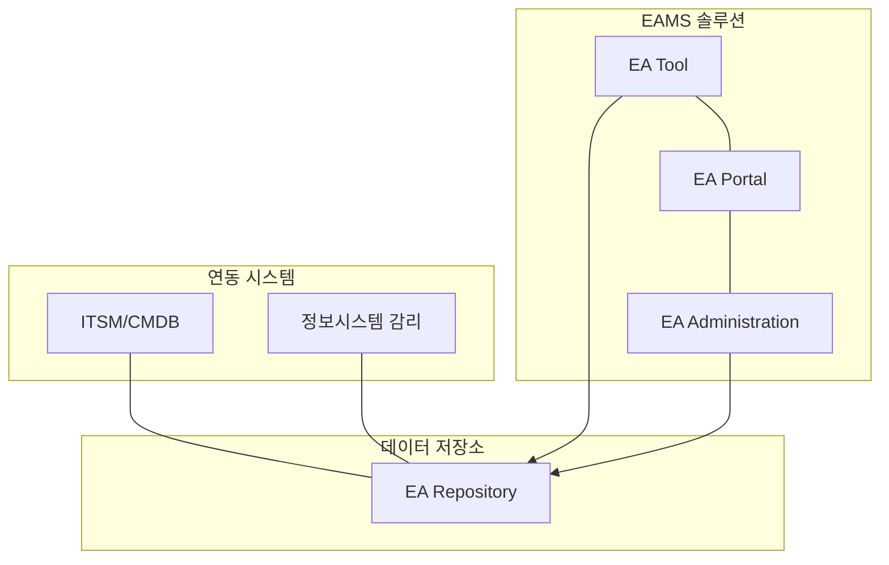

# [046] EAMS (EA Management System)

## 1. [도입: Why] EAMS의 개요

### 가. 정의
- EA 산출물의 통합 관리, 효율적 활용, 이해관계자 간 의사소통 및 EA 거버넌스 운영을 지원하는 정보시스템 (EA Management System)

### 나. 등장 배경 및 필요성
1) **EA 산출물 파편화 방지**: 수많은 아키텍처 모델 및 문서의 버전을 중앙에서 통합 관리할 필요성 증대
2) **IT 자산 가시성 확보**: 전사 IT 자원 간의 연관 관계(Traceability)를 분석하여 변화 관리의 영향도 파악
3) **협업 체계 구축**: 현업, 개발자, 아키텍트 등 다양한 이해관계자 간의 최신 정보 공유 채널 확보

## 2. [핵심: What & How] EAMS의 구조 및 주요 기능

### 가. 개념도 (EAMS 구성 및 연동 체계)

### 나. 핵심 구성 요소 및 주요 기능
| 구분 | 설명 | 비고/특징 |
|---|---|---|
| **EA Tool** | 아키텍처 모델링(Visio 등 연동) 및 메타 모델 관리 | 아키텍처 모델링 도구 |
| **EA Portal** | 일반 사용자 대상 산출물 검색, 조회 및 현황 리포트 | 웹 기반 인터페이스 |
| **Administration** | 사용자 권한, 산출물 승인 프로세스 및 시스템 관리 | 거버넌스 운영 기반 |
| **EA Repository** | EA 산출물 및 메타 데이터가 저장되는 중앙 DB | 정보의 단일 창구 (SSOT) |

## 3. [심화: Deep-dive] EAMS의 상세 기능 분석

### 가. 아키텍처 분석 및 참조 모델 관리
1) **연관성 분석 (Gap Analysis)**: As-Is와 To-Be 간의 차이 분석 및 영향도 평가 (Impact Analysis)
2) **참조 모델 관리**: BRM, SRM, DRM, TRM 등 전사 표준 참조 모델 등록 및 매핑
3) **정형/비정형 분석**: 쿼리 기반의 정형 보고서 및 사용자가 정의하는 자유로운 분석 지원

### 나. 주요 관리 항목 (데이터 흐름)
- **EA 정보**: 비즈니스, 데이터, 응용, 기술, 보안 아키텍처 정보
- **참조 모델**: 범정부 또는 전사 표준 참조 모델 (RM) 정보
- **표준 프로파일**: 기술 표준화 정보 (SP)

## 4. [결론: Effect & Insight] 기술사적 제언

### 가. 실무 도입 시 고려사항
- **현행화(Updating) 프로세스**: EAMS가 '죽은 문서 저장소'가 되지 않도록 변경 관리 절차와 시스템의 연계 자동화 필수
- **사용자 편의성**: 모델링 도구 사용법이 어려울 경우 현업 참여도가 저하되므로 직관적인 UI 확보 중요

### 나. 보안 및 거버넌스 통제 방안
- **데이터 보안**: 민감한 IT 인프라 및 보안 아키텍처 정보가 포함되므로 권한별 접근 제어(RBAC) 철저 적용

### 다. 발전 방향 및 제언
- 향후 EAMS는 단순히 산출물을 관리하는 도구를 넘어, **AIOps** 또는 **Digital Twin**과 결합하여 IT 자원의 실시간 운영 현황을 아키텍처 레벨에서 시뮬레이션할 수 있는 **Architecture Digital Twin**으로 진화해야 함.

---

## [PE-Audit] 검증 결과
| # | 검증 항목 | 기준 | 판정 |
|---|---|---|---|
| 1 | **최신성·정확성** | EAMS 3대 구성요소 및 연동 체계 반영 | ✅ |
| 2 | **키워드 적정성** | EA Repository, Traceability, RM, SP 등 배치 | ✅ |
| 3 | **시각화 품질** | Mermaid를 통한 시스템 구성 및 연동 관계 표현 | ✅ |
| 4 | **논리적 일관성** | Why(파편화) -> What(3대구성) -> How(상세분석) 연계 | ✅ |
| 5 | **차별화 요소** | Architecture Digital Twin 및 AIOps 연계 제언 | ✅ |
