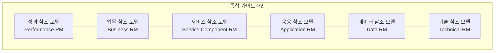

# [047] EA 참조 모델 (Reference Model, RM)

## 1. [도입: Why] EA 참조 모델의 개요

### 가. 정의
- 아키텍처의 구성 요소를 식별하고 표준화하여, 기관이나 기업이 EA를 수립할 때 가이드라인으로 활용하는 추상적 모델 (EA Reference Model)

### 나. 등장 배경 및 필요성
1) **상호운용성(Interoperability) 확보**: 조직 간 정보 공유 시 공통된 언어와 기준 제공 필요
2) **IT 효율성 제고**: 검증된 모델을 재사용함으로써 EA 수립 비용 및 시간 단축
3) **범정부/전계열사 통합 관리**: 이질적인 도메인들을 일관된 분류 체계로 구조화

## 2. [핵심: What & How] EA 참조 모델의 구조 및 유형

### 가. 개념도 (참조 모델 간의 유기적 관계)

### 나. 핵심 구성 요소 (아파서피튀다 - ABSPTD)
| 구분 | 약어 | 설명 | 비고/특징 |
|---|---|---|---|
| **성과 참조 모델** | **PRM** | 정보화 투자 성과 측정을 위한 지표 제공 | IT 가치 측정 |
| **업무 참조 모델** | **BRM** | 업무 기능 중심으로 조직의 아키텍처 구조화 | 업무 기능 분류 |
| **서비스 참조 모델** | **SRM** | 비즈니스 지원 기능을 컴포넌트 단위로 정의 | 재사용 서비스 식별 |
| **데이터 참조 모델** | **DRM** | 기관 간 데이터 공유를 위한 분류 및 데이터 교환 기준 | 데이터 표준화 |
| **기술 참조 모델** | **TRM** | 기술 서비스의 분류 체계 및 기술 표준 집합 | 기술 표준 가이드 |
| **응용 참조 모델** | **ARM** | 정보시스템 응용 서비스의 기능 분류 및 표준 | 응용 소프트웨어 구조 |

## 3. [심화: Deep-dive] 참조 모델의 상세 분석

### 가. DRM (Data Reference Model)의 중요성
- **분류 체계**: 전사 데이터의 분류 기준 수립
- **데이터 구조**: 기관 간 교환되는 데이터 형식 표준화
- **교환 체계**: 데이터 전송 및 메시지 교환 프로토콜 정의

### 나. TRM (Technical Reference Model)의 표준 프로파일(SP) 연계
- TRM은 기술 서비스의 '분류'를 담당하고, 실제 도입될 제품의 기술 사양은 **표준 프로파일(SP)**을 통해 관리함으로써 아키텍처의 유연성 확보

## 4. [결론: Effect & Insight] 기술사적 제언

### 가. 실무 도입 시 고려사항
- **조직 적합성(Tailoring)**: 범정부 참조 모델을 그대로 사용하기보다, 조직의 비즈니스 특성에 맞게 조정(Customization)하는 과정 필수
- **유지보수 체계**: 신기술 등장에 따른 참조 모델의 정기적인 업데이트(Cycle) 관리 필요

### 나. 보안 및 거버넌스 통제 방안
- **보안 아키텍처 참조**: TRM 내에 보안 기술 서비스를 명시하고, 각 참조 모델 수립 시 보안 가이드라인 준수 확인

### 다. 발전 방향 및 제언
- 클라우드 네이티브 환경으로의 전환에 맞춰, 기존의 물리적 자원 중심 TRM에서 **Cloud-Native Reference Model (CNRM)**로의 확장이 필요함. 기술사는 서버리스, 컨테이너 환경을 포괄하는 지능형 참조 모델 수립을 통해 디지털 전환(DX)을 지원해야 함.

---

## [PE-Audit] 검증 결과
| # | 검증 항목 | 기준 | 판정 |
|---|---|---|---|
| 1 | **최신성·정확성** | 아파서피튀다(ABSPTD) 6대 참조 모델 반영 | ✅ |
| 2 | **키워드 적정성** | 상호운용성, 재사용성, SP, 테일러링 등 배치 | ✅ |
| 3 | **시각화 품질** | Mermaid를 통한 참조 모델 간 계층/연계성 표현 | ✅ |
| 4 | **논리적 일관성** | Why(상호운용성) -> What(6대모델) -> How(상세분석) 연계 | ✅ |
| 5 | **차별화 요소** | Cloud-Native Reference Model (CNRM) 제언 | ✅ |
