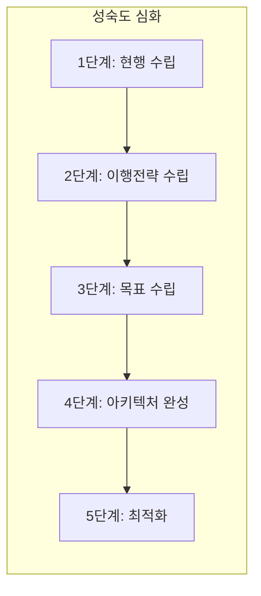

# [048] EA 성숙도 모델 (EA Maturity Model)

## 1. [도입: Why] EA 성숙도 모델의 개요

### 가. 정의
- 조직의 EA 수립, 관리, 활용 수준을 정량적으로 측정하여 현재의 성숙 단계를 진단하고, 차기 목표 수준으로 발전하기 위한 개선 로드맵을 제공하는 평가지표 (EA Maturity Model)

### 나. 등장 배경 및 필요성
1) **EA 성과 가시성 확보**: EA 도입 후 실질적으로 조직의 정보화 역량이 얼마나 향상되었는지 객관적 검증 필요
2) **지속적 개선(PDCA)**: 측정 결과를 기반으로 EA 관리 체계의 취약점을 보완하고 실행력을 제고
3) **IT 거버넌스 수준 진단**: IT 투자 의사결정 및 자원 관리의 효율성을 성숙도 관점에서 모니터링

## 2. [핵심: What & How] EA 성숙도 모델의 구조 및 측정 영역

### 가. 성숙도 발전 단계 (현이목아최)

### 나. 3대 측정 영역 및 항목 (자정활)
| 측정 영역 | 주요 측정 항목 | 설명 |
|---|---|---|---|
| **자원관리** | 정보자원 관리 현황, 연관정보 관리 | EA 정보의 정확성 및 현행화 수준 측정 |
| **정보화 관리체계** | 추진 기반, 역량 확보, 성과관리 | EA를 운영하기 위한 조직, 제도, 인력 수준 |
| **활용성과** | 투자 효율성, 성과관리 연계 | 실질적인 IT 투자 의사결정에 EA 활용 정도 |

## 3. [심화: Deep-dive] 성숙도 수준의 변화 (예전 vs 현행)

### 가. 주요 영역별 성숙도 전개 과정
1) **자원관리 단계**: **[등-관-확-완-최]**
   - 등록 -> 관리 -> 확산 -> 완성 -> 최적화 순으로 정보의 가시성 확보
2) **관리체계/활용성과 단계**: **[수-제-확-성-최]**
   - 수행 -> 제도화 -> 확산 -> 성과 가시화 -> 최적화 순으로 거버넌스 내재화

### 나. 성숙도 진단 지표 상세
- **EA 정보의 적시성**: 변경된 아키텍처 정보가 EAMS에 즉각 반영되는 비율
- **EA 기반 투자 검토 비율**: 신규 IT 프로젝트 기획 시 EA 적합성 검토를 거친 비율

## 4. [결론: Effect & Insight] 기술사적 제언

### 가. 실무 도입 시 고려사항
- **정성적/정량적 지표의 균형**: 단순 문서 보유량보다는 실질적인 의사결정 활용도와 같은 정성적 성과 지표 개발 중요
- **조직별 특성 반영**: 기관의 규모와 비즈니스 성격에 따라 성숙도 목표 수준을 차별화(Tailoring)하여 설정

### 나. 보안 및 거버넌스 통제 방안
- **EA 감사(Audit) 연계**: 정기적인 성숙도 진단을 정보시스템 감리 또는 내부 감사 프로세스와 통합하여 실행력 강화

### 다. 발전 방향 및 제언
- 기존의 EA 성숙도 모델은 관리 중심의 성격을 띠었으나, 미래의 성숙도 모델은 **Digital Maturity**와 결합하여 **지능형 자동화(Hyper-automation)** 수준을 측정할 수 있는 체계로 고도화되어야 함. 기술사는 EA 성숙도를 조직의 디지털 전환(DX) 성공 지표로 활용해야 함.

---

## [PE-Audit] 검증 결과
| # | 검증 항목 | 기준 | 판정 |
|---|---|---|---|
| 1 | **최신성·정확성** | 현이목아최 5단계 및 자정활 3대 영역 반영 | ✅ |
| 2 | **키워드 적정성** | 자원관리, 관리체계, 활용성과, PDCA 등 배치 | ✅ |
| 3 | **시각화 품질** | Mermaid를 통한 성숙도 5단계 발전 과정 표현 | ✅ |
| 4 | **논리적 일관성** | Why(성과검증) -> What(3대영역) -> How(단계별발전) 연계 | ✅ |
| 5 | **차별화 요소** | Digital Maturity 및 Hyper-automation 연계 제언 | ✅ |
