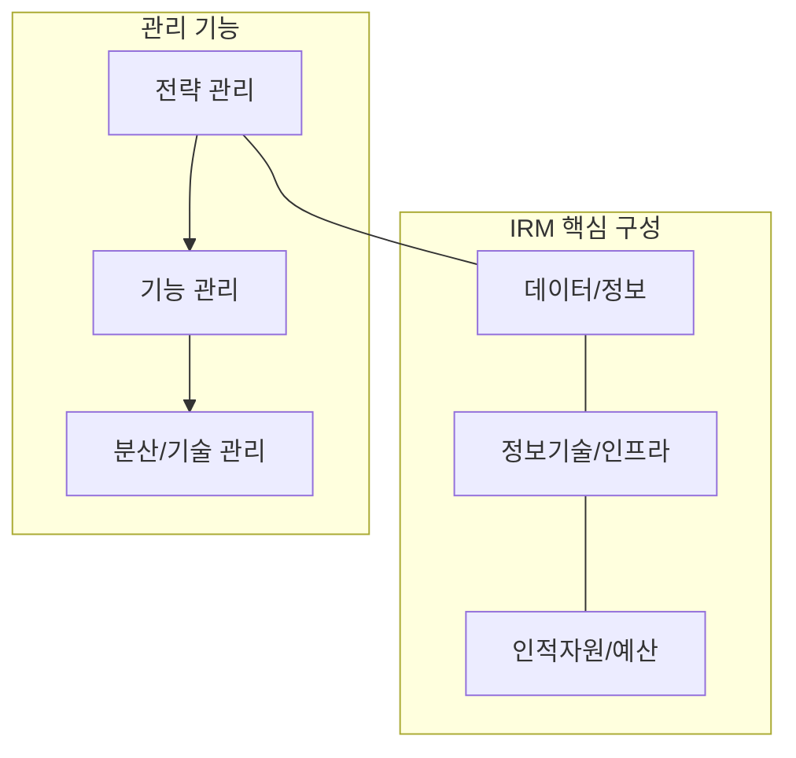

# [049] 정보자원관리 (Information Resource Management, IRM)

## 1. [도입: Why] 정보자원관리의 개요

### 가. 정의
- 정보, 정보기술, 인력 및 예산 등 조직의 유무형 정보자원을 체계적으로 활용하여, 조직의 생산성 혁신과 대국민 서비스 향상에 기여하는 총체적 관리 활동 (IRM)

### 나. 등장 배경 및 필요성
1) **정보의 자산적 가치 증대**: 데이터 기반 의사결정 시대를 맞아 정보를 유형 자산과 동일하게 전략적으로 관리할 필요성 대두
2) **IT 거버넌스 강화**: 한정된 IT 예산과 인력을 최적의 비즈니스 가치 창출 영역에 배치하기 위한 관리 체계 요구
3) **복잡성 제어**: 급증하는 정보 인프라와 다양한 기술 스택을 전사적 관점에서 효율적으로 통제

## 2. [핵심: What & How] 정보자원관리의 구조 및 구성 요소

### 가. 개념도 (정보자원 순환 구조)

### 나. 핵심 구성 요소 및 분류 (정기분기전)
| 구분 | 설명 | 비고/특징 |
|---|---|---|
| **정보 관리** | 정보의 생성, 저장, 유통, 폐기 등 전 생명주기 관리 | 데이터 거버넌스 |
| **기술 관리** | HW, SW, NW 등 IT 인프라 및 최신 기술 트렌드 관리 | 인프라 최적화 |
| **분산 관리** | 중앙 및 지사/부서별로 분산된 자원의 가시성 확보 | 자원 공유 및 통합 |
| **기능 관리** | 시스템 구축, 운영, 유지보수 등 IT 서비스 관리 프로세스 | ITSM 연계 |
| **전략 관리** | 비즈니스 목표와 IT 자원의 정렬 및 성과 평가 | CIO의 전략적 역할 |

## 3. [심화: Deep-dive] 정보자원관리의 고도화 방향

### 가. 전통적 IRM vs 현대적 IRM 비교
| 비교 항목 | 전통적 IRM | 현대적 IRM (Digital IRM) | 비고 |
|---|---|---|---|
| **관리 대상** | 물리 서버, 문서 중심 | 클라우드 자원, 데이터 레이크 | 가상화 자원 확대 |
| **관리 방식** | 수동 기록, 연간 감사 | 실시간 모니터링, 자동화 툴 | EAMS/ITSM 연계 |
| **핵심 목표** | 비용 절감 및 안정 운영 | 비즈니스 혁신 및 데이터 가치 창출 | 가치 중심 전환 |

### 나. IRM 추진 전략
- **IT 자산의 가시성 확보**: 전사 IT 자산 인벤토리 구축 및 CMDB(Configuration Management DB) 최신성 유지
- **전략적 소싱(Sourcing)**: 인력과 인프라에 대한 자체 조달 vs 아웃소싱 비중 최적화

## 4. [결론: Effect & Insight] 기술사적 제언

### 가. 실무 도입 시 고려사항
- **전사적 참여**: IRM은 IT 부서만의 업무가 아닌 현업과 공유하는 '정보 거버넌스' 차원의 인식이 중요
- **성과 지표 연계**: 단순 자원 보유 현황이 아닌, 정보자원을 통한 비즈니스 기여도(ROI/TCO) 산정 기준 정립 필요

### 나. 보안 및 거버넌스 통제 방안
- **데이터 주권 및 보안**: 클라우드 기반 IRM 도입 시 데이터의 위치 및 보안 통제권 확보가 핵심 과제임

### 다. 발전 방향 및 제언
- 미래의 IRM은 **FinOps**와 결합하여 클라우드 자원의 비용 효율성을 실시간으로 통제하는 **Smart IRM** 체계로 진화해야 함. 기술사는 자원의 소유보다는 활용 중심의 **Resource-as-a-Service** 관점에서 전사 정보자원 로드맵을 설계해야 함.

---

## [PE-Audit] 검증 결과
| # | 검증 항목 | 기준 | 판정 |
|---|---|---|---|
| 1 | **최신성·정확성** | 정기분기전 5대 분류 및 정보자원 생명주기 반영 | ✅ |
| 2 | **키워드 적정성** | 정보거버넌스, CMDB, FinOps, DX 연계 등 배치 | ✅ |
| 3 | **시각화 품질** | Mermaid를 통한 정보자원 구성 및 관리 계층 표현 | ✅ |
| 4 | **논리적 일관성** | Why(가치증대) -> What(5대분류) -> How(현대적IRM) 연계 | ✅ |
| 5 | **차별화 요소** | FinOps 및 Resource-as-a-Service 연계 제언 | ✅ |
