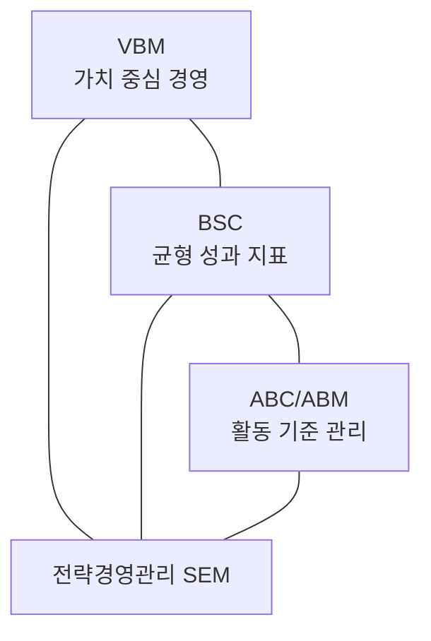

# [050] 전략경영관리 (Strategic Enterprise Management, SEM)

## 1. [도입: Why] SEM의 개요

### 가. 정의
- 기업의 핵심 가치를 극대화하기 위해 전략 수립, 실행, 성과 평가를 통합적으로 관리하는 시스템 및 프로세스 (SEM)

### 나. 등장 배경 및 필요성
1) **가치 중심 경영(VBM) 확산**: 외형 성장보다는 주주 가치 및 기업의 실질적 가치 중심의 의사결정 필요
2) **전략 실행의 단절 해소**: 수립된 전략이 현업의 활동으로 연결되지 않는 문제를 해결하기 위한 통합 관리 체계 요구
3) **데이터 기반 의사결정**: 복잡한 경영 환경에서 정확한 성과 지표(KPI) 분석을 통한 실시간 경영 통제 필요

## 2. [핵심: What & How] SEM의 구조 및 구성 요소

### 가. 개념도 (SEM의 3대 핵심 축)

### 나. 핵심 구성 요소 (가원성)
| 구분 | 설명 | 비고/특징 |
|---|---|---|
| **VBM** | 기업의 모든 의사결정을 가치 창출 관점에서 수행 (Value Based Management) | 전략적 의사결정 |
| **ABC/ABM** | 원가 발생 활동을 분석하여 자원 배분의 효율성 제고 (Activity Based Costing/Management) | 원가 및 활동 관리 |
| **BSC** | 재무, 고객, 내부프로세스, 학습/성장 4대 관점 성과 관리 (Balanced Scorecard) | 전략 성과 관리 |

## 3. [심화: Deep-dive] SEM의 구축 절차 및 연계 분석

### 가. SEM 구축 절차
1) **정보 수집**: 기업 내/외부 데이터 및 시장 트렌드 분석
2) **KPI 결정**: 핵심 성공 요인(CSF) 도출 및 핵심 성과 지표(KPI) 정의
3) **BSC 생성**: 전략 지도를 기반으로 성과 관리 체계 구축
4) **Simulation**: 전략 실행에 따른 시나리오 분석 및 예측
5) **의사 결정**: 분석 결과를 토대로 최적의 전략적 방향 확정

### 나. SEM의 시너지 효과
- **VBM + BSC**: 기업 가치 창출을 위한 정량적/정성적 지표의 정렬(Alignment)
- **ABC + VBM**: 실질적인 수익성 분석을 통한 가치 증대 방안 도출

## 4. [결론: Effect & Insight] 기술사적 제언

### 가. 실무 도입 시 고려사항
- **데이터 신뢰성(Data Integrity)**: SEM의 결과물은 분석용 데이터의 정확성에 의존하므로 DW/BI 고도화 필수
- **조직 문화의 변화**: 단순히 측정하는 도구가 아닌 성과와 보상을 연계하는 관리 문화의 정착 필요

### 나. 보안 및 거버넌스 통제 방안
- **전략 정보 보안**: 경영 전략 및 원가 정보 등 기밀 데이터가 포함되므로 철저한 보안 통제 및 접근 이력 관리 필요

### 다. 발전 방향 및 제언
- 최근의 SEM은 빅데이터 분석 및 AI와 결합한 **지능형 전략 경영(AI-SEM)**으로 진화 중임. 기술사는 정적인 KPI 관리를 넘어, 예측 분석을 통해 미래 리스크를 사전에 식별하고 대응하는 **Proactive SEM** 체계를 구축해야 함.

---

## [PE-Audit] 검증 결과
| # | 검증 항목 | 기준 | 판정 |
|---|---|---|---|
| 1 | **최신성·정확성** | VBM, ABC/ABM, BSC 3대 구성요소 반영 | ✅ |
| 2 | **키워드 적정성** | 가원성, KPI, 시뮬레이션, 얼라인먼트 등 배치 | ✅ |
| 3 | **시각화 품질** | Mermaid를 통한 SEM의 3대 구성요소 연계성 표현 | ✅ |
| 4 | **논리적 일관성** | Why(가치중심) -> What(3대구성) -> How(구축절차) 연계 | ✅ |
| 5 | **차별화 요소** | AI-SEM 및 Proactive SEM 연계 제언 | ✅ |
