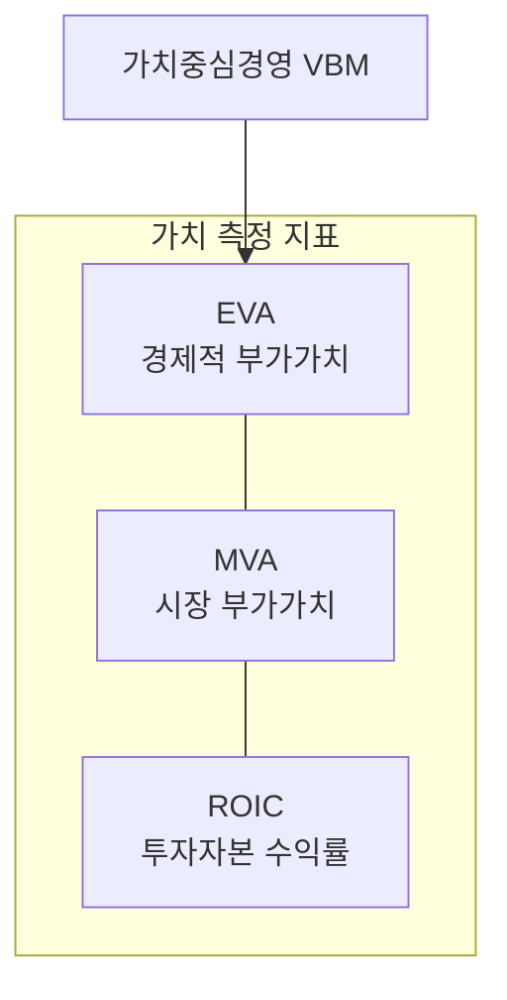

# [051] 가치중심경영 (Value Based Management, VBM)

## 1. [도입: Why] VBM의 개요

### 가. 정의
- 기업의 근본 목적이 주주와 투자자의 가치 극대화에 있다는 관점 하에, 모든 의사결정과 성과 평가를 가치 창출 중심으로 수행하는 경영 관리 체계 (VBM)

### 나. 등장 배경 및 필요성
1) **외형 위주 성장의 한계**: 단순 매출이나 이익 중심의 경영이 실제 기업 가치를 반영하지 못하는 한계 노정
2) **자본 효율성 중시**: 투자 자본에 대한 기회 비용을 고려한 실질적인 경제적 이익 중심의 평가 요구
3) **글로벌 스탠다드 대응**: 투명한 경영 성과 공개와 주주 중심 경영을 통한 대외 신인도 제고

## 2. [핵심: What & How] VBM의 구조 및 측정 지표

### 가. 개념도 (VBM의 가치 창출 메커니즘)

### 나. 가치 측정 지표 (경시투)
| 구분 | 약어 | 설명 | 비고/특징 |
|---|---|---|---|
| **경제적 부가가치** | **EVA** | 세후 영업이익에서 자본비용을 차감한 실제 이익 | 가치 창출의 척도 |
| **시장 부가가치** | **MVA** | 기업의 시장 가치와 투입된 총 자본의 차이 | 주주 가치 증대 정도 |
| **투자자본 수익률** | **ROIC** | 영업 활동에 투입된 자본 대비 창출된 이익의 비율 | 효율적 자원 운용 |

## 3. [심화: Deep-dive] VBM의 생명주기 및 실행 단계

### 가. VBM 실행 4단계
1) **개념 정립**: 기업의 가치 동인(Value Driver) 식별 및 목표 가치 설정
2) **전략적 의사결정**: 가치 창출 가능성이 높은 사업 포트폴리오 재편
3) **운영적 의사결정**: 일상적인 업무 프로세스를 가치 증대 관점에서 최적화
4) **실행 및 보상**: 가치 창출 실적에 기반한 성과 관리 및 보상 체계 연계

### 나. 가치 동인(Value Driver) 분석
- **재무적 동인**: 매출 성장률, 영업 이익률, 자본 비용 절감 등
- **비재무적 동인**: 브랜드 가치, 고객 충성도, 기술 혁신 역량 등

## 4. [결론: Effect & Insight] 기술사적 제언

### 가. 실무 도입 시 고려사항
- **단기 성과 주의 경계**: 과도한 가치 중심 경영이 미래를 위한 R&D 투자 등을 위축시키지 않도록 장단기 밸런스 유지
- **전직원 내재화**: 가치 경영이 경영진의 구호에 그치지 않고, 말단 직원의 행동 지침으로 연결(Alignment)되어야 함

### 나. 보안 및 거버넌스 통제 방안
- **성과 지표 왜곡 방지**: EVA 등 가치 지표 산출 로직의 투명성을 확보하고 정기적 검증(Validation) 수행

### 다. 발전 방향 및 제언
- 최근의 VBM은 단순 재무적 가치를 넘어 **ESG(환경/사회/지배구조) 가치**를 통합하는 **Sustainable VBM**으로 진화하고 있음. 기술사는 IT 투자가 재무적 가치뿐 아니라 사회적 가치(Social Value)를 어떻게 창출하는지 측정하는 프레임워크를 수립해야 함.

---

## [PE-Audit] 검증 결과
| # | 검증 항목 | 기준 | 판정 |
|---|---|---|---|
| 1 | **최신성·정확성** | EVA, MVA, ROIC 등 핵심 지표 반영 | ✅ |
| 2 | **키워드 적정성** | 가치동인, 경제적부가가치, ESG, 가치경영 등 배치 | ✅ |
| 3 | **시각화 품질** | Mermaid를 통한 가치 측정 지표 간의 관계 표현 | ✅ |
| 4 | **논리적 일관성** | Why(자본효율성) -> What(측정지표) -> How(실행단계) 연계 | ✅ |
| 5 | **차별화 요소** | Sustainable VBM 및 ESG 통합 가치 제언 | ✅ |
